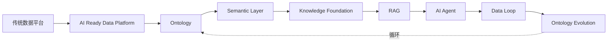

# Data-Driven AI：从数据到智能

> Teach Data Engineers How to Think AI.

一部开源技术书籍，帮助具有数据研发背景的工程师完成 AI 思维升级（Mindset Shift）。

本书不是 AI 入门教程，不是 Prompt Engineering 教程，不是 LangChain 或 MCP 的使用手册。

本书唯一目标：让读者从数据视角理解 AI。

---

## 全书主线



整本书只有两个真正的核心：**Ontology**（机器理解企业业务世界的方式）与 **Data Loop**（AI 系统持续学习、持续修正、持续演进的能力）。

---

## 目标读者

- 数据研发工程师（Data Engineer）
- 数据平台工程师（Data Platform Engineer）
- 数据架构师（Data Architect）
- Analytics Engineer
- 技术负责人（Tech Lead）

经验门槛：5~15 年。默认读者已熟悉 SQL、ETL、Lakehouse、CDC、Streaming、Spark、Flink、Airflow、数据治理、元数据、数据血缘。

---

## 快速开始

本书使用 [MkDocs Material](https://squidfunk.github.io/mkdocs-material/) 构建。

```bash
# 安装依赖
pip install mkdocs mkdocs-material

# 本地预览
mkdocs serve

# 浏览器打开
# http://127.0.0.1:8000
```

---

## 目录结构

```
data-driven-ai-guide/
├── mkdocs.yml            站点配置
├── AGENTS.md             协作路由（入口）
├── handbook/             全书规范（唯一真相源）
│   ├── BOOK_CONSTITUTION.md
│   ├── ARCHITECTURE.md
│   ├── WRITING_STYLE.md
│   ├── GLOSSARY.md
│   └── DIAGRAM_GUIDE.md
├── docs/                 书稿内容（MkDocs 内容根）
├── diagrams/             架构图源文件
├── assets/               静态资源
└── scripts/              校验与构建辅助脚本
```

---

## 贡献

写任何章节前，请先阅读：

1. [`AGENTS.md`](AGENTS.md) -- 协作路由
2. [`handbook/BOOK_CONSTITUTION.md`](handbook/BOOK_CONSTITUTION.md) -- 全书宪法
3. [`handbook/ARCHITECTURE.md`](handbook/ARCHITECTURE.md) -- DDA 方法论
4. [`handbook/WRITING_STYLE.md`](handbook/WRITING_STYLE.md) -- 写作规范
5. [`handbook/GLOSSARY.md`](handbook/GLOSSARY.md) -- 术语表
6. [`handbook/DIAGRAM_GUIDE.md`](handbook/DIAGRAM_GUIDE.md) -- 图表规范

`handbook/` 是唯一规范来源。

---

## 许可证

TODO
