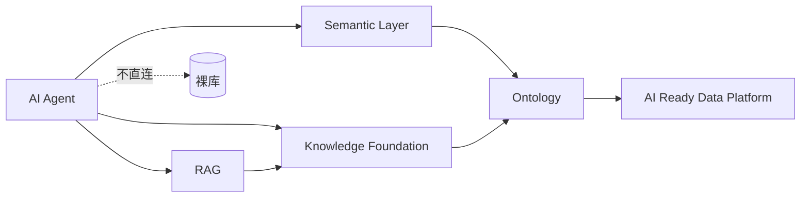
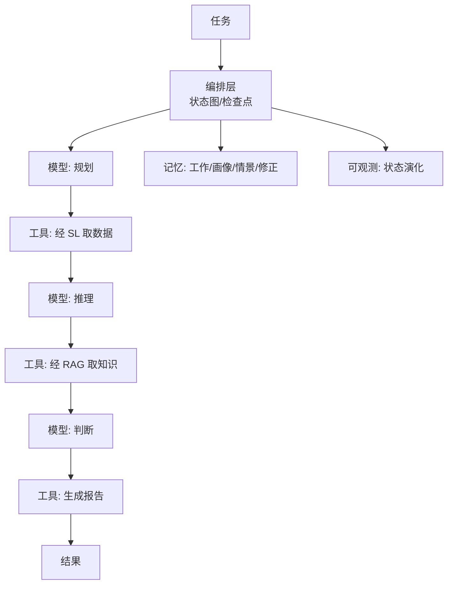
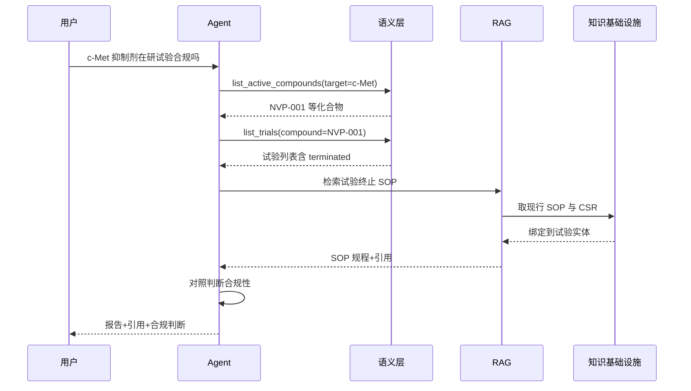
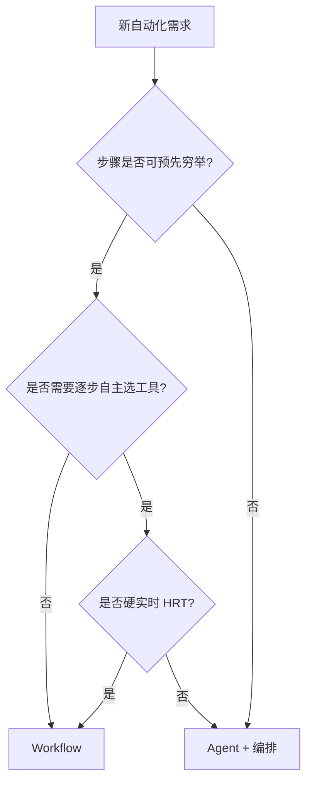

# AI 智能体：Agent

> 本章所属 DDA 层：AI Agent

## 问题

「查 c-Met 抑制剂的在研试验，汇总状态，对照现行 SOP 判断终止流程是否合规，生成带引用的报告。」药明诺华药物情报团队的这个问题，无法一次 RAG 检索完成：要先落到化合物实体 `NVP-001`，再查关联试验，再取绑定到试验的现行 SOP，再对照规则判断，最后组织输出。五步之间有依赖，任一步口径漂移或知识无引用，整份报告在监管审计面前无效。

这类任务需要 AI 智能体（AI Agent）——消费前面各层的执行单元，在受控语义边界内编排多步动作。数据工程师须理解 Agent **如何消费** Ontology、语义层（Semantic Layer，SL）、知识基础设施（Knowledge Foundation，KF）与检索增强生成（Retrieval-Augmented Generation，RAG），才能把数据层设计成 Agent 友好形态；不必亲自写 Agent 框架，但必须守住「不直连裸库」的硬边界。

Agent 的可靠性上限由语义传递链决定，不由模型决定。Agent 若绕过 Ontology 与 SL 直连裸库，等于在传递链末端重新引入口径自造与不可追溯。DDA 把 Agent 定位为消费方，不是中心。

## 传统方案

早期做法是让 Agent 直连数据库自己写 SQL、自己判断、自己执行。药明诺华的尝试是：接一个通用模型，给它数据库连接，让它自己查。问它"在研的 c-Met 抑制剂"，它自己拼 SQL，自己解释结果。

这种做法在演示里好看，在生产里失控。

## 为什么失效

直连裸库的 Agent 没有边界。错误失控，出了事也说不清。

Agent 自己写 SQL，可能全表扫描跑垮平台，可能 JOIN 错了给出错误答案，可能越权访问不该看的数据。没有语义层护栏，这些都没有拦截。

口径也会漂。Agent 把 `preclinical` 算进"在研"，企业口径不算——拼出来的 SQL 和报表对不上。这不是模型笨，是传递链缺了协议层。

更麻烦的是无法追责：每一步没有结构化记录，说不清依据什么、调用了什么。受监管场景下，这种 Agent 直接不可用。

没有统一语义来源时，同一个问题，不同时候会给不同口径的答案。

图：Agent 消费链路（DDA 层：AI Agent）

SL、KF、RAG 三路向下追溯到 Ontology；虚线表示不直连裸库。Agent 是消费方，可靠性来自语义传递链。

## 新的设计思想

DDA 方法重新看这一层：**Agent 不是中心，数据才是。** 它是消费前面各层的执行单元，可靠性取决于语义传递链，不取决于模型本身。

四条硬约束：

- **经语义层消费**：Ontology、SL、KF 是数据入口，不直连裸库；每次数据动作走语义接口，受 SL 护栏约束。
- **每步可追溯**：调用、决策、工具使用全部结构化记录，出错可回溯。
- **受控语义边界**：在 Ontology 与 SL 划定的边界内操作，不自造口径、不越权、不绕过护栏。
- **编排而非自由发挥**：多步任务用编排框架管理，有状态、检查点、中断恢复，不放任自由推理。

这里要区分 Agent 与工作流（Workflow）。工作流是预定义的执行路径，没有自主决策；Agent 有自主决策能力，能在边界内选择下一步。药明诺华的 Phase I 终止合规检查步骤固定，适合工作流；开放式药物情报综合分析步骤依问题而定，适合 Agent。具体判定见工程实践段的决策树。

## 架构设计

图：Agent 编排架构（DDA 层：AI Agent）

编排层驱动规划→工具→推理的循环；工具经 SL/RAG，不直连裸库。记忆与可观测贯穿全程。Agent 是带编排的执行系统，不是「一个模型加几个工具」。

编排框架的演进可以看一条线索：从 ReAct [^1]（推理-行动交替）到有向无环图（Directed Acyclic Graph，DAG）再到状态图（StateGraph）。ReAct 简单但难控，DAG 可控但不灵活，状态图用显式状态管理兼顾可控与灵活，支持检查点与中断恢复。LangGraph 的 StateGraph 是这一思路的代表（仅为一种实现选择 [^2]）。本书关心的是状态图这种编排形态的工程价值，不是某个框架。

药明诺华药物情报 Agent 可按研发流程组织为五阶段技能包：理解问题 → 经 SL 检索结构化数据 → 经 RAG 取接地知识 → 对照 Ontology 规则判断 → 生成带引用报告。这与垂直数据行业「提问-检索-解决-起草-验证」模式同构（见[附录](../appendix/index.md)），但消费链必须经本章图示的 SL/KF/RAG，不能旁路自建语义。

## 工程实践

工程实践从开篇的药物情报任务展开：先看清多步消费链，再谈该用 Agent 还是工作流，最后谈上生产时的治理与平台选型。

### 药物情报 Agent 的多步查询

以药明诺华的药物情报 Agent 为例，一个典型多步任务用时序图说明：

图：药物情报 Agent 多步查询时序（DDA 层：AI Agent）

五步依次经 SL 取数据、RAG 取 SOP（RAG 再向 KF 取规程），最终输出带引用与合规判断。可靠性来自第 2–5 章已加固的传递链。

Agent 从 RAG 继承三项能力：视觉证据（CSR 里的剂量-响应图表等像素原生块）可与文本一并交给生成模型；RAG 拒答时 Agent 须如实转达"无依据"，不能自己编；引用坐标从 RAG 一路继承到 Agent 输出。Agent 是引用链的终点消费者，不是起点。

### 三层工具范式与技能包

时序图中的每一步对应一类可调用工具。Agent 调用的工具有三种范式：

- **函数工具**：Agent 调用一个函数，如 `list_active_compounds(target='c-Met')`。最常见，适合确定性查询。
- **节点即工具**：把一个处理节点封装为工具，如"证据聚合节点"，Agent 调用它完成复杂处理。
- **ML 能力注册**：把模型能力（如抽取、分类）注册为工具，Agent 按需调用。适合需要模型判断的子任务。

三种范式按任务复杂度选用。药明诺华的查询多用函数工具，证据聚合用节点即工具，文档抽取用 ML 能力注册。这些工具应按领域组织为**技能包**（`compound_lookup`、`trial_status`、`sop_retrieval`、`compliance_check`、`report_compose`），对应上文时序图五步，而非堆在一个巨型提示词里。

**Multi-agent 边界：** 默认 **一个编排器 + 多技能包**。独立 Agent 仅在组织或权限域须隔离时拆分（如监管对外 vs 内部研发）。否则用编排器内路由即可，避免 Agent 蔓延导致口径与版本各管各的。

### Agent vs Workflow 决策

上文时序图描述的是**需要 Agent** 的场景：步骤依问题变化，且要在 SL/RAG 边界内动态选工具。若需求是步骤可预先穷举、不需逐步自主决策，应选工作流（Workflow）——与「新的设计思想」段的区分一致。

| 任务 | 选 Workflow | 选 Agent |
| --- | --- | --- |
| Phase I 终止合规检查（步骤固定） | 是 | 否 |
| 开放式药物情报综合分析 | 否 | 是 |
| 月度固定报表生成 | 是 | 否 |
| 「这个靶点竞争格局如何」探索性问题 | 否 | 是 |

图：Agent vs Workflow 决策树（DDA 层：AI Agent）

硬实时场景两者都不合适，应预计算或规则引擎。Workflow 同样不能旁路 SL 直连裸库。

### 平台内置 Agent 的消费模式

第 3 章讨论的 Databricks Genie、Snowflake Cortex Agents（仅为实现选择）是自然语言入口，落在本层，但**不替代**下层语义与本体：

- Genie 经 Unity Catalog 授权查询；若指标定义分散在笔记本 SQL，仍会口径漂移。
- Cortex Agents 消费 Semantic Views；若与第 2 章 Ontology 别名不同步，`NVP-001` 与 `savolitinib` 仍可能对不上。

数据团队职责不变：交付契约化 `compound_active`、第 3 章 SL 单一口径、第 4 章 KF 绑定。平台 Agent 降低 UI 门槛；端到端消费链见[附录时序图](../appendix/index.md)。

### Agent OS 治理五支柱

消费链跑通后，多 Agent 上生产须过治理审批。Agent OS 是概念框架（非特指某商业产品），药明诺华药物情报 Agent 上线可对照五支柱——其中成本、合规、可观测、生命周期四条直接依赖第 3 章 SL 护栏与第 7 章 Data Loop 黄金集：

| 支柱 | 治理内容 | 药明诺华示例 |
| --- | --- | --- |
| **模型路由** | 规划/推理/生成用不同模型或策略 | 规划用小模型，报告生成用大模型 |
| **成本治理** | Token、工具调用、查询成本上限 | 第 3 章 SL 成本估算层拦截全表扫描 |
| **合规** | 权限、数据域、引用完整性 | 试验数据仅经 SL 授权接口 |
| **可观测** | Trace/State 全链路 | 每步工具调用可回溯到 SL 版本 |
| **生命周期** | 版本、灰度、下线与黄金集回归 | 新 SOP 版本触发 Agent 回归测试 |

数据工程师角色：交付 SL 护栏、契约、血缘与评估黄金集；Agent 产品团队负责编排与模型路由。

### 四层记忆

Agent 需要记忆来处理多步任务与持续交互。四层记忆：

- **工作记忆**：当前任务的上下文，任务结束即清。
- **画像记忆**：用户偏好与权限，跨任务保留。
- **情景记忆**：历史交互记录，支持召回相似场景。
- **修正记忆**：用户纠正过的错误，避免重犯。

修正记忆是 Data Loop 在 Agent 层的体现：用户的纠错被记住，下次不犯。纠错来源不限于 Agent 自身的决策错误，也包括 RAG 检索与接地的失败（如召回了错误文档、接地对齐失败），这些经修正记忆沉淀后回流驱动 RAG 参数与 Ontology 修正。这与下一章的主题衔接。

### Agent 可观测性

Agent 的可观测性聚焦状态演化。Agent 每一步改变了什么状态、为什么选这条路径、调用了什么工具，都要记录。状态层是可观测的关键：状态演化决定路由，看不清状态就调不动 Agent。

可观测性的四层信息模型（Trace/I/O/State/Metrics）在第一章数据可观测性已出现，这里复用于 Agent。Trace 记录调用链，I/O 记录工具输入输出，State 记录状态演化，Metrics 记录性能指标。其中 State 层对 Agent 最关键。

### 生产陷阱与诚实边界

Agent 上生产有几个常见陷阱，每个都有具体表现。

**Agent 蔓延（Agent Sprawl）**：一个任务造一个 Agent，Agent 数量失控，维护成本爆炸。应控制 Agent 数量，多用编排复用。

**递归调用循环**：Agent 调工具，工具又触发 Agent，形成死循环。编排层要设递归深度与超时限制。

**工具爆炸**：给 Agent 配太多工具，它选不准。应做渐进式上下文披露，按任务阶段暴露相关工具子集。

**延迟边界**：Agent 多步推理的延迟，受模型与工具调用累计影响。十毫秒级硬实时响应（HRT）对 Agent 不可达，这是诚实边界。需要硬实时的场景不适合 Agent，适合预计算或工作流。

## 最佳实践

**Agent 消费语义层，不直连裸库**：这是硬边界。Agent 可靠性的下限由它消费的语义层决定。

**编排优先于自由推理**：用状态图管理多步任务，有检查点、有中断恢复，不放任 Agent 自由发挥。

**状态可观测是关键**：State 层记录要细，它是调试与改进 Agent 的主要依据。

**记忆分层管理**：工作记忆清空、修正记忆持久，不同寿命的记忆分开管理。

**诚实面对边界**：Agent 不适合硬实时、不适合无约束自主。该用工作流的场景不要硬塞 Agent。

**控制 Agent 数量**：复用编排，避免 Agent 蔓延。一个 Agent 解决一类问题，不是一个问题一个 Agent。

## 延伸阅读

- **Agent 编排演进**：ReAct（推理-行动交替）论文；DAG 与状态图（StateGraph）编排资料；LangGraph 状态图相关开源文档。
- **Agent OS 与治理**：Agent OS 概念与五支柱（模型路由/成本治理/合规/可观测/生命周期）相关资料；基于能力、范围受限、时限受限的 Agent 权限治理资料。
- **MCP 协议**：模型上下文协议（Model Context Protocol）规范与 Agent 工具化资料。
- **Agent 记忆**：工作记忆/画像/情景/修正四层记忆系统相关研究。
- **Agent 可观测性**：Agent 状态演化观测与 OpenTelemetry/OpenInference 等可观测标准资料。

[^1]: ReAct（Reasoning and Acting）框架，参见 ReAct 原始论文。
[^2]: LangGraph StateGraph，参见 LangGraph 开源项目文档。

## Checklist

- [ ] Agent 是否经 SL/KF/RAG 消费数据，不直连裸库？
- [ ] 是否澄清了 Agent 与工作流的区别，该用工作流的场景未硬塞 Agent？
- [ ] 多步任务是否用编排框架管理，有状态、检查点、中断恢复？
- [ ] Agent 每步操作是否结构化记录，可追溯？
- [ ] 是否有四层记忆，修正记忆是否持久化以避免重犯错误？
- [ ] 可观测性是否聚焦状态演化，State 层记录是否足够细？
- [ ] 是否设了递归深度与超时限制，防递归调用循环？
- [ ] 是否控制 Agent 数量，避免 Agent 蔓延？
- [ ] 平台内置 Agent（Genie/Cortex Agents 等）是否仍经自建 SL 与契约消费，未旁路裸库？
- [ ] Agent OS 五支柱中，数据侧（SL 护栏、黄金集、血缘）是否已纳入上线审批？

---

**自检（依据 WRITING_STYLE §9）**：本章为何需要？因为真实业务问题是多步任务，需要受控执行单元。数据工程师为何关心？Agent 消费数据层，数据层设计决定 Agent 可靠性。解决什么问题？让 AI 在受控语义边界内完成多步任务。属哪一 DDA 层？AI Agent。改变什么架构？把直连裸库的失控 Agent，改为经语义层消费、带编排记忆可观测的受控执行单元，且明确 Agent 不是中心。
