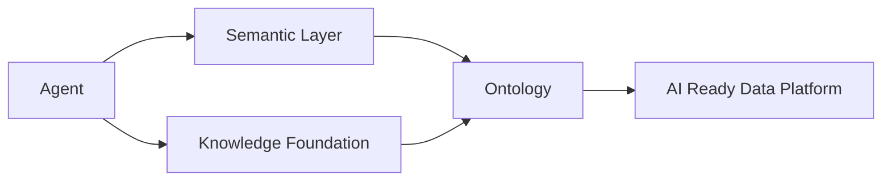

# AI 智能体：Agent

> 本章所属 DDA 层：AI Agent

## 定位

消费 Ontology、Semantic Layer、Knowledge Foundation 的执行单元。

Agent 不是中心。数据才是中心。

## 待写内容

- [ ] 问题：让 AI 在受控语义边界内完成多步任务
- [ ] 传统方案：让 Agent 直连数据库
- [ ] 为什么失效：失控、出错、无法追责
- [ ] 新的设计思想：Agent 消费语义层而非裸库
- [ ] 架构设计
- [ ] 工程实践
- [ ] 最佳实践
- [ ] Checklist

## Agent 消费链路

## 规范依据

- `handbook/ARCHITECTURE.md` 2.6 节
- `handbook/BOOK_CONSTITUTION.md` 第五章（Data First）

> TODO：本章待写。
