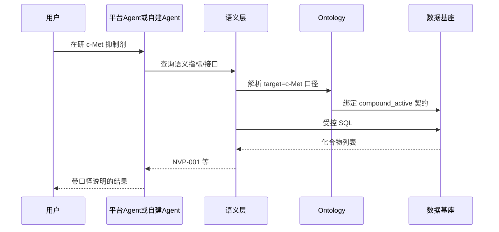

# 附录

> 本章所属：跨层

跨章节参考材料，便于查阅。

## 一、全书术语索引

术语权威定义见 [`handbook/GLOSSARY.md`](../handbook/GLOSSARY.md)。下表按 DDA 层组织，首现格式：中文（English，缩写）。

| 所属层 | 中文术语 | English | 缩写 |
| --- | --- | --- | --- |
| 跨层 | 数据驱动 AI | Data-Driven AI | DDA |
| 跨层 | 思维升级 | Mindset Shift | - |
| 跨层 | AI 原生 | AI Native | - |
| 跨层 | 业务语义不可靠 | Unreliable Business Semantics | - |
| 跨层 | 语义传递不可靠 | Semantic Transmission Unreliability | - |
| 跨层 | 语义时效不可靠 | Semantic Temporal Unreliability | - |
| 跨层 | 数据即服务 | Data-as-a-Service | DaaS |
| 跨层 | 升级版数据产品 | AI-ready Data Product | - |
| 跨层 | 最小可行本体 | Minimum Viable Ontology | MVO |
| 跨层 | 路线选择与适用边界 | Decision Boundary | - |
| AI Ready Data Platform | AI 就绪数据平台 | AI Ready Data Platform | - |
| AI Ready Data Platform | 数据契约 | Data Contract | - |
| AI Ready Data Platform | 数据血缘 | Data Lineage | - |
| Ontology | 数据本体 | Ontology | - |
| Ontology | 业务世界模型 | Business World Model | - |
| Ontology | 实体 | Entity | - |
| Ontology | 关系 | Relation | - |
| Ontology | 知识图谱 | Knowledge Graph | KG |
| Semantic Layer | 语义层 | Semantic Layer | SL |
| Semantic Layer | BI 语义层 | BI Semantic Layer | - |
| Semantic Layer | 语义接口 | Semantic API | - |
| Knowledge Foundation | 知识基础设施 | Knowledge Foundation | - |
| Knowledge Foundation | 知识绑定 | Knowledge Binding | - |
| RAG | 检索增强生成 | Retrieval-Augmented Generation | RAG |
| RAG | 接地 | Grounding | - |
| RAG | 引用 | Citation | - |
| RAG | 评估 | Evaluation | - |
| AI Agent | AI 智能体 | AI Agent | - |
| AI Agent | 工作流 | Workflow | - |
| Data Loop | 数据闭环 | Data Loop | - |
| Data Loop | 反馈回流 | Feedback Loop | - |
| Ontology Evolution | 数据本体演进 | Ontology Evolution | - |

### 禁止混用速查

| 概念 A | 概念 B | 关系 | 强制选择 |
| --- | --- | --- | --- |
| 数据本体（Ontology） | 知识图谱（KG） | KG 是 Ontology 的可能实现 | 方法论用 Ontology，具体图存储用 KG |
| 语义层（SL） | BI 语义层 | Agent 消费 vs 人读报表 | Agent 消费用 SL |
| 数据闭环（Data Loop） | ETL/ELT | 持续学习修正 vs 数据搬运 | AI 反馈回流用 Data Loop |
| AI 智能体（Agent） | 工作流（Workflow） | 自主决策 vs 预定义路径 | 自主执行用 Agent |
| 接地（Grounding） | 事实核查 | 生成前对齐 vs 生成后核查 | 生成前对齐用 Grounding |
| 评估（Evaluation） | 监控（Monitoring） | 质量度量 vs 系统运行 | 检索生成质量用 Evaluation |
| 数据契约（Data Contract） | SLA | 内容协议 vs 服务水平 | 数据内容协议用 Data Contract |

## 二、药明诺华（NovaPharm）统一案例数据资产清单

药明诺华是全书虚构创新药企，管线聚焦抗肿瘤靶向药。下列数据资产供各章对照。药企的实体对齐、别名消歧、口径统一、知识绑定，和征信、专利等垂直数据服务商的问题同构，案例可互参。

### 核心实体

| 实体 | 说明 | 关键属性 | 首现章节 |
| --- | --- | --- | --- |
| 候选化合物（Compound） | 研发管线核心对象 | research_code, status, aliases | 第 1 章 |
| 靶点（Target） | 药物作用靶点 | target_name（如 c-Met） | 第 2 章 |
| 临床试验（Trial） | 试验对象与进度 | trial_id, phase, status | 第 1 章 |
| 研究者（Investigator） | 试验主要研究者 | investigator_id, site | 第 2 章 |
| 监管文档（Regulatory Doc） | SOP/试验方案/CSR | doc_id, type, version | 第 4 章 |

### 别名消歧主场景

化合物 `NVP-001`（研发代号）在不同数据源有多个名称，用行业标准编码对齐到同一实体：

| 别名类型 | 值 | 标准体系 |
| --- | --- | --- |
| 研发代号 | NVP-001 | 企业内部 |
| 通用名 | savolitinib | 通用名 |
| 研发代号别名 | AZD6094 | 合作方编号 |
| CAS 号 | 1373746-33-2 | 化学物质标识 |
| PubChem CID | 51035674 | PubChem |
| ChEMBL ID | CHEMBL2108683 | ChEMBL |
| DrugBank ID | DB15423 | DrugBank |
| UMLS CUI | C4073094 | UMLS |

化合物活性清单数据契约 `compound_active` 见第 1 章。语义接口 `list_active_compounds` 见第 3 章。SOP 绑定 `sop_phase1_termination_v3` 见第 4 章。

### 自建 YAML vs 平台 Ontology 命名对照

同一化合物实体在不同路线下的命名示例（便于跨团队对话）：

| 概念 | 自建 YAML | Palantir Foundry | Microsoft Fabric IQ |
| --- | --- | --- | --- |
| 化合物实体 | `entity: Compound` | Object Type `Compound` | Entity `Compound` |
| 研发代号属性 | `research_code` | Property `researchCode` | Property `research_code` |
| 别名 savolitinib | `aliases.generic_name` | Alias 配置 | Property 别名映射 |
| 绑定数据产品 | `compound_active` 契约 | Object 后端数据集 | Binding 到 OneLake 表 |
| 终止试验写回 | 自建 Action 服务（演进） | Action `TerminateTrial` | Function / Action |

### 「在研 c-Met 抑制剂」端到端消费链

药明诺华查询「在研 c-Met 抑制剂有哪些」时，平台内置 Agent（Genie / Cortex Agents，仅为实现选择）与自建 Agent 的消费链一致，数据层仍是中心：

图：平台 Agent 与自建 Agent 共享同一 SL–Ontology–数据基座链（附录）

Genie / Cortex Agents 只是入口，不替代 SL 单一口径。SL 没定义「在研」是否含 `preclinical`，任何 Agent 都会给出不同数字。

### 合规约束

- ALCOA+ 数据完整性原则。
- 21 CFR Part 11 电子记录与电子签名要求。
- 零幻觉监管问答。
- Phase I 到上市约 12% 成功率（行业普遍参考）。
- 单药研发成本约 $1-2B（行业普遍参考）。

## 三、DDA 八层对照速查表

| 层 | 解决什么问题 | 主要对付的语义不可靠 | 为什么传统失效 | 核心设计思想 | 首现章节 |
| --- | --- | --- | --- | --- | --- |
| AI Ready Data Platform | 让数据能被 AI 可靠消费 | 传递：字段含义散落 | BI 数仓不提供访问语义与契约 | 数据契约+可程序消费元数据+可追溯血缘+持续质量 | 第 1 章 |
| Ontology | 给 AI 与业务共识对齐的世界模型 | 传递：无单一来源 | 语义散落无单一来源 | 显式定义实体/关系/规则/约束，绑定数据资产 | 第 2 章 |
| Semantic Layer | Agent 经语义接口取数据 | 传递：口径漂移、多消费方不一致 | 裸 SQL 字段改名即崩、口径漂移 | 语义 API 而非语义表，单一口径，拒直连裸库 | 第 3 章 |
| Knowledge Foundation | 统一结构化语义与非结构化知识 | 传递：文档与数据割裂；时效：知识过期 | 文档库与数据割裂、视觉信息丢失 | 多格式解析+视觉资产一等公民+块级绑定+版本时效+溯源坐标 | 第 4 章 |
| RAG | 让 AI 输出可追溯可引用可校验 | 传递：生成端无接地（幻觉为症状） | 直接让 LLM 回答致幻觉无引用、视觉信息丢失 | 语义结构化+多向量多路检索+视觉融合+接地+引用+评估 | 第 5 章 |
| AI Agent | 受控完成多步任务 | 传递：绕过语义链自造口径 | 直连裸库失控出错无法追责 | 消费语义层不直连裸库，编排+记忆+可观测 | 第 6 章 |
| Data Loop | AI 输出反向修正数据知识本体 | 时效：定义滞后于业务变化 | 单向管道错误不反馈 | 反馈采集+三路回流+评估闸门+可观测传感器 | 第 7 章 |
| Ontology Evolution | Ontology 随业务持续生长 | 时效：本体腐化与下游冲击 | 一次性建模后腐化 | 版本化+变更追溯+下游影响评估+历史兼容 | 第 8 章 |

### 两类语义不可靠与分布式系统的类比

数据工程师可用分布式系统的思维理解 DDA 的根本问题。类比不精确一一对应，但能帮判断「这一层该解决什么」。

| 分布式系统 | Data-Driven AI | 工程应对 |
| --- | --- | --- |
| 不可靠时钟：不能假设全局有序 | **语义时效不可靠**：业务在变，定义滞后 | Data Loop 反馈回流；Ontology Evolution 版本演进；KF 知识版本与时效 |
| 不可靠网络：不能假设消息必达 | **语义传递不可靠**：含义散落，传不到或传错 | 数据契约与元数据；Ontology 单一来源；SL 单一口径；KF 实体绑定；RAG 接地与引用 |
| 两者共同前提：设计时默认不可靠 | **业务语义不可靠**（总称） | 全书主线逐层驯服，而非指望模型"自己懂业务" |

读各章时对照：该层加固传递链哪一段，还是让语义跟上业务时钟哪一环？下游出现幻觉、口径对不上、Agent 自造 SQL，往往要往上追——是传递断了，还是定义过时了。

### 升级版数据产品：从 BI 到 AI-ready

AI-ready 转型不是另建 AI 数仓，而是按**升级版数据产品**交付——驯服语义不可靠的工程落点。详见[前言](../preface/index.md)。

**BI 时代 vs AI-ready：产品交付升级**

| 维度 | BI 时代（表交付） | AI-ready（产品交付） |
| --- | --- | --- |
| 基本单元 | 主题表、字段名承载含义 | 数据产品：契约+元数据+质量门禁 |
| 消费者 | 人（分析师、业务） | 人 + Agent + RAG |
| 交付接口 | SQL、报表 | 语义 API，拒裸库直连 |
| 语义 | 散落注释、人口径 | Ontology 单一来源 + SL 单一口径 |
| 非结构化 | 文档库，与数据割裂 | 知识产品：绑定+版本+溯源 |
| 迭代 | 工单驱动改表 | Data Loop 反馈驱动产品版本演进 |
| 验收 | T+1 跑通、报表可用 | 五项 AI 就绪特性 + 评估黄金集 |

**全书八层 = 产品栈逐级升级**

| 层 | 产品升级职责 |
| --- | --- |
| AI Ready Data Platform | 定义产品单元（契约、血缘、质量） |
| Ontology | 产品语义说明书（实体、规则、绑定） |
| Semantic Layer | 产品交付接口（语义 API） |
| Knowledge Foundation | 知识产品目录（多模态、版本、绑定） |
| RAG | 产品消费者的接地与引用 |
| AI Agent | 新产品消费者（经产品接口消费） |
| Data Loop | 产品持续迭代机制 |
| Ontology Evolution | 产品语义版本管理 |

**行业验证：征信与专利数据服务商**

详见下文「十二、行业同构参照」。

**内化时的现实差异（不改变产品本质）**

| 要点 | 说明 |
| --- | --- |
| 不卖钱，但标准同构 | 内部产品也须有负责人、契约、消费者清单 |
| Ontology 须共建 | 无外部产品团队单方面定义口径，须跨部门对齐 |
| 评估须自建 | 无付费客户替你定义"好"，黄金集是产品质量门禁 |
| 忌影子产品 | Agent 沙箱自建语义 = 产品目录外的旁路系统 |

## 四、贯穿全书的可观测四层信息模型

数据可观测性的四层信息模型在多个章节复用，是跨层框架：

| 层 | 回答的问题 | 在数据平台的用途 | 在 Agent 的用途 | 在 Data Loop 的用途 |
| --- | --- | --- | --- | --- |
| Trace | WHERE 在哪发生 | 链路追踪定位故障 | 记录 Agent 调用链 | 把反馈定位到具体调用 |
| Metrics | WHEN 何时发生 | 新鲜度与时效告警 | 记录 Agent 性能指标 | 触发时效与质量告警 |
| I/O | WHAT 是什么 | 校验契约符合度 | 记录工具输入输出 | 校验消费的数据对不对 |
| State | WHY 为什么 | 解释异常根因 | 记录状态演化（Agent 最关键） | 解释 Agent 为什么犯错 |

该模型还贯穿 RAG 章的评估环节：Trace 定位检索失败发生在哪个空间，I/O 校验召回证据对不对，Metrics 度量检索与生成质量并触发回流。

## 五、工具实现索引

以下工具在书中仅作为实现示例出现，标注"仅为一种实现选择"，不代表唯一方案。

| 工具 | 出现章节 | 作为何类示例 |
| --- | --- | --- |
| Apache AGE | 第 2 章 | PostgreSQL 图扩展，Ontology 图结构实现 |
| GraphRAG / LazyGraphRAG | 第 2 章 | 图结构知识检索方法 |
| SHACL | 第 2、8 章 | 本体约束校验语言 |
| dbt MetricFlow / Cube | 第 3 章 | 通用语义层指标定义 |
| Snowflake Cortex Semantic Views | 第 3 章 | 平台原生语义层 |
| Databricks Unity Catalog / Genie | 第 3、6 章 | 平台治理与自然语言消费界面 |
| Palantir Foundry Ontology | 第 2、9 章 | 商业 Ontology + 操作层 |
| Microsoft Fabric IQ | 第 2、9 章 | Fabric 栈 Ontology + Bindings |
| MCP（Model Context Protocol） | 第 3、6 章 | 语义层对 Agent 原生可调用的协议 |
| Deequ | 第 1 章 | 数据质量门禁工具 |
| Knowhere | 第 4、5 章 | 文档语义解析与章节树重建 |
| PixelRAG | 第 5 章 | 像素原生视觉检索与视觉编码 |
| EagleRAG | 第 5 章 | 多向量双空间并行召回与 RRF 融合 |
| LangGraph StateGraph | 第 6 章 | Agent 状态图编排框架 |
| UMLS / RxNorm / CDISC / MeSH / ChEMBL / DrugBank | 第 2 章 | 药品与化合物行业标准编码体系 |
| TextIn xParse | 第 4 章 | 文档理解引擎，多格式解析为 Markdown+坐标+类型化元素 |
| Hiro-OCSR | 第 4 章 | 光学化学结构识别，专利结构图转 SMILES |
| 启信宝 / 启信慧眼 | 第 1、2 章 | 企业征信数据服务商，实体对齐与关联图谱的行业实例 |
| 智慧芽 / PatSnap | 第 1、2、4 章 | 专利数据服务商，专利族对齐与化学结构检索的行业实例 |

## 六、参考文献与延伸阅读

以下为书中提及的方法、研究与行业实践方向，供延伸阅读。本书不逐条列 URL，可按关键词检索。各章末尾「延伸阅读」按主题细分，可与本节对照。

- **数据契约与数据产品**：Dehghani《Data Mesh》关于数据产品的论述；Data Contract 规范社区资料。
- **AI Ready 数据平台**：Thoughtworks Looking Glass 关于"从数据平台到 AI 就绪数据生态"的讨论；Data Mesh 2.0 与可组合数据产品平台相关资料。
- **Ontology 工程**：微软 Fabric IQ、Palantir Ontology、FAOS 三层本体框架（2025 年公开）相关资料；SHACL 与数据目录校验相关 Gartner 报告。
- **语义层复兴**：dbt MetricFlow 开源相关资料；Cube、AtScale、LookML 语义层对比资料；Open Semantic Interchange（OSI）标准。
- **RAG 与检索**：倒数秩融合（RRF）方法资料；多向量跨空间融合与单空间 dense+sparse 混合资料；GraphRAG 与 LazyGraphRAG（微软 2025 年公开）资料；交叉编码器重排方法资料；像素原生视觉检索（PixelRAG 类）资料；Citationware 与引用优先 RAG 方向资料。
- **Agent 与编排**：ReAct、DAG、StateGraph 编排演进资料；LangGraph 状态图相关资料；MCP 协议规范。
- **数据闭环与评估**：Airbnb AITL（EMNLP 2025）关于隐式反馈信号的资料；NVIDIA Data Flywheel Blueprint 相关资料；Ragas、DeepEval、Langfuse、Arize Phoenix 等评估可观测工具资料。
- **本体演进**：本体即产品（Ontology as product）与衰减模式相关资料；SHACL 与 Collibra 校验相关资料。
- **药企行业标准**：UMLS CUI、RxNorm、CDISC SDTM、MeSH、ChEMBL、DrugBank 各自官方文档；ALCOA+ 数据完整性原则；21 CFR Part 11 电子记录规范。
- **垂直数据服务商**：启信宝/合合信息（企业征信）关于实体对齐、关联图谱、数据治理、文档理解引擎（TextIn）的产品与技术资料；智慧芽/PatSnap（专利数据）关于专利族对齐、标准化权利人、化学结构识别（Hiro-OCSR）、新药情报库（Synapse）、Agent 平台（Eureka）的产品与技术资料。

## 七、DDA 成熟度模型（L0–L3）

下列等级汇总第 1–8 章 Checklist 与[第 9 章](../decision-boundary/index.md)决策树，可单独做现状评估。

| 等级 | 特征 | 典型投入（人月，单业务域） |
| --- | --- | --- |
| **L0** | 裸库 + Prompt / 直连 Text-to-SQL | — |
| **L1** | 数据契约 + 文档目录 + 人复核 Text-to-SQL | 1–2 |
| **L2** | L1 + MVO Ontology + SL + RAG 黄金集 | 3–8 |
| **L3** | L2 + 全链路 Data Loop + Ontology Evolution | 8–20+ |

**L2 最低验收（药明诺华）：**

- [ ] 10+ 核心表有数据契约
- [ ] 3+ 指标 SL 单一口径，Agent/RAG 共用
- [ ] 化合物 MVO（别名 + 关键状态规则）
- [ ] RAG 20+ 题黄金集 + Evaluation 闸门

## 八、成本与人力估算

以下为**区间估算**，非报价。前提：已有湖仓、虚构药企规模、1 个高价值域（化合物管线）。

| 建设项 | L1 | L2 | L3 |
| --- | --- | --- | --- |
| 数据契约（10 表） | 0.5–1 PM | 1–2 PM | 2–3 PM |
| MVO Ontology | — | 1–3 PM | 3–6 PM |
| 语义层（3–10 指标） | 0.5–1 PM | 1–2 PM | 2–4 PM |
| KF + RAG 黄金集 | — | 2–4 PM | 4–8 PM |
| Data Loop + Evolution | — | — | 4–8 PM |
| **合计** | **1–2 PM** | **3–8 PM** | **8–20+ PM** |

采购 Palantir / Fabric IQ 另计 license 与实施，不替代上表数据侧投入——平台替不了契约共建和黄金集。

## 九、组织协作 RACI

| 活动 | 数据平台团队 | AI 产品团队 | 业务方 | 安全/合规 |
| --- | --- | --- | --- | --- |
| 数据契约 | R/A | C | C | I |
| Ontology 定义 | R | C | A | I |
| SL 口径 | A/R | C | C | I |
| KF 知识绑定 | R | C | A | I |
| RAG 黄金集 | C | R | A | C |
| Agent 编排上线 | C | R/A | I | C |
| Data Loop 回流审批 | A/R | C | C | I |

R = Responsible，A = Accountable，C = Consulted，I = Informed。

## 十、30-60-90 天行动清单（Monday Morning）

**30 天：盘点与契约**

- 列出 Agent/RAG 会查的 10 张核心表（如 `dwd_compound`、`dwd_clinical_trial`）
- 为每张表写契约 YAML 草稿（字段含义 + 版本）
- 标注现有口径争议点（如「在研」是否含 `preclinical`）

**60 天：口径与黄金集**

- 选 3 个核心指标建 SL 单一口径（如「在研化合物数」「活性化合物清单」）
- 建 RAG 20 题黄金集（监管问答 + 试验状态 + SOP 引用）
- 跑首轮 Evaluation，记录失败 Trace

**90 天：MVO 与最小闭环**

- 上线化合物 MVO（别名表 + Phase 状态规则）
- 评估闸门接入：用户纠错 → RAG 参数回流
- 对照第七节成熟度模型自评是否达 L2

## 十一、业界产品全景索引（浓缩）

正文各章有详述，此处供速查。均为实现选择，非唯一方案。

### Ontology 路线

| 方案 | DDA 映射 | 见章节 |
| --- | --- | --- |
| 自建 YAML + Git | 默认描述层 | 第 2 章 |
| Palantir Foundry Ontology | 描述层 + 操作层 | 第 2、9 章 |
| Microsoft Fabric IQ | Entity + Bindings + Actions | 第 2、9 章 |
| MVO | 轻量别名/枚举 | 第 9 章 |

### 语义层路线

| 方案 | 模式 | 见章节 |
| --- | --- | --- |
| dbt MetricFlow | Universal / Headless | 第 3 章 |
| Cube | Universal / Headless | 第 3 章 |
| Snowflake Cortex Semantic Views | Platform-native | 第 3 章 |
| Databricks Unity Catalog + Genie | Platform-native | 第 3、6 章 |
| LookML / Power BI | BI-native（不满足 Agent SL） | 第 3 章 |
| OSI | 语义定义可移植标准动向 | 第 3 章 |

### Agent 消费

| 方案 | 角色 | 见章节 |
| --- | --- | --- |
| 自建编排 + MCP 工具 | 消费自建 SL | 第 3、6 章 |
| Databricks Genie | 平台 Agent，消费 UC/SL | 第 6 章 |
| Snowflake Cortex Agents | 平台 Agent，消费 Semantic Views | 第 6 章 |

## 十二、行业同构参照（征信与专利）

正文以药明诺华为主轴；下列垂直数据行业实践与 DDA 问题**同构**，作可行性参照，不是对比主轴。

### 企业征信（启信宝等）

- **实体对齐**：同一企业在工商、税务、司法、海关的多源编号归一为单一主体（同构于化合物 `NVP-001` ↔ `savolitinib`）
- **关联图谱**：股权、担保、高管任职多跳推理（同构于 Ontology 规则层「风险传染」）
- **数据产品**：数百个带 SLA 的数据 API，口径单一定义点
- **Agent 叠加**：在已有 API 产品目录上封装 MCP / Agent API，而非另建影子语义

### 专利数据（智慧芽等）

- **专利族对齐**：同一发明跨司法辖区的公开号、申请号、优先权号归一（同构于跨系统试验 ID）
- **权利人标准化**：同一公司多语言名称合并（同构于合作方研发代号）
- **知识产品**：化学结构图 → 可检索分子表示；扫描件 → 带坐标结构化
- **Agent 平台**：研发情报五阶段（提问-检索-解决-起草-验证），同构于药明诺华药物情报技能包

### 与药明诺华对照速查

| 产品能力 | 征信 | 专利 | 药明诺华 |
| --- | --- | --- | --- |
| 产品单元 | 数百数据 API | 三百+ 数据 API | 契约 + 语义接口 |
| 实体语义 | 多源编号归一主体 | 专利族、权利人标准化 | 化合物别名 |
| 知识产品 | 扫描件结构化 | 结构图→指纹 | CSR/SOP/图表 |
| 产品迭代 | 客户反馈修正 | 用户纠错 | Data Loop |
| Agent 消费 | MCP 叠加 | Eureka 等平台 | 经 SL，拒裸库 |

## 十三、章节写作规范依据

各章遵循的写作规范与自检依据见 `handbook/`：

- [`BOOK_CONSTITUTION.md`](../handbook/BOOK_CONSTITUTION.md)：全书宪法，红线与边界。
- [`ARCHITECTURE.md`](../handbook/ARCHITECTURE.md)：DDA 各层定义与章节依赖。
- [`WRITING_STYLE.md`](../handbook/WRITING_STYLE.md)：章节结构与 AI 写作规则。
- [`GLOSSARY.md`](../handbook/GLOSSARY.md)：全书统一术语。
- [`DIAGRAM_GUIDE.md`](../handbook/DIAGRAM_GUIDE.md)：图表规范。

贡献者写新章节前，请先读 [`AGENTS.md`](../AGENTS.md) 与上述五个规范文件。
