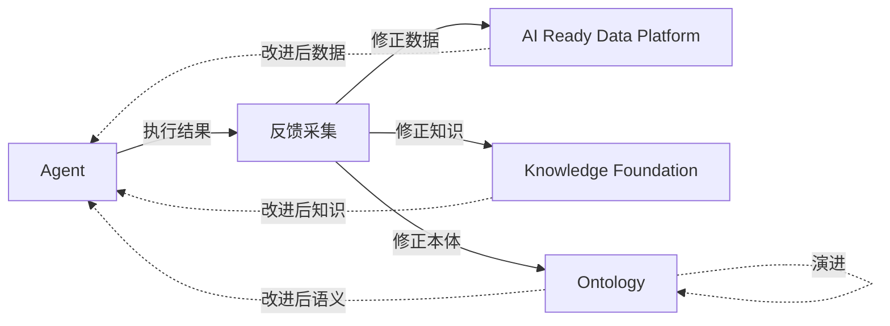
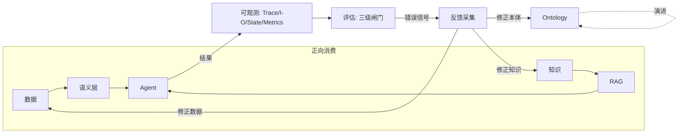

# 数据闭环：Data Loop

> 本章所属 DDA 层：Data Loop

## 问题

为什么 AI 系统必须能持续学习与修正？因为静态系统会衰退。

药明诺华的 AI 系统上线时，化合物别名映射是对的，试验状态口径是对的，SOP 引用是现行版。三个月后，新化合物进了管线，新通用名出现了，SOP 换了版本，试验状态流转规则改了。如果系统不能持续吸收这些变化，它的答案就开始偏离现实。这种现象有人称为"第三月停滞"：AI 系统上线初期表现不错，几个月后因未跟上业务变化而停滞乃至衰退。它不是模型退化，是语义时效不可靠在时间维度上的累积——像时钟漂移，当时对齐的业务共识，过一阵就落后了。

数据工程师为什么要学数据闭环（Data Loop）？因为这是全书两大核心之一，也是 AI 原生（AI Native）企业最重要的竞争护城河。前面的层解决了"AI 如何消费数据"，Data Loop 解决"AI 如何反过来修正数据"。没有 Data Loop，AI 系统是一次性产物，上线即开始衰退；有了 Data Loop，AI 系统是持续进化的飞轮。

Data Loop 让数据产品能持续迭代：对应前言所言语义**时效不可靠**，当业务变化而定义滞后时，靠反馈把数据、知识与 Ontology 拉回与现实对齐。它是数据工程师最能发挥价值的地方——本质是数据工程问题，不是模型问题。

## 传统方案

传统数据管道是单向的。数据从源头抽取，经 ETL 流向下游消费，结束。药明诺华的传统数据流是：研发系统抽化合物数据，经 ETL 入仓，BI 报表消费。数据只往下流，不回流。

错误也是单向处理：下游发现数据错了，提个工单，数据团队人工修上游，下次 ETL 跑通。知识更新靠人工：SOP 换版了，有人记得去改文档库；不记得，就还是老版本。

## 为什么失效

失效机制是：单向管道没有回流，错误与变化无法被系统吸收。

第一，错误不反馈。Agent 答错了，错误停留在用户那里，不回流到数据层。下次同样的问题，同样错。化合物别名映射错了，没人修，一直错下去。

第二，知识不更新。SOP 换版了，知识基础设施（Knowledge Foundation，KF）里的现行版本没跟着换，RAG 还是引用老版本。AI 给出过时答案，因为它的知识源过时了。

第三，Ontology 不演进。新化合物类别进了管线，Ontology 里没有对应实体定义，Agent 不认识。没有机制让业务变化反映到 Ontology。

这里必须澄清：**数据闭环不是新的 ETL，不是数据管道的同义词，不是模型再训练流程。** ETL 是单向数据搬运，Data Loop 是双向反馈修正；数据管道是数据流动的通道，Data Loop 是学习与修正的机制；模型再训练只动模型参数，Data Loop 修正的是数据、知识、Ontology。把 Data Loop 等同于 ETL 或再训练，就错过了它作为竞争护城河的本质。

图：数据闭环的反馈回流（DDA 层：Data Loop）

解读：Agent 执行结果进入反馈采集，反馈分三路回流：修正数据、修正知识、修正 Ontology。修正后的数据、知识、语义又改进 Agent 的下一次执行，形成闭环。Ontology 的演进用虚线自环表示。注意回流箭头方向与正向消费相反，这是 Data Loop 区别于单向管道的关键。这张图说明 Data Loop 不是又一条管道，是让 AI 输出反向修正数据层的机制。

## 新的设计思想

DDA 方法重新看这一层：数据系统必须是双向的，AI 输出是改进数据层的输入。Data Loop 的设计思想有三点。

第一，反馈采集。把 Agent 执行的结果、用户的纠错、评估的判定采集起来，作为回流的原料。反馈分显式（用户点"答错了"）与隐式（用户追问同一问题、重新表述），隐式信号往往比显式信号更丰富。

第二，反馈回流。反馈分三路回流：修正数据（如修正化合物别名映射错误）、修正知识（如更新 SOP 现行版本、修正 RAG 的语义结构化与检索参数）、修正 Ontology（如新增化合物类别）。每路回流有对应的校验与审批，不能让错误反馈污染数据层。其中 RAG 层有自己的评估闭环（检索质量、融合质量、生成质量），评估结果回流驱动 RAG 的语义结构化与检索参数调整，是"修正知识"这一路在 RAG 层的具体形态。

第三，可观测闭环。整个闭环可观测，能看到反馈在哪里产生、回流到哪里、改进了什么。可观测性是闭环的传感器，没有它就不知道闭环在不在转。

Data Loop 是 AI 原生企业的护城河，原因在于它难以复制。模型可以换，提示词可以抄，但一个运转良好的数据闭环是长期工程积累，竞争对手短期建不起来。

## 架构设计

图：数据闭环完整架构（DDA 层：Data Loop）

解读：上半部分是正向消费链，数据与知识经语义层与 RAG 喂给 Agent。Agent 结果进入可观测层，可观测层把信号喂给评估层，评估产出的错误信号进入反馈采集，反馈分三路回流修正数据、知识、Ontology。其中 RAG 节点自身带评估回流（检索/融合/生成质量评估驱动其语义结构化与检索参数调整），是"修正知识"这一路在 RAG 层的内部闭环。这张图说明 Data Loop 不是一个独立组件，而是把可观测与评估接入正向消费链形成的闭环，RAG 的内部闭环是其中一环。可观测与评估是闭环的传感器与闸门。

## 工程实践

### 反馈信号的采集

药明诺华的反馈信号分五类：

- **显式纠错**：用户标记"答案错误"或"引用不对"。信号强但稀疏。
- **隐式追问**：用户对同一问题反复追问或重新表述。信号弱但密集，往往暗示答案没满足需求。
- **评估判定**：三级评估体系判定答案不达标。系统自动产生，量大。
- **修正记忆**：Agent 的修正记忆层记录的用户纠正（见上一章）。跨任务积累。
- **RAG 评估信号**：RAG 层的检索质量、融合质量、生成质量评估产出的错误信号。RAG 自身是带评估反馈的闭环（见第 5 章），其评估结果既驱动 RAG 内部的语义结构化与检索参数调整，也作为 Data Loop 的反馈源之一。

隐式信号的价值常被低估。有观察（Airbnb 的 AITL 工作 [^1]，2025 年公开）指出，隐式反馈信号比显式信号更能反映真实满意度，且能把反馈到改进的周期从月级压到周级。这个发现的工程含义是：不要只盯显式纠错，要把隐式追问也纳入反馈采集。

### 三级评估体系作为闭环闸门

评估是 Data Loop 的闸门，决定哪些反馈值得回流、哪些改进可以上线。三级评估：

- **L1 运行时评估**：每次 Agent 执行即时评估，如引用完整性校验、护栏拦截率。门槛低、频率高。
- **L2 治理 CI 评估**：变更上线前跑回归集，用黄金数据集验证质量不退化。门槛中、变更触发。
- **L3 LLM-as-Judge [^2] 评估**：用模型评判答案质量，覆盖 L1/L2 难以枚举的语义维度。门槛高、周期跑。

三级各有侧重，不能互相替代。L1 防运行时崩坏，L2 防变更引入退化，L3 防语义质量下滑。

行业级"可上线"标准因场景而异。受监管场景（如药企监管问答、金融）要求高，医疗类常用 95% 以上准确率作为门槛，金融类常见 99% 以上；容错性高的场景（如零售推荐）门槛可低至 90% 左右。这些数字是行业普遍参考，不是绝对标准。要诚实的是：通过 CI 不等于可上线。CI 是必要条件，不是充分条件。

### 四层可观测信息模型作为闭环传感器

可观测性是闭环的传感器。四层信息模型在第一章数据可观测性已建立，这里复用为闭环的感知层：

- **Trace（WHERE，在哪发生）**：调用链追踪，定位反馈源头。
- **I/O（WHAT，是什么）**：工具输入输出，校验消费是否正确。
- **State（WHY，为什么）**：状态演化，解释为什么走这条路。
- **Metrics（WHEN，何时发生）**：性能与质量指标，触发时效与质量告警。

四层各有对应的闭环作用。Trace 把反馈定位到具体调用，I/O 校验消费的数据对不对，State 解释 Agent 为什么犯错，Metrics 监控整体健康度。这套模型把可观测从"给人看的仪表盘"变成"喂给闭环的信号"。

### 药企场景的回流实例

一个具体回流：用户问" savolitinib 的 Phase I 结果"，Agent 回答引用了 `NVP-002` 的 CSR。用户标记"引用错了"。反馈采集记录这次错误。

回流处理：L1 评估发现引用与化合物不匹配，标记为别名消歧错误。反馈回流到 Ontology 层，修正 `savolitinib` 的别名映射（原来错连到 `NVP-002`，应为 `NVP-001`）。修正经 L2 回归验证不破坏其他映射，上线。下次同样问题，Agent 引用正确的 CSR。

这个例子里，反馈不是只改了模型行为，而是修正了 Ontology 的别名映射这个数据层根因。这就是 Data Loop 区别于模型再训练的地方：它修的是数据，不是参数。

### 飞轮与"第三月停滞"

Data Loop 的目标是让系统成为飞轮而非衰退曲线。飞轮成熟度可以分几阶段看：初期靠人工标注驱动改进，中期靠隐式反馈半自动改进，成熟期靠闭环自动改进。"第三月停滞"发生在闭环没真正转起来的系统上：上线初期的静态知识够用，三个月后变化积累，没有回流机制就衰退。

破解停滞的关键是把闭环真正接通：反馈要采得到、回流要修得对、改进要能验证。任何一环断掉，飞轮就停。

垂直数据服务商的整个商业模式就是一个飞轮，只是以前转得慢。企业征信平台的闭环是这样的：数据摄入（工商/司法/海关多源推送）→ 治理（实体对齐、质量校验）→ 关联图谱更新 → 风险预警推送给银行客户 → 客户反馈"这个预警不准" → 修正实体对齐或规则 → 下一轮摄入更准。这个闭环在 BI 时代靠人工驱动，周期是天级到周级。AI 让它加速：Agent 自动发现关联图谱里的异常路径，RAG 评估自动标记召回错误，反馈回流自动修正 Ontology。专利数据平台同理，结构-活性关系（SAR）数据从专利表格里抽取，抽取错误被研发用户纠正，纠正回流改进抽取模型与化学结构识别规则。这些闭环在 AI 之前就存在，AI 做的是把它们从"人工转"变成"自动转"，从"周级"压到"小时级"——这是数据产品迭代机制在行业里的成熟样板。企业内部往往没有付费客户这条纠错链，须用评估闸门与黄金集补上同等压力，但闭环结构相同：摄入→治理→消费→反馈→修正。

## 最佳实践

**隐式信号不可忽视**：显式纠错稀疏，隐式追问密集，两者都要采集，隐式往往更有价值。

**反馈回流要校验**：回流不是直写，要经评估与审批，防止错误反馈污染数据层。

**评估是闸门不是摆设**：三级评估各有门槛，不达标的改进不上线，不达标的反馈不回流。

**可观测喂给闭环**：可观测不是给人看仪表盘，是给闭环提供信号。四层模型要把信号接到回流上。

**修数据而非只修模型**：Data Loop 的本质是修数据层根因，不是调模型参数。根因修了，所有消费方都受益。

**诚实面对"过 CI≠可上线"**：CI 是必要不充分条件。生产可上线还要看灰度、看真实流量表现。

## 延伸阅读

- **反馈信号与飞轮**：Airbnb AITL（EMNLP 2025）关于隐式反馈信号的资料；NVIDIA Data Flywheel Blueprint 关于数据飞轮的资料；"第三月停滞"现象与飞轮成熟度相关讨论。
- **评估体系**：三级评估（运行时/治理 CI/LLM-as-Judge）相关方法论；Ragas、DeepEval、Langfuse、Arize Phoenix 等评估可观测工具资料。
- **可观测性作为闭环传感器**：四层可观测信息模型（Trace/I-O/State/Metrics）相关资料；OpenTelemetry、OpenInference 等可观测标准。
- **行业级可上线标准**：金融/医疗/零售场景的准确率门槛与"过 CI≠可上线"相关工程实践资料。

[^1]: Airbnb AITL 关于隐式反馈信号与反馈周期的发现，参见 EMNLP 2025 相关资料。
[^2]: LLM-as-Judge 指用一个 LLM 作为评分器评判另一个 LLM 输出质量的评估方法，适用于人工难以枚举的语义维度（如连贯性、相关性），常作为运行时与 CI 之外的补充评估层。

## Checklist

- [ ] 是否澄清了 Data Loop 与 ETL、数据管道、模型再训练的区别？
- [ ] 反馈采集是否覆盖显式纠错与隐式追问两类信号？
- [ ] 反馈是否分三路回流（数据、知识、Ontology），各有校验审批？
- [ ] 是否有三级评估体系（L1 运行时/L2 治理 CI/L3 LLM-as-Judge）？
- [ ] 可观测四层模型是否把信号接到回流，而非仅给人看？
- [ ] 回流是否修数据层根因，而非只调模型参数？
- [ ] 是否有"过 CI≠可上线"的诚实认知，上线前做灰度验证？
- [ ] 闭环是否真正接通，反馈能采到、回流能修对、改进能验证？

---

**自检（依据 WRITING_STYLE §9）**：本章为何需要？因为静态 AI 系统会衰退，必须持续学习修正。数据工程师为何关心？Data Loop 是全书两大核心之一，本质是数据工程问题，是数据工程师最能发挥价值的地方。解决什么问题？让 AI 输出反向修正数据、知识、Ontology，形成持续进化的飞轮。属哪一 DDA 层？Data Loop。改变什么架构？把单向数据管道改为带反馈回流、评估闸门、可观测传感器的双向闭环。
