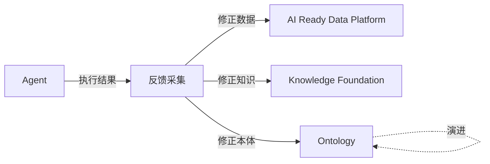

# 数据闭环：Data Loop

> 本章所属 DDA 层：Data Loop

## 定位

AI 系统持续学习、持续修正、持续演进的能力。

Data Loop 不是新的 ETL。

## 待写内容

- [ ] 问题：让 AI 输出反过来修正数据、知识、Ontology
- [ ] 传统方案：单向数据管道
- [ ] 为什么失效：错误不反馈，知识不更新
- [ ] 新的设计思想：反馈采集与回流
- [ ] 架构设计
- [ ] 工程实践
- [ ] 最佳实践
- [ ] Checklist

## 闭环示意

## 规范依据

- `handbook/ARCHITECTURE.md` 2.7 节
- `handbook/BOOK_CONSTITUTION.md` 第四章（Data Loop 为两大核心之一）

> TODO：本章待写。
