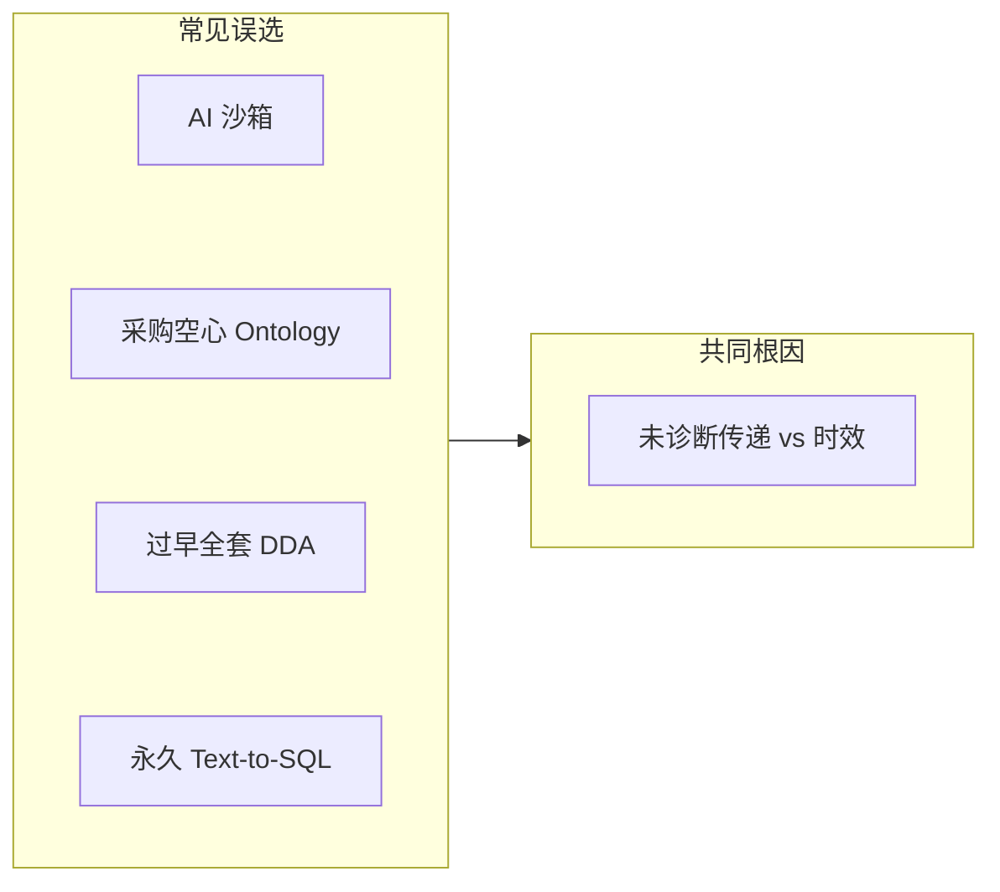
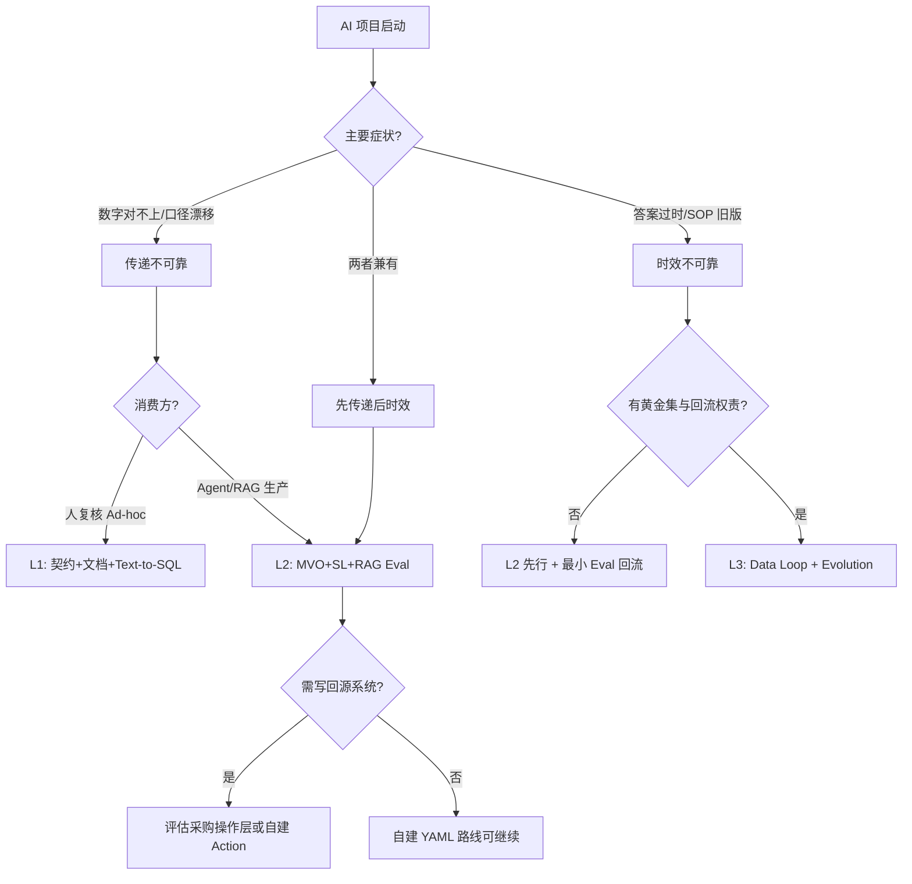

# 路线选择与适用边界

> 本章所属：跨层（路线选择与适用边界）

药明诺华的 AI 项目会上三套方案：产品团队两周内要聊天 Demo；数据平台主张先补契约和语义层；采购在评估 Palantir Foundry 一站式。三个方向都不全错，同时推会得到三套口径、三个影子目录。本章不问「哪套技术更先进」，而是：**资源有限时，DDA 八层建到哪一档、哪些层可缓、自建和采购怎么拼。**

前八章走完从数据契约到 Ontology Evolution 的完整回路。本章是收束：在「驯服语义不可靠」和「交付升级版数据产品」之上，补上诚实的边界——不必每层上满；选型错了和不上线一样要命。

## 问题

为什么企业不能每层都上满 DDA？每一层都是持续投入：契约维护、Ontology 共建、SL 版本化、RAG 黄金集、Data Loop 回流审批。PoC 阶段就铺完整 Ontology 和全链路 Data Loop，跟误用 Text-to-SQL 或另建 AI 沙箱一样危险。

数据工程师要学这一章，因为路线多半落在你肩上。业务方和 AI 产品常默认「上了大模型就能问一切」；采购常默认「买了平台 Ontology 就齐」。你需要一套能拿去辩护的分阶段路径：先加固传递链哪一段，再补时效哪一环，什么时候可以说「这一层现在不必建」。

本章目标：在传递 vs 时效的诊断下，选轻量、标准或完整三档路径，并判断自建、采购还是混合。

## 传统方案

传统路线有两类极端，药明诺华都遇到过。

**极端一：AI 外挂式接入。** 复制一份化合物与试验数据到 AI 沙箱，接通用模型，两周出 Demo。传递链在沙箱入口重新断裂：沙箱里的 `cmpd_status` 与数仓契约不同步，RAG 向量库与 CSR 现行版本脱节。Demo 好看，生产数字与报表对不上。

**极端二：采购一站式平台指望 Ontology 自动出现。** 评估 Palantir Foundry 或 Microsoft Fabric IQ 时，假设「买了平台，业务世界模型会自动长出来」。若湖仓里仍是散落字段名、无契约、无业务方共建，平台 Ontology 会是空心 Object——有类型名，无可靠绑定，Agent 仍靠猜。

还有一种常见中间态：**全员 Text-to-SQL。** 给分析师和早期 Agent 直连 Redshift，靠字段名和口头口径。在表少、人少、人工复核的场景能运转；一旦多 Agent、多 RAG、监管零幻觉问答同时出现，口径漂移不可控。

## 为什么失效

两类极端根因一样：**没先诊断语义不可靠的类型和严重度，就选了不匹配的路线。**

沙箱绕开数据产品目录，在组织里再造一套不受契约约束的影子产品。采购空心化把「平台能力」当「数据前提」——Ontology 绑的是数据资产，资产本身不 AI 就绪，平台只是多一层空壳。

过早全套 DDA：维护成本压过业务价值，比如给 MeSH 已覆盖的通用医学概念建满规则层（FAOS 反参数化知识效应，见[第 2 章](../ontology/index.md) FAOS 小节）。过晚建 SL：第 6 章 Agent 已直连裸库，债固化后再收口径，成本翻倍。

过早 Data Loop：没有生产流量、黄金集和回流权责，管道空转，最后当成「又一个 ETL」被弃掉。

图：四种误选路线与共同根因（跨层：路线选择与适用边界）

四种误选表面不同，根因都是没先分型。沙箱和永久 Text-to-SQL 主要恶化传递；采购空心 Ontology 传递和时效一起坏；过早全套 DDA 常在没验证高价值域前就铺开维护成本。对照本章决策流：主要症状是「对不上」还是「过时了」？

## 新的设计思想

DDA 方法看路线选择：**先诊断，再分档，再选型。**

**第一步：诊断语义不可靠类型。**

- **传递不可靠为主**：多消费方数字对不上、Agent 自造口径、CSR 与数仓化合物名对不齐 → 优先数据契约、Ontology 单一口径、语义层。
- **时效不可靠为主**：SOP 换版仍被引用、别名映射缺新通用名、「第三月停滞」 → 优先知识版本、Data Loop、Ontology Evolution。
- **两者兼有**：多数生产系统；先加固传递链最小闭环，再开时效回流。

**第二步：选三档成熟度。**

| 档位 | 包含层 | 典型场景 |
| --- | --- | --- |
| **轻量（L1）** | 数据契约 + 文档目录 + Text-to-SQL（人复核） | PoC、单域分析、&lt;30 张核心表 |
| **标准（L2）** | L1 + MVO Ontology + SL + RAG 黄金集 | 单 Agent 生产、监管问答、多消费方口径 |
| **完整（L3）** | L2 + 全链路 Data Loop + Ontology Evolution | 多 Agent、业务高频变化、竞争壁垒级数据闭环 |

**第三步：自建、采购或混合。** 映射 DDA 能力要求，不比较「哪个厂商更聪明」。详见工程实践段矩阵。

## 架构设计

图：DDA 路线决策流（跨层：路线选择与适用边界）

从症状分型起手，不从工具起手。传递问题看人复核还是机器自主消费；时效问题看有没有回流前提。L2 是多数企业的务实目标；L3 要组织承诺。写回源系统（终止试验、审计日志）常是采购 Palantir/Fabric 操作层的触发条件，不是「要更聪明的 KG」。

## 工程实践

### 反面教材一：何时 Ontology 是过度工程

FAOS 框架（2025 年公开，仅供参考）观察到反参数化知识效应：模型已熟的概念上建 Ontology，收益有限甚至可能添乱；企业特定、模型陌生的概念上建，收益才明显。

| 药明诺华场景 | 是否值得建 Ontology | 理由 |
| --- | --- | --- |
| 「化合物有分子量」 | 否 | 通用化学常识，契约字段 `molecular_weight` 足够 |
| 「Phase I 是什么」 | 否 | 通用临床试验概念，MeSH/CDISC 已覆盖 |
| `NVP-001` ↔ `savolitinib` 别名 | 是 | 企业跨系统编号，模型易错 |
| Phase I 失败 → `suspended` + 监管补件 | 是 | 企业内部状态机 + 规则，文档散落 |
| 内部 SOP 编号 `SOP-CT-012` 规则 | 是 | 模型知识稀疏 |

判定规则：若问题可用 **行业标准编码 + 数据契约 + 单一文档目录** 解决，Ontology 可降为 **最小可行本体（Minimum Viable Ontology，MVO）**——仅别名表 + 关键枚举 + 1–2 条可校验规则，不建动作层。

### 反面教材二：何时 Text-to-SQL + 良好文档就够

须 **同时满足** 以下条件，才可暂不上语义层：

1. 消费方以人复核的 Ad-hoc 分析为主，非自主 Agent 多步执行。
2. 核心表数量少（如 &lt;30 张），字段含义文档化且变更可控。
3. 口径争议可通过人工确认（电话、工单），无多消费方并发争口径。
4. 无监管零幻觉、无「AI 答案必须与报表一致」的硬要求。

药明诺华对照：早期 BI 分析师查「在研 c-Met 抑制剂」——可 Text-to-SQL + 数据目录文档。药物情报合规 Agent（查试验 + 对照 SOP + 生成带引用报告）——必须 SL + RAG 引用链，Text-to-SQL 无法保证口径与可追溯。

### 反面教材三：何时 Data Loop 投入产出比不划算

**低 ROI 信号：**

- PoC 无稳定生产流量，反馈样本不足。
- 业务域季度级甚至更慢才变，静态知识可人工更新。
- 无 RAG 黄金集与评估基础设施，无法判定「错在哪一层」。
- 组织无「反馈回流」权责——无人审批 Ontology 变更。

**高 ROI 信号：**

- 别名映射错误周级重复出现。
- SOP/CSR 版本频繁，RAG 引用旧版已成事故。
- 「第三月停滞」已发生：上线初期尚可，数月后答案系统性偏离。

**最小可行 Data Loop：** 只做 RAG Evaluation 回流 + 显式用户纠错按钮，暂不建 Ontology 自动演进审批流。等 L2 稳定后再扩到三路回流（数据、知识、本体）。

### 自建 vs 采购 vs 混合

对照 DDA 能力，非厂商功能清单：

| DDA 能力 | 自建 YAML/Git | Palantir Foundry Ontology | Microsoft Fabric IQ |
| --- | --- | --- | --- |
| 实体/关系单一定义 | YAML 实体层 + Git 版本 | Object Types / Links | Entity / Relationship |
| 业务规则编码 | L3 规则层 | Dynamic Layer 规则 | Rules |
| 可执行操作（写回源系统） | 需自建，本书动作层为演进方向 | Kinetic Layer / Actions | Actions / Functions |
| 与数据资产绑定 | 绑定数据产品契约 | 对象后端绑定数据集 | Bindings 谓词下推 OneLake |
| Agent 消费 | 经自建 SL/MCP | 平台 API / 集成 | Fabric 栈内消费 |
| 适合前提 | 已有湖仓 + DE 团队；愿与业务共建 | 已购 Foundry；运营/决策写回需求强 | 已标准化 on Fabric |
| 锁定风险 | 低（YAML 可移植） | 高 | 中高 |

**混合常见形态：** 契约和 SL 自建（dbt MetricFlow 或 Cube），写回用平台 Actions；或实体定义自建 YAML，绑定到 Fabric IQ Bindings 做联邦查询。买不买平台，**数据产品目录和单一口径都得先有**。

### 中小团队路径（无大型实体对齐积累）

不必等「三亿企业实体对齐」级工程再起步：

| 阶段 | 建设内容 | 不建什么 |
| --- | --- | --- |
| 0–6 月 | 10 个核心表数据契约；3–10 个指标 SL；CSR/SOP 文档目录 | 完整 Ontology 动作层、全链路 Data Loop |
| 6–12 月 | MVO Ontology（化合物别名 + 试验状态机）；RAG 20–50 题黄金集 | 多域 Ontology、Multi-agent |
| 12 月+ | Data Loop 评估闸门；Ontology Evolution 版本化 | 无评估前提时的自动本体变更 |

药明诺华若只有 5 人数据团队，应按此表推进，而非复制垂直数据服务商的全套 API 目录。

## 最佳实践

**先诊断再选型**：用传递 vs 时效分型，避免从厂商 Demo 或模型能力起手。

**L2 是多数企业的务实目标**：MVO + SL + RAG 黄金集，已能解决多数生产 Agent 的口径与引用问题。

**采购平台前先 AI 就绪数据**：契约、血缘、业务方共建 Ontology 定义，再谈 Bindings 或 Object Types。

**MVO 验证后再扩域**：一个高价值域（如化合物管线）跑通，再复制到 ADC 等新管线。

**Data Loop 从 Eval 起步**：最小回流比空转全链路更诚实。

**诚实标注动作层缺口**：若需写回源系统且自建成本高，评估采购操作层；若只需查询理解，自建 YAML 往往足够。

读完本章，用[附录](../appendix/index.md)的成熟度模型、成本估算和 RACI 把决策落到人月和分工；第 2、3、6 章的业界路线对照，应在本章框架里读，别单独拿来选型。

## 延伸阅读

- **FAOS 与反参数化知识效应**：2025 年公开 FAOS 三层本体框架相关资料。
- **Palantir Ontology**：Foundry Ontology、Kinetic Layer / Actions 官方文档。
- **Microsoft Fabric IQ**：Entity、Bindings、Actions 官方介绍资料。
- **DDA 成熟度与 RACI**：见[附录](../appendix/index.md)成熟度模型、成本估算与组织协作表。

## Checklist

- [ ] 是否先诊断了传递不可靠 vs 时效不可靠，而非从工具或模型起手？
- [ ] 是否明确了当前目标档位（L1/L2/L3），避免 PoC 阶段强上 L3？
- [ ] Ontology 是否优先覆盖模型知识稀疏的企业特定概念，而非通用常识？
- [ ] Text-to-SQL 是否仅在人复核、少表、无多消费方争口径时使用？
- [ ] Data Loop 是否在具备黄金集与回流权责后才扩到三路回流？
- [ ] 采购平台前，数据契约与单一口径是否已起步？
- [ ] 若需写回源系统，是否评估了操作层（自建 vs 采购）而非仅建描述层？
- [ ] 中小团队是否采用 MVO 分阶段路径，而非复制大型数据服务商全套目录？

---

**自检（依据 WRITING_STYLE §9）**：为何需要？资源有限，不能每层上满。DE 为何关心？路线执行与跨部门辩护。解决什么？分档建设 + 自建采购选型 + 反面教材。属哪层？跨层决策收束。改什么架构？「默认全套 DDA」→「诊断后分档」。
