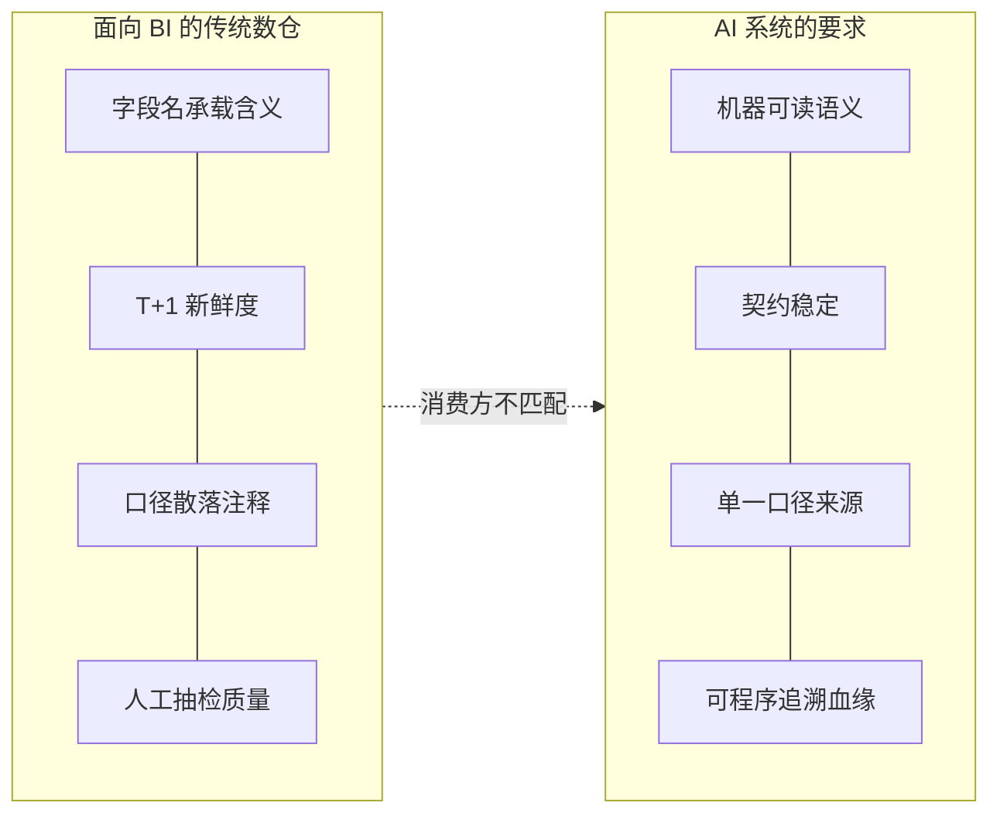
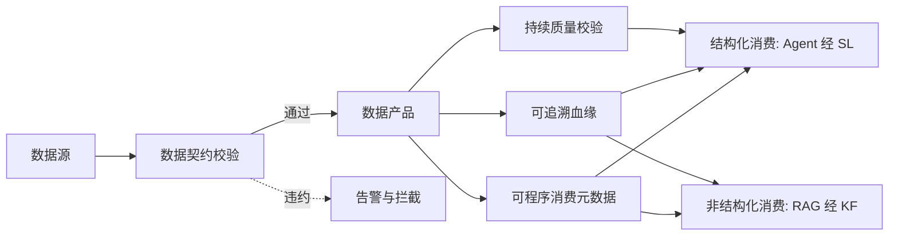

# 数据基座：AI Ready Data Platform

> 本章所属 DDA 层：AI Ready Data Platform

## 问题

为什么 AI 改变了数据平台？因为数据平台的消费方变了。

过去十年，数据平台服务的是人。分析师写 SQL 跑报表，业务人员看仪表盘，数据科学家取样本训模型。人能从字段名里猜出业务含义，能容忍 T+1 的新鲜度，能在口径模糊时打电话确认。AI 系统不行。AI 系统是一个不会自己猜业务含义、对契约稳定性高度敏感、需要可追溯血缘的消费方。

数据工程师为什么要学这一层？因为这是所有上层建筑的地基。没有 AI 就绪数据平台，后面要讲的数据本体（Ontology）没有可绑定的数据资产，语义层（Semantic Layer，SL）没有可封装的接口，数据闭环（Data Loop）没有可回流的数据。这一层解决的问题是：让企业数据从"能跑批"变为"能被 AI 系统可靠消费"。

这一层改变的是数据平台的设计前提。传统数仓以 BI 消费为目标设计，AI 就绪数据平台以机器消费为目标设计。两者对语义、新鲜度、契约、血缘、质量的要求完全不同。

从全书框架看，数据基座是对付**语义传递不可靠**的第一道工程防线：用数据契约把字段含义写进机器可读的协议，用可程序消费的元数据替代"靠字段名猜"，用血缘让 Agent 追溯一个数字从哪来、依据什么口径算出。传递链从这里起步，后面 Ontology 收拢业务共识，语义层封装稳定接口。

需要强调的是，AI 时代的数据消费方不止一类。一类是 AI 智能体（AI Agent）经语义层查询结构化数据，另一类是知识库与检索增强生成（Retrieval-Augmented Generation，RAG）应用消费非结构化知识与数据。数据基座要同时支撑这两类下游：结构化数据被 Agent 经 SL 消费，非结构化知识被 RAG 经知识基础设施（Knowledge Foundation，KF）检索。两类下游都依赖数据基座提供的契约、元数据与血缘，只是消费路径不同。本章聚焦数据基座本身，下游消费方式在后续章节展开。

## 传统方案

面向 BI 的数据平台是这样设计的：数据经 ETL 入仓，按主题域分表，字段名承载业务含义，口径写在 ETL 注释或 BI 语义层里，新鲜度多为 T+1，质量靠人工抽检与 SLA 报表。

药明诺华的早期数据平台也是这个形态。化合物表 `dwd_compound` 存研发代号与属性，临床试验表 `dwd_clinical_trial` 存试验进度，监管文档存在文档管理系统里。分析师查"在研的 c-Met 抑制剂有哪些"，自己写 SQL，自己在字段名里找含义。

这种设计在 BI 时代工作得很好。报表稳定，口径靠人脑对齐，数据团队的核心工作是保证 T+1 跑通。

但有一类企业早就不满足于这个形态：垂直数据服务商。企业征信平台覆盖三亿多家企业，每周新增四十七万、注销三十七万家，数据摄入是准实时而非 T+1。它要把同一主体在工商、税务、司法、海关多源系统里的不同编号统一到一个实体，要把股权、高管、投资、担保关系织成可多跳查询的关联图谱，要保证付费的银行客户做贷前尽调时查到的数字准确--脏数据流向付费客户就是直接的经济损失。专利数据平台覆盖两亿多件专利、横跨一百七十多个司法辖区，要把同一发明在不同专利局的公开号对齐到同一专利族，要把化学结构从专利图片里提取成可检索的分子指纹，要支持跨语言的全文检索与引用网络分析。这些实体对齐、口径统一、血缘追溯、质量门禁，远在 AI 之前就做到了生产级。

本书讲的数据契约、可程序消费元数据、可追溯血缘、持续质量校验，对这类企业不是新概念，是已经跑通的日常工程。这意味着 AI 就绪数据平台的方法论有真实行业根基：它不是为 AI 凭空设计，而是把数据服务商早已验证的治理能力，扩展到多模态知识与 Agent/RAG 消费。理解了这一点，后面各章的"为什么失效"就有了对照基准--失效往往不是因为企业没做数据治理，而是治理的目标还停留在"服务人读数据"，没升级到"服务机器消费"。

## 为什么失效

失效不是因为慢，是因为消费方换了。具体失效机制有四条。

第一，AI 读不到数据含义。字段名 `cmpd_status` 对人可能够用，对 AI 是黑箱。AI 不知道 `cmpd_status='A'` 是"活性化合物"还是"已归档"，更不知道这张表和 `dwd_clinical_trial` 的关联语义。含义散落在表名、字段名、ETL 注释、BI 口径里，没有单一来源，AI 无法程序化读取。这是**语义传递不可靠**在数据层的典型表现：数据在管道里流动，但业务含义没有随数据一起可靠地传下去。

第二，契约不稳定导致管道断裂。传统数仓里，上游改字段名、改类型、改取值含义是常态，下游靠人工通知与临时修复。AI 系统不能容忍这种漂移。Agent 上周还能查的语义接口，这周因为上游改了字段名就返回空。没有显式契约，就没有稳定的消费边界。

第三，血缘不可被 Agent 追溯。传统血缘服务于数据治理，给人看上下游关系。AI 系统需要的是：当 Agent 拿到一个数字，能顺着血缘追溯到原始数据、计算逻辑、口径定义，从而判断这个数字可信不可信。传统血缘的粒度和可消费性，达不到这个要求。

第四，知识库与 RAG 应用无法绑定数据资产。传统数仓只为 BI 设计，既不给 Agent 提供语义接口，也不给知识库与 RAG 提供可绑定的数据资产与可追溯血缘。结果是 RAG 应用直接复制一份数据到向量库自建语义，与数仓口径脱节--AI 答案里的数字和报表对不上，因为两边各算各的。传递不可靠从结构化侧蔓延到非结构化侧，消费方各自收到不同版本的"业务真相"。



图：传统数仓与 AI 系统消费要求的错位（DDA 层：AI Ready Data Platform）

解读这张图：左侧是面向 BI 的数仓设计假设，右侧是 AI 系统的消费要求。两者错位不是哪一方做错了，而是设计前提不同。AI 就绪数据平台要做的，是把右侧四项作为一等公民重新设计。

## 新的设计思想

数据驱动 AI（Data-Driven AI，DDA）方法重新看这一层：数据平台不再只服务人，而要服务一个不会自己猜业务含义的机器消费方。围绕这个前提，四项设计思想成立。

第一，数据契约（Data Contract）[^1] 是一等公民。生产者与消费者之间有显式、可程序校验的协议，字段名、类型、取值含义、变更规则都写进契约。契约变了，下游立刻知道。

第二，元数据可被程序消费。表的业务含义、口径定义、上下游关系不是写给人看的文档，而是机器可读的元数据，Agent 能直接查询。

第三，数据血缘可被 Agent 追溯。血缘不是给人看的可视化，而是可程序遍历的图，Agent 拿到一个结果能顺藤摸瓜回原始数据。

第四，质量被持续校验。不是 T+1 跑完抽检，而是写入即校验，异常即告警，质量是数据管道的运行时属性。

这四项合起来，就是把数据从"能跑批"提升到"能被 AI 可靠消费"。需要强调的是，数据契约与可程序消费的元数据，既是 Agent 经语义层消费结构化数据的基础，也是知识基础设施把非结构化知识绑定到数据资产的基础。两类下游消费路径不同，但都依赖数据基座的契约与血缘能力。

## 架构设计



图：数据契约驱动的数据产品架构（DDA 层：AI Ready Data Platform）

解读：数据源入仓前先过契约校验，通过则成为数据产品，违约则拦截告警。数据产品对外暴露三类能力：可程序消费的元数据、可追溯的血缘、持续运行的质量校验。这三类能力分别服务两类下游消费方：结构化消费方（Agent 经 SL）与非结构化消费方（RAG 经 KF）。两类消费方走不同路径，但共享数据基座的契约与血缘。这张图的核心是契约前置与能力外显，且数据基座为多类下游预留统一的能力出口。

数据产品是这一层的基本单位。它不是一张表，而是一个带契约、带元数据、带质量门禁的可消费单元。一个数据产品对外暴露的，是稳定的语义接口，而非脆弱的表结构。

## 工程实践

### 数据契约的定义

数据契约用 YAML 声明，包含字段、类型、业务含义、变更规则。以药明诺华的化合物数据产品为例：

```yaml
name: compound_active
owner: data-platform@novapharm.example
description: 活性化合物清单，含研发代号与属性
contract:
  version: 1.2.0
  fields:
    - name: compound_id
      type: string
      business_meaning: 化合物内部唯一标识
      constraints: [not_null, unique]
    - name: research_code
      type: string
      business_meaning: 研发代号，如 NVP-001
      constraints: [not_null]
    - name: target
      type: string
      business_meaning: 作用靶点，如 c-Met
      allowed_values: [c-Met, EGFR, KRAS]
    - name: status
      type: string
      business_meaning: 研发状态
      allowed_values: [discovery, preclinical, phase1, phase2, phase3, marketed, withdrawn]
change_policy:
  breaking_change: requires_major_version
  notification: contract-broadcast@novapharm.example
```

这份契约同时服务于人和机器。数据团队读它确认口径，Agent 读它理解字段含义。契约版本号控制变更：新增字段是小版本，改类型或改取值含义是大版本，大版本变更必须广播下游。

### 五项 AI 就绪特性

把"AI 就绪"拆成可执行的五项特性，避免它沦为一个口号。

1. **语义化**：每个数据产品有机器可读的业务含义，不是靠字段名猜。
2. **可治理**：契约、血缘、口径有单一来源，变更可追溯。
3. **可追溯**：从消费结果到原始数据的血缘可程序遍历。
4. **低延迟**：关键链路支持准实时，满足 Agent 的时效要求。
5. **安全**：访问按数据产品粒度授权，不开放裸库。

这五项是验收标准。一个数据产品声称"AI 就绪"，就对照这五项检查，任何一项不达标都不算就绪。

这五项不是理论指标，垂直数据服务商早已用商业模式验证过它们。企业征信平台把数据当付费产品卖，"语义化"是数据 API 必须带字段含义说明，否则客户不会调；"可治理"是同一企业的关联关系必须跨源一致，否则银行尽调报告自相矛盾；"低延迟"是借款人新被列入失信被执行人名单后，贷后风控必须准实时感知，T+1 就来不及拦这笔放款。专利数据平台同理，"可追溯"是客户质疑某个专利价值评分时，必须能追溯到引用网络与权利人标准化逻辑。这些要求在 BI 时代对付费的人就已经成立，AI 只是让它们从"对付费客户负责"扩展到"对 Agent 决策负责"，容错更低。

### 数据可观测性作为质量的运行时保障

质量校验不是 T+1 抽检，而是写入即校验。数据可观测性 [^2] 提供四层信息模型，作为质量问题的传感器：

- **Trace（在哪发生）**：数据从源到消费的链路追踪，定位故障环节。
- **Metrics（何时发生）**：新鲜度、吞吐、延迟等指标，触发时效告警。
- **I/O（是什么）**：输入输出的数据形态，校验契约符合度。
- **State（为什么）**：管道运行状态，解释异常根因。

这四层在后续 Data Loop 章会再次出现，作为闭环的传感器。这里只需记住：质量不是事后审计，是运行时属性。垂直数据服务商把这套可观测性做到了商业级--准实时摄入的每条记录都要可定位、可监控、可校验，延迟即服务事故。

### 为下游而设计：从数据基座到知识基座

数据基座不只服务 Agent 的结构化查询，也服务知识库与 RAG 的非结构化消费。这里说明数据基座如何被下游消费，而非以高层概念为设计依据。

**契约被 KF 用于文档-数据绑定**。知识基础设施把非结构化文档（CSR、SOP）绑定到 Ontology 实体，而实体的数据侧面来自数据基座的数据产品。化合物实体的属性（研发代号、状态、靶点）来自 `compound_active` 数据产品，这份产品的契约保证属性稳定可消费。KF 的文档绑定因此能锚定到稳定的数据资产，而非悬空概念。

**血缘被 RAG 用于引用溯源**。RAG 生成答案时引用的数据，需要可追溯。数据基座的可程序遍历血缘，让 RAG 的引用坐标（文档、章节、块）能追溯到对应的数据产品与计算逻辑。这样 AI 答案里的数字与报表对得上，因为两者共享同一份血缘与口径。

**元数据被 Agent 与 RAG 共享**。可程序消费的元数据，Agent 经 SL 读取用于结构化查询，RAG 经 KF 读取用于生成时对齐数据口径。两类消费方共享同一份元数据，保证口径一致。

数据基座的设计原则因此要补一条：为结构化（Agent 经 SL）与非结构化（RAG 经 KF）两类消费预留契约与血缘能力。这不是以 KF/RAG 为设计依据，而是数据基座作为地基，天然要支持多类下游消费。

### 三个反模式

工程实践里常见的三个坑，每个都有具体失效机制。

**索引漂移**：向量索引在数据增量写入后未重建，召回率持续下降，AI 答案越来越不准。根因是把索引当作一次性产物，而非需要持续维护的状态。向量索引的持续维护见第 5 章 RAG 多向量架构。

**AI 外挂式接入**：把 AI 当作数据平台的事后插件，复制一份数据到 AI 沙箱自建语义。结果是语义与数仓口径脱节，AI 给出的数字和报表对不上。

**一平台通吃**：试图用一套配置同时服务 BI 和 AI，结果两头不讨好。BI 要稳定口径，AI 要可程序消费的语义，两者的契约粒度与新鲜度要求不同，应允许分层。

## 最佳实践

**数据产品化** [^3]：把数据当作产品管理，每个数据产品有负责人、契约、SLA、消费者清单。这是治理粒度的最小单位。

**契约先行**：新建数据产品先定义契约再写 ETL，而非写完 ETL 再补文档。契约是设计产物，不是事后记录。

**质量门禁入管道**：质量校验作为管道的一环，违约即拦截，不让脏数据流向下游。参考 Deequ 等质量门禁工具（仅为一种实现选择）。

**分层而非分库**：BI 消费与 AI 消费可以在同一物理平台，但语义层与契约层分开。物理复用降成本，逻辑分层保边界。

**为两类下游预留能力**：数据基座要为结构化消费（Agent 经 SL）与非结构化消费（RAG 经 KF）都预留契约与血缘能力，不偏废其一。

**诚实面对成本**：AI 就绪不是免费午餐。契约维护、元数据治理、持续质量校验都是持续投入。在 PoC 阶段可以简化，但进入生产前必须补齐。

## 延伸阅读

- **数据契约与数据产品**：Dehghani《Data Mesh》关于数据产品与数据网格的论述；Data Contract 规范社区资料。
- **AI Ready 数据平台**：Thoughtworks Looking Glass 关于"从数据平台到 AI 就绪数据生态"的讨论；Data Mesh 2.0 与可组合数据产品平台相关资料。
- **数据可观测性**：Monte Carlo 等关于数据可观测性四层信息模型的资料；数据质量门禁（Deequ 类）相关资料。

[^1]: 数据契约（Data Contract）的概念与规范，参见 Data Mesh 相关论述与 Data Contract 社区规范。
[^2]: 数据可观测性（Data Observability）的概念与四层信息模型，参见 Monte Carlo 等数据可观测性厂商的方法论资料。
[^3]: 数据产品化（Data Product）的论述，参见 Dehghani《Data Mesh》。

## Checklist

- [ ] 是否每个对外消费的数据产品都有显式数据契约？
- [ ] 契约是否包含字段业务含义，且机器可读？
- [ ] 是否有契约版本控制与破坏性变更广播机制？
- [ ] 数据血缘是否可被 Agent 程序化遍历，而非仅可视化？
- [ ] 质量校验是否在写入时执行，违约即拦截？
- [ ] 五项 AI 就绪特性是否逐项达标，而非笼统声称？
- [ ] AI 消费方是否经数据产品的语义接口消费，而非直连裸库？
- [ ] 数据基座是否为结构化（Agent 经 SL）与非结构化（RAG 经 KF）两类消费都预留了契约与血缘能力？

---

**自检（依据 WRITING_STYLE §9）**：本章为何需要？因为 AI 改变了数据平台的消费方，且消费方不止 Agent 一类。数据工程师为何关心？这是 Ontology 与 Data Loop 的地基，也是 KF/RAG 的数据资产来源。解决什么问题？让数据能被 AI 可靠消费，支撑结构化与非结构化两类下游。属哪一 DDA 层？AI Ready Data Platform。改变什么架构？把契约、元数据、血缘、质量从辅助项提升为一等公民，并为多类下游预留统一能力出口。
