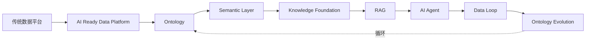

# Data-Driven AI：从数据到智能

> Teach Data Engineers How to Think AI.

一部开源技术书籍，帮助具有数据研发背景的工程师完成 AI 思维升级。

本书不是 AI 入门教程，不是 Prompt Engineering 教程，不是框架使用手册。

本书唯一目标：让读者从数据视角理解 AI。

---

## 全书主线

整本书只有两个真正的核心：**Ontology** 与 **Data Loop**。

---

## 章节导航

- [前言](preface/index.md)
- [数据基座：AI Ready Data Platform](foundation/index.md)
- [数据本体：Ontology](ontology/index.md)
- [语义层：Semantic Layer](semantic-layer/index.md)
- [检索增强：RAG](rag/index.md)
- [AI 智能体：Agent](agent/index.md)
- [数据闭环：Data Loop](data-loop/index.md)
- [附录](appendix/index.md)

---

## 贡献

写章节前请先读 [AGENTS.md](../AGENTS.md) 与 `handbook/` 规范。
