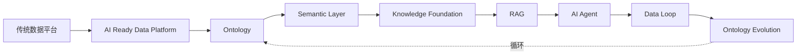

# Data-Driven AI：从数据到智能

  

> Teach Data Engineers How to Think AI.

一部开源技术书籍，帮助具有数据研发背景的工程师完成 AI 思维升级。

定位：资深数据工程师的 AI 思维升级短篇 + 路线决策框架，非初级 AI 教程。

本书不是 AI 入门教程，不是 Prompt Engineering 教程，不是框架使用手册。

本书唯一目标：让读者从数据视角理解 AI。

---

## 全书主线

全书绕两个核心转：**Ontology** 与 **Data Loop**。

读的时候带着两条线：怎么驯服业务语义不可靠（问题从哪来），怎么把数据做成升级版产品交付出去（工程落点在哪）。详见[前言](preface/index.md)。

---

## 章节导航

- [前言](preface/index.md)
- [数据基座：AI Ready Data Platform](foundation/index.md)
- [数据本体：Ontology](ontology/index.md)
- [语义层：Semantic Layer](semantic-layer/index.md)
- [知识基础设施：Knowledge Foundation](knowledge-foundation/index.md)
- [检索增强：RAG](rag/index.md)
- [AI 智能体：Agent](agent/index.md)
- [数据闭环：Data Loop](data-loop/index.md)
- [本体演进：Ontology Evolution](ontology-evolution/index.md)
- [路线选择与适用边界](decision-boundary/index.md)
- [附录](appendix/index.md)
---

## 贡献

写章节前请先读 [AGENTS.md](AGENTS.md)（内含 `handbook/` 规范索引）。
