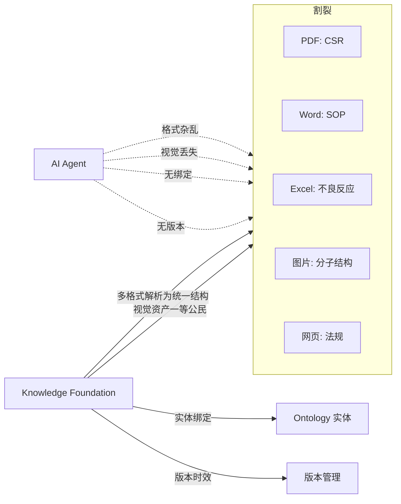
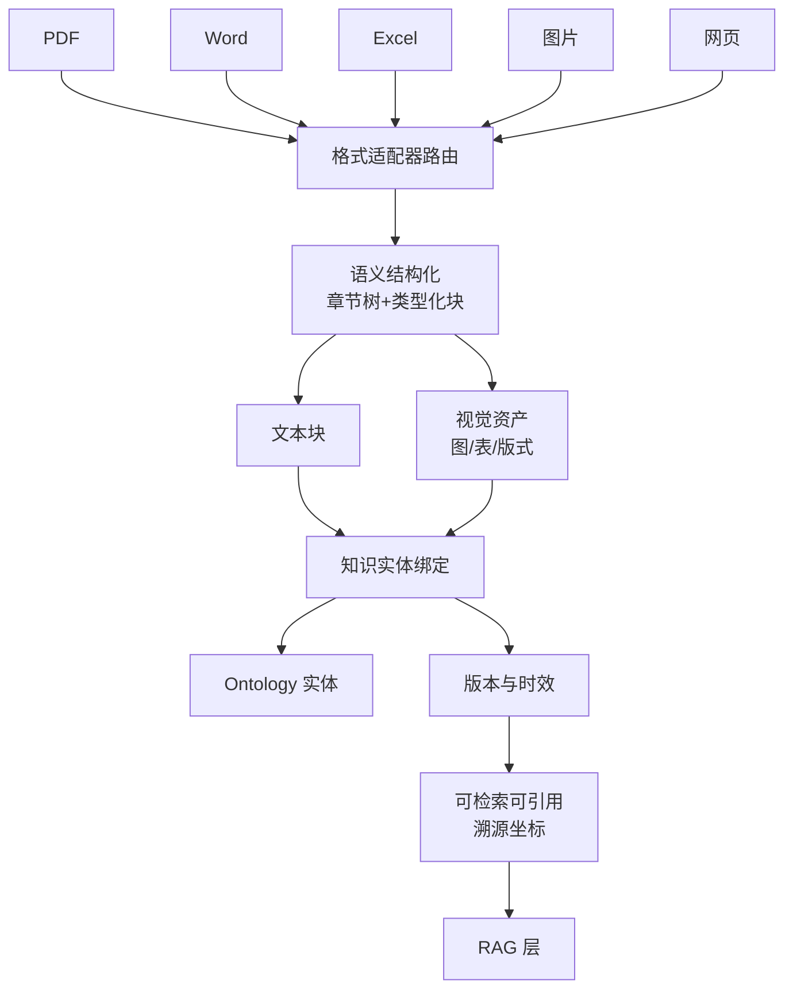
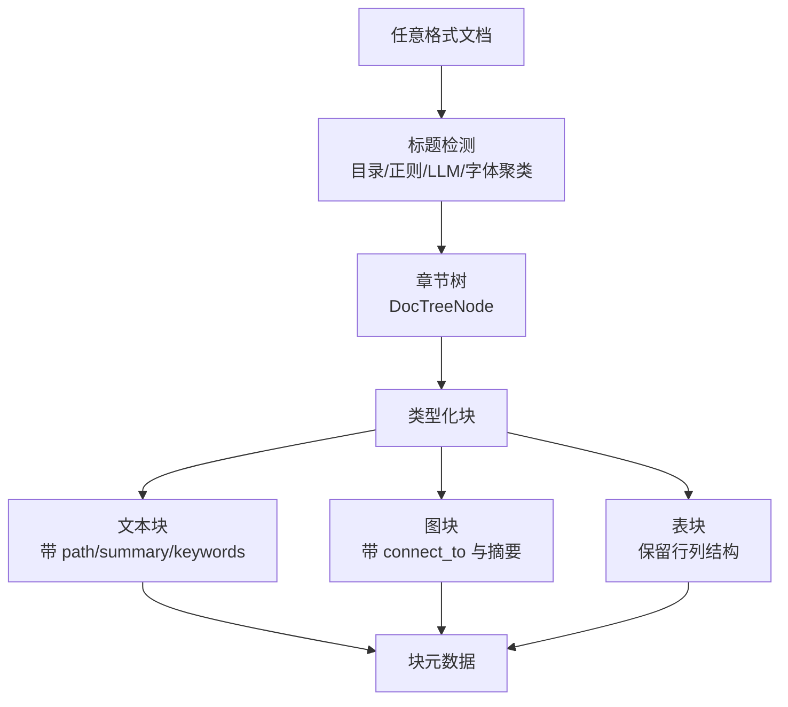

# 知识基础设施：Knowledge Foundation

> 本章所属 DDA 层：Knowledge Foundation

## 问题

数据只记录"是什么"，知识解释"为什么"和"怎么做"。AI 系统两者都要：只查数据，拿不到背景与规则；只读文档，又对不上数仓里的实体。

药明诺华的临床试验数据里有一行：化合物 `NVP-001`、试验编号 `NCT040...`、状态 `terminated`。数据告诉你试验终止了，但不告诉你为什么终止、终止流程是什么、终止后化合物状态如何流转、监管文档要怎么补。这些在试验方案、标准操作规程（Standard Operating Procedure，SOP）、临床研究报告（Clinical Study Report，CSR）里写着。数据是结构化的结果，知识是非结构化的背景与规则。

知识基础设施（Knowledge Foundation，KF）是把结构化语义与非结构化知识统一起来的一层。前面建的数据本体（Ontology）和语义层（Semantic Layer，SL）解决了结构化数据的机器理解，但企业里大量知识是非结构化文档。KF 要把多类型、多模态文档变成统一组织、可绑定、可追溯、可版本化的**知识产品**，纳入与结构化数据同一套产品目录——否则传递不可靠会发生在"数仓叫 `NVP-001`、CSR 写 `savolitinib`"这类结构化与非结构化边界上，时效不可靠则表现为 SOP 换版后仍被当作现行规程引用。

企业知识库的现实是：文档类型极度杂乱。药明诺华的知识库里有 PDF 版的 CSR 与试验方案、Word 版的 SOP、Excel 版的不良反应清单、图片格式的分子结构图与剂量-响应曲线、网页版的监管法规。这些文档不仅携带文本信息，也携带大量视觉信息--表格、图表、版式、分子结构。KF 要处理的不是"一堆文本文档"，而是"一堆类型各异、模态各异、互不关联的非结构化资料"。

## 传统方案

传统企业的知识管理约等于文档库。药明诺华的早期实践是：SOP 存在文档管理系统，试验方案存在临床系统附件里，CSR 存在监管归档里，不良反应清单是 Excel 邮件附件，分子结构图散在研究员电脑里，监管法规是收藏夹里的网页链接。

这种方案的问题不在文档本身，在于四点：格式杂乱、模态丢失、互相割裂、无版本管理。PDF、Word、Excel、图片、网页各自为政，没有一个统一的组织方式把它们变成机器可消费的知识资产。

## 为什么失效

格式异构是最先卡住的地方。PDF 的 CSR 用版面解析，Word 的 SOP 用段落解析，Excel 的不良反应清单是表格结构，图片的分子结构图是纯视觉，网页的法规是 HTML。没有统一的解析与组织，AI 要么只能处理单一格式，要么把所有文档当纯文本处理，丢掉结构。问"3.2 节的不良反应清单"，AI 在 PDF 正文里找不到，因为它在 Excel 附件里。

视觉信息也会在这一步丢光。药企文档大量信息在表格、图表、分子结构图里。把 CSR 当纯文本处理，表格被拍平成乱序文字，图表被直接丢弃。AI 问"某化合物的剂量-响应曲线"，文档库里根本没有可消费的视觉信息。视觉信息不是装饰，是知识本身。

知识与数据还会各走各的。AI 查到化合物 `NVP-001` 的试验状态是 `terminated`，想解释为什么，得去文档库搜 `NVP-001`。但文档库里用的是通用名 `savolitinib`，不是 `NVP-001`。没有别名消歧的关联，AI 找不到对应文档。文档是孤岛，数据是另一个孤岛。这是传递链在结构化与非结构化之间的断裂——两边各自"传到了"，但传的不是同一实体的语义。

版本与时效没人管，就更麻烦了。两年前的 SOP 还在文档库里，AI 把它当作现行规程引用，给出过时答案。没有知识的时效管理，AI 的回答不可信。这是**语义时效不可靠**在知识侧的表现：不是检索不到，是检索到了已经过时的定义。



图：多类型多模态文档的割裂与 KF 的统一（DDA 层：Knowledge Foundation）

## 新的设计思想

DDA 方法重新看这一层：知识不能停在杂乱文档库，必须被统一组织、绑定到实体、管版本。PDF、Word、Excel、图片、网页各有合适的解析适配器，解析后归一到同一种结构化表示：章节树加类型化块。不论来源格式，知识资产在 KF 里形态统一。

表格、图表、分子结构图不丢弃、不拍平，作为与文本块并列的视觉资产保留。视觉信息是知识本身，不是文本的附属。每份知识资产（文本块或视觉资产）还要显式绑定到 Ontology 实体 [^1]：SOP 绑定到试验实体，CSR 绑定到化合物与试验实体。知识不再悬空，而是锚定在业务对象上。

版本与时效同样不能缺。知识有版本，有过期机制；现行规程与历史规程可区分，AI 不会引用过时知识。每份知识资产还带完整的溯源坐标（路径、文档 ID、页码、块 ID），AI 引用时能追溯到具体位置——引用是问责的基础。

KF 在结构化语义（Ontology + SL）之上叠加非结构化知识，形成 AI 可消费的完整知识基础。KF 产出的是组织好的知识资产，下一章 RAG 在其上做向量化、多路检索、视觉融合、接地与引用生成。KF 负责"把杂乱文档组织成统一知识资产"，RAG 负责"从知识资产里检索与接地"。

## 架构设计



图：Knowledge Foundation 多格式多模态组织架构（DDA 层：Knowledge Foundation）

KF 在全书主线里位于 SL 之上、RAG 之下。SL 提供结构化语义接口，KF 在其上叠加非结构化知识并绑定到 Ontology 实体，RAG 在 KF 之上做检索与接地。

## 工程实践

### 多格式解析适配器

企业知识库的杂乱首先体现在格式。不同格式需要不同的解析方式，但解析后必须归一到统一结构。以 Knowhere（Ontos-AI/knowhere，一种文档语义解析服务 [^2]，仅为一种实现选择）的设计为参照，按格式选适配器：

| 文档格式 | 解析适配器 | 结构化要点 |
| --- | --- | --- |
| PDF | 版面解析（OCR + 字体聚类） | 标题按字体大小聚类分档，重建章节层级 |
| Word | OXML 元素遍历 | 用目录作标题层级 ground truth，遍历段落检测标题 |
| Excel | 表格结构解析 | 保留行列结构，表头与数据区分，转类型化表格块 |
| 图片 | 视觉解析 | 像素原生保留，附文本摘要与所属章节 |
| 网页 | HTML 解析 | 按 DOM 结构提取标题与正文，去导航噪声 |

关键工程原则是"适配器各异，归一相同"。每个适配器处理自己格式的特殊性，但输出同一种结构：章节树加类型化块。这样下游不论面对哪类文档，消费方式统一。

### 语义结构化：从文档到章节树

不论什么格式，解析后的核心产物是章节树与类型化块。这是 KF 组织知识的基础工作。



图：语义结构化产出章节树与类型化块（DDA 层：Knowledge Foundation）

标题检测的多法配合是工程关键：DOCX 的目录是标题层级的 ground truth；正则匹配编号标题（如"3.2 不良反应"）；LLM 给候选标题分配层级；PDF 用字体大小聚类把标题分成几档。多种方法覆盖不同格式与排版习惯。

类型化块是保留模态的关键。一个块知道自己是文本、图还是表，下游检索能按类型过滤，生成能按类型组织证据。这比把所有内容拍平成文本强得多。

### 视觉资产作为一等公民

药企文档的视觉信息不是装饰，是知识本身。剂量-响应曲线、分子结构图、入组流程图、不良反应表格，这些信息在像素与版式里，不在文字里。KF 必须把视觉信息作为与文本块并列的一等资产保留，而非丢弃或拍平。

这件事垂直数据行业已经做到生产级。专利数据平台要处理专利文件里的化学结构图--这些图是知识产权的核心，但它们以图片形式嵌在 PDF 里，纯文本检索完全够不到。生产级做法是用光学化学结构识别（Optical Chemical Structure Recognition，OCSR）把结构图转成 SMILES [^3] 分子式，再建分子指纹索引，让化学结构可检索、可比较相似度。企业征信平台要处理扫描件--营业执照、财务凭证、合同--用文档理解引擎把它们转成 Markdown 加坐标的结构化输出，每个段落、表格、图片都带八点坐标，可精准定位回原文。这些引擎的输出格式是"大模型原生友好"的：Markdown 喂 RAG，坐标喂引用溯源，类型化元素喂语义结构化。它们证明了一件事：把文档从"人看的图片"变成"机器消费的结构"，是数据服务商干了十几年的活，现在成了 KF 的基础能力。

视觉资产分三类来源，都作为一等公民存入 KF：

- **内嵌图块**：文档里的图片（分子结构图、流程图），经解析提取，附文本摘要与所属章节。化学结构图还要转成分子式，进入化学结构向量空间（见第 5 章 RAG 领域专用空间）。
- **表格块**：Excel 表格或文档内表格，保留行列结构，而非拍平成文字。不良反应清单的行列结构是它的语义。
- **版式块**：PDF 页面渲染成的像素块，保留版式信息，用于回答"这张表第几行写了什么"这类版式敏感问题。

每类视觉资产都带溯源坐标：所属文档、章节路径、页码、块 ID。这让它可被引用、可被检索、可被绑定。

视觉资产与文本块通过 `connect_to` 元数据互相关联：文本块链接到它内嵌的图或表，图块链接到它所在的文本段落。这样检索到一个图块时，能找到它的文本上下文；检索到文本段落时，能找到它引用的图表。这种关联是 KF 内部的，不依赖外部向量检索。

### 知识实体绑定

结构化之后，每份知识资产（文本块或视觉资产）显式绑定到 Ontology 实体。这是 KF 区别于文档库的关键。以药明诺华的监管文档为例：

```yaml
knowledge_asset:
  id: sop_phase1_termination_v3_sec3_2
  type: SOP
  source_format: docx
  title: Phase I 试验终止操作规程
  version: 3.0
  effective_from: 2025-01-01
  effective_to: null
  status: current
  chunk:
    path: pharma/sop/phase1_termination/3 终止流程/3.2 通知监管
    chunk_type: text
    summary: 试验终止后 48 小时内通知监管机构
    keywords: [终止, 通知, 监管, 48小时]
    connect_to: [table_notification_template_v3]
  binds_to:
    - entity: Trial
      relation: governs
    - entity: Compound
      relation: applies_when_status_in
      condition: [phase1]
  provenance:
    document_id: doc_2025_00123
    page: 7
    chunk_id: sop_phase1_termination_v3_sec3_2
  supersedes: sop_phase1_termination_v2_sec3_2
  citations:
    - ref: 21-CFR-Part-11 [^4]
      meaning: 电子记录合规要求
```

要点几处：`source_format` 记录原始格式，`chunk` 部分是结构化后的块信息（含 `path`、`chunk_type`、`connect_to`），`binds_to` 把块绑定到试验与化合物实体并标注触发条件，`provenance` 是完整溯源坐标（文档 ID、页码、块 ID），`supersedes` 建立版本链。AI 查到某化合物试验终止时，能顺绑定关系找到现行 SOP 的具体块，知道流程与合规要求，且能引用到页码与块 ID。

绑定不只是文档级，是块级。一份 CSR 可能几十页，只有 3.2 节与某化合物相关。块级绑定让 AI 精准命中相关块，而非整份文档。

这种把多源知识绑定到实体的做法，垂直数据行业有生产级实践。专利数据平台的新药情报库把药物作为中心实体，向外连接靶点（作用机制）、企业（研发方）、临床试验（研发进度）、专利（知识产权保护）、文献（科学证据）、新闻（实时动态），形成一个以药物为枢纽的知识图。一条药物记录，能同时回答"它作用于什么靶点""谁在开发""做到第几期""专利保护到哪年""有哪些 supporting 文献"。这背后就是把结构化数据（试验进度、专利状态）与非结构化知识（文献全文、新闻舆情）绑定到同一实体的工程。药企的化合物-靶点-试验-监管文档绑定，与这个药物知识图是同构的，只是实体不同。

### 版本与时效管理

时效是 KF 区别于文档库的另一个关键。药明诺华给每份知识资产打三类标记：`current`（现行）、`superseded`（已被取代）、`historical`（历史归档，仅供追溯）。AI 检索时默认只取 `current`，需要追溯历史时才查 `superseded` 与 `historical`。

版本链通过 `supersedes` 字段建立：v3 取代 v2，v2 取代 v1。AI 知道某块知识的演进历史，能回答"这条规程去年是什么样"。

这避免了 AI 引用两年前已废止的 SOP 回答今天的问题。在受监管的药企环境里，引用过时规程是合规事故。

### 引用基础设施

KF 必须支持引用（Citation）。每条知识资产带完整溯源坐标：路径、文档 ID、页码、块 ID。引用不是装饰，是问责的基础。在药企这种受监管的环境里[^4]，"这个结论依据哪份 SOP 的第几版第几页第几块"是必须能回答的问题。

引用基础设施在 KF 层建好，RAG 层才能在生成时挂上引用。KF 提供溯源坐标，RAG 在生成时把坐标变成可读引用。两层分工：KF 保证坐标完整，RAG 保证引用挂对。

## 最佳实践

**适配器各异，归一相同**：每类格式用自己的解析适配器，但输出统一的结构化表示。不因格式杂乱就放弃统一组织。

**视觉资产是一等公民**：表格图表不丢弃不拍平，作为与文本块并列的资产保留。视觉信息是知识本身。

**块级绑定优于文档级**：绑定到具体块而非整份文档，让 AI 精准命中相关知识，而非拖入整份文档的噪声。

**时效是一等公民**：知识的现行与过期状态必须显式管理，过期知识是 AI 出错的常见来源。

**溯源坐标贯穿到底**：每份知识资产带路径、文档 ID、页码、块 ID，引用链从 KF 贯穿到 RAG 到 Agent 输出，可追溯到具体位置。

**知识也是产品**：像数据产品一样管理知识资产，有负责人、版本、消费者、衰减监控。

**KF 组织，RAG 检索**：KF 负责把杂乱文档组织成统一知识资产，RAG 负责向量化、多路检索、融合、接地。分工清晰，不越界。

## 延伸阅读

- **文档解析与章节树重建**：Knowhere（Ontos-AI/knowhere）关于多格式文档语义解析与章节树构建的开源实现；MinerU 等 PDF 版面解析工具资料。
- **知识实体绑定**：知识图谱与本体绑定方法相关文献；文档-数据关联的工程实践资料。
- **知识版本与时效管理**：知识资产管理与版本控制相关方法论资料。
- **视觉资产作为一等公民**：多模态知识管理中视觉信息保留与检索的相关研究。

[^1]: 知识绑定（Knowledge Binding）的概念，参见知识图谱与本体工程相关文献。
[^2]: Knowhere 文档语义解析服务，参见 Ontos-AI/knowhere 开源项目。
[^3]: SMILES（Simplified Molecular-Input Line-Entry System）是用 ASCII 字符串线性表示分子结构的记法，如 `C(=O)N` 表示酰胺键，是化学信息学的通用分子表示格式。
[^4]: 21 CFR Part 11 是美国 FDA 关于电子记录与电子签名的联邦法规，要求受监管企业的电子记录具备真实性、完整性与机密性，是药企电子化合规的基线。

## Checklist

- [ ] 是否有覆盖 PDF/Word/Excel/图片/网页的多格式解析适配器，且输出统一结构？
- [ ] 文档是否经语义结构化还原成章节树与类型化块，而非等长切块或整文档存储？
- [ ] 视觉资产（图/表/版式）是否作为一等公民保留，而非丢弃或拍平成文字？
- [ ] 文本块与视觉资产是否通过 connect_to 互相关联？
- [ ] 知识资产是否绑定到 Ontology 实体，且为块级绑定而非仅文档级？
- [ ] 知识是否有版本管理与现行/过期状态标记，AI 检索默认只取现行？
- [ ] 每份知识资产是否带完整溯源坐标（路径/文档 ID/页码/块 ID）？
- [ ] 引用链是否从 KF 贯穿到 RAG 到 Agent 输出，可追溯到具体位置？
- [ ] 是否澄清了 KF 与文档库的区别，未把 KF 仅当作存储？
- [ ] KF 与 RAG 是否分工清晰--KF 组织知识资产，RAG 检索与接地？

---

**自检（依据 WRITING_STYLE §9）**：本章为何需要？因为企业知识库是杂乱的多类型多模态文档，AI 无法直接消费。数据工程师为何关心？KF 是结构化语义与非结构化知识的统一层，多格式解析与视觉资产保留是数据团队的本职。解决什么问题？把 PDF/Word/Excel/图片/网页统一组织成可绑定、可追溯、可版本化的知识资产，保留文本与视觉两类信息。属哪一 DDA 层？Knowledge Foundation。改变什么架构？把杂乱文档库升级为多格式统一解析、视觉资产一等公民、块级实体绑定、带版本与溯源坐标的知识基础设施，并与 RAG 形成"组织-检索"清晰分工。
