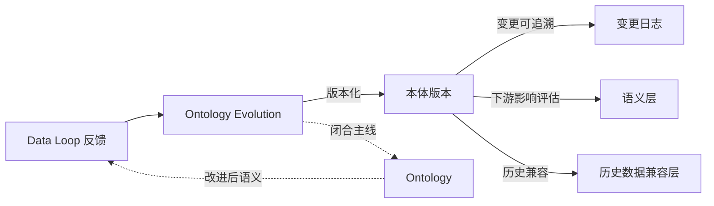
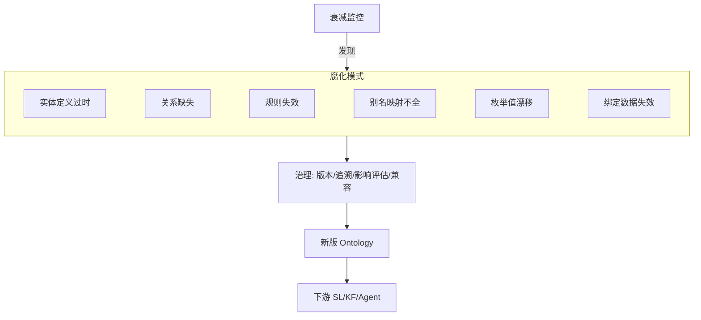

# 本体演进：Ontology Evolution

> 本章所属 DDA 层：Ontology Evolution

## 问题

为什么数据本体（Ontology）不能是一次性建模的产物？因为业务在变，Ontology 不变就会腐化。

药明诺华的 Ontology 上线时，定义了化合物、靶点、试验、研究者四类实体，覆盖当时的研发管线。半年后，公司新开了一条抗体偶联药物（Antibody-Drug Conjugate，ADC）管线，ADC 既有抗体又有连接子又有毒素，不是原来"单一化合物"模型能描述的。如果 Ontology 不演进，要么 ADC 数据塞进不合适的旧模型导致语义错乱，要么 ADC 数据游离在 Ontology 之外成为新的语义孤岛。

数据工程师为什么要学本体演进（Ontology Evolution）？因为这是全书主线的闭合点。前面的层建好了从数据到 Agent 的正向消费链，上一章的数据闭环（Data Loop）让反馈能回流修正 Ontology，本章解决回流之后 Ontology 如何有控制地生长。Ontology 不演进，Data Loop 的"修正本体"那条回流就无处落地；Ontology 演进失控，下游语义层（Semantic Layer，SL）、知识基础设施（Knowledge Foundation，KF）、AI 智能体（AI Agent）全部受冲击。这一层解决的问题是：让 Ontology 能随业务与反馈持续生长，同时保持下游稳定与历史数据兼容。

传递不可靠靠 Ontology 收拢为单一来源，时效不可靠则靠 Ontology Evolution 有控制地更新这个来源。业务新开 ADC 管线、枚举值外溢、别名映射缺了新通用名——都是世界模型与业务现实脱节。没有版本化、下游影响评估与历史兼容，修时效问题时会冲击整条传递链；有了治理流程，演进才是加固而非破坏。

## 传统方案

传统数据建模是一次性工程。项目初期做需求分析，设计实体关系模型，建表上线，结束。之后的变更靠临时工单：加个字段、改个枚举值、补张表，零散进行，没有整体版本管理，没有下游影响评估，没有历史数据兼容考虑。

药明诺华的早期数据模型也是这样。化合物表加字段靠发工单，临床试验状态枚举改值靠人工通知下游，没人全局看这次变更影响了哪些报表、哪些 Agent 接口。

## 为什么失效

失效机制是：Ontology 腐化是渐进过程，等发现时已经冲击下游。

第一，本体与业务脱节。新业务对象出现，Ontology 没跟上，数据被塞进不合适的旧模型。ADC 塞进化合物表，抗体信息丢失，AI 查不全。

第二，下游失效。Ontology 改了实体定义，SL 的语义接口没同步改，Agent 调用就出错。没有下游影响评估，变更的连锁反应不可控。

第三，历史数据兼容断裂。枚举值改了，老数据还是旧值，查询口径不一致。"status='A'" 在旧版本是"活性"，在新版本是"已归档"，同一查询不同时间给不同结果。

Ontology 的腐化有多种模式，常见的有六类：实体定义过时、关系缺失、规则失效、别名映射不全、枚举值漂移、绑定数据资产失效。每种都会让 AI 的判断偏离业务现实。用全书框架说，这六类都是**语义时效不可靠**的不同腐化形态——不是当时建错了，是没跟上业务变化。



图：Ontology Evolution 闭合主线（DDA 层：Ontology Evolution）

解读：Data Loop 的反馈进入 Ontology Evolution，经版本化、变更可追溯、下游影响评估、历史数据兼容四步控制演进，演进后的 Ontology 回到主线起点，改进后的语义又喂给 Data Loop。虚线表示这是主线的闭合回边。这张图说明 Ontology Evolution 不是孤立的建模活动，是 Data Loop 驱动的、有控制的持续生长，它让全书主线真正闭合成环。

## 新的设计思想

DDA 方法重新看这一层：Ontology 是活的产品，不是死的模型。本体演进的设计思想有四点。

第一，Ontology 版本化。本体像代码一样有版本，每次变更有版本号、有变更说明、有作者。版本可回溯，可对比，可回滚。

第二，变更可追溯。每次本体变更记录四个 W：改了什么（What）、为什么改（Why，关联到 Data Loop 的哪条反馈或哪个业务变化）、谁批准的（Who）、何时生效（When）。

第三，下游 SL 影响评估。本体变更前评估对 SL、KF、Agent 的影响，受影响的消费方有迁移窗口。不能改了本体让下游莫名其妙地坏掉。

第四，历史数据兼容。本体演进要保证老数据可读、老查询可解释。枚举值变更要有映射，实体拆分要有归并规则，历史数据不能因为本体升级而失语。

Ontology Evolution 让全书主线闭合：Data Loop 的反馈驱动本体演进，演进后的本体回到主线起点，改进的语义经 SL、KF、RAG 喂给 Agent，Agent 的执行又产生新的反馈。环闭上了。

## 架构设计



图：本体腐化模式与治理（DDA 层：Ontology Evolution）

解读：六类腐化模式由衰减监控发现，进入治理流程，治理经版本化、追溯、影响评估、兼容四步产出新版 Ontology，新版同步下游。这张图说明 Ontology Evolution 是有治理的演进：先发现腐化，再受控修复，最后同步下游，不是随意改模型。

## 工程实践

### 新实体纳入的版本演进

药明诺华纳入 ADC 管线是一次典型演进。旧版本 Ontology 只有 `Compound` 实体。新版本新增 `ADC` 实体，并定义它由 `Antibody`、`Linker`、`Toxin` 三个组件构成，`ADC` 与 `Target` 的关系沿用 `Compound` 的 `targets` 关系。

用 YAML 声明变更：

```yaml
ontology_change:
  version: 2.0.0
  type: minor
  change: 新增 ADC 实体及其组件关系
  reason: 公司新开 ADC 管线，原 Compound 模型无法描述抗体-连接子-毒素结构
  feedback_ref: data-loop-feedback-2025-08-17
  approved_by: ontology-council@novapharm.example
  effective_from: 2025-09-01
  additions:
    - entity: ADC
      properties: [adc_id, antibody, linker, toxin]
      relations:
        - type: targets
          target: Target
        - type: consists_of
          target: [Antibody, Linker, Toxin]
  downstream_impact:
    - layer: Semantic Layer
      change: 新增 list_adc_compounds 接口
    - layer: Knowledge Foundation
      change: ADC 相关 SOP 绑定到新实体
  historical_compat:
    compound_to_adc: legacy_compound_flag
    note: 历史 Compound 数据保留，不强制迁移
```

要点几处：`reason` 关联到具体业务变化与 Data Loop 反馈；`downstream_impact` 列出对 SL 与 KF 的影响及应对；`historical_compat` 规定历史数据如何兼容（保留 legacy 标记，不强制迁移）。这份变更记录同时是文档、是审批依据、是下游通知。

### 别名消歧规则的演进

第二章的别名消歧规则也需要演进。新通用名出现时（如某化合物获批后有了商品名），别名映射要更新。这类变更通常是补丁版本（2.0.1），只加别名不改实体结构，下游影响小，但仍要记录变更与校验不冲突。

药明诺华的做法是：新通用名出现时，先在行业标准编码库（UMLS、RxNorm）查是否已有登记，有则直接引用标准编码，无则内部登记并标注待标准化。这样别名消歧规则随新名出现持续演进，又不脱离标准体系。

这种演进在垂直数据行业是日常工程。专利数据平台的权利人标准化规则要持续演进：企业改名、并购、拆分、跨国注册 variants（如第 2 章所述的华为多名称变体），都会产生新的名称变体，权利人合并规则都要跟上，否则竞争情报分析就会把同一主体的专利算成多家的。专利族定义本身也会演进：不同专利局的对齐规则会调整，PCT [^3] 国家阶段的入口会变化，平台自有的专利族定义需要版本化更新。这些变更如果不受控，下游的专利分析、FTO 检索、竞争情报全部受冲击。这正是 Ontology Evolution 要解决的--本体随业务变化有控制地生长，而不是积压到腐化才大改。

### 衰减监控

Ontology 腐化要靠监控发现，不能等用户投诉。衰减监控关注几类信号：

- **实体使用率下降**：某实体被查询的频率持续下降，可能定义过时。
- **关系缺失告警**：Agent 查询频繁触发"关系不存在"错误，说明缺关系定义。
- **别名未命中**：检索时化合物名频繁无法映射到实体，说明别名映射不全。
- **枚举值外溢**：数据出现枚举定义外的取值，说明枚举漂移或业务变化未跟上。

这些信号很多来自 Data Loop 的可观测层。衰减监控把可观测信号转成本体演进的触发器。

### 用约束语言校验

本体变更后要用约束语言校验一致性。SHACL（一种 RDF 数据约束语言，仅为一种实现选择）配合数据目录工具，可以自动校验：新实体定义是否符合本体规范、关系是否合法、枚举值是否在定义范围内。校验失败则变更不生效，强制修正。

有观察（Gartner 公开报告 [^2]）指出，用约束校验能把本体治理效率提升约两倍，但实际部署率不高。这个发现的工程含义是：校验工具成熟，差距在组织是否把校验纳入变更流程。

### 下游影响评估

本体变更前必须评估对 SL、KF、Agent 的影响。药明诺华的做法是变更评审里列下游影响清单：

- SL：哪些语义接口要新增、要改口径、要废弃。
- KF：哪些知识绑定要更新。
- Agent：哪些 Agent 工作流要调整。

每项影响有负责人确认与迁移计划。没有下游确认的变更不生效。这把"改了本体让下游坏掉"的风险压到最低。

## 最佳实践

**Ontology 即产品** [^1]：把 Ontology 当作产品管理，有负责人、版本、消费者、衰减监控。Ontology 不是一次性建模，是持续维护的产品。

**变更必有四个 W**：每条变更记录改了什么、为什么改、谁批准、何时生效，可追溯可回滚。

**下游影响先评估再变更**：本体变更前评估对 SL、KF、Agent 的影响，下游有迁移窗口。

**历史数据兼容是硬约束**：本体演进不能让历史数据失语。枚举变更要有映射，实体拆分要有归并。

**衰减监控接入 Data Loop**：把可观测信号转成演进触发器，主动发现腐化而非等用户投诉。

**优先在模型知识稀疏区演进**：演进资源投在企业特定、模型不熟悉的概念上，与第二章的建本体原则一致。

**约束校验纳入流程**：变更必须过约束校验，校验失败不生效，不让不一致的本体进生产。

## 延伸阅读

- **本体即产品与衰减模式**：Ontology as product 与六种腐化模式相关资料；本体持续维护与衰减监控方法论。
- **本体约束校验**：SHACL（RDF 数据约束语言）规范；SHACL 与 Collibra 数据目录校验相关 Gartner 报告。
- **本体版本化与下游影响**：本体版本管理与下游语义层影响评估相关工程实践资料。
- **历史数据兼容**：本体演进中枚举映射、实体拆分归并、历史数据兼容相关方法论。

[^1]: Ontology 即产品（Ontology as product）与衰减模式，参见本体治理相关方法论资料。
[^2]: SHACL 与数据目录校验提升治理效率的发现，参见 Gartner 公开报告。
[^3]: PCT（Patent Cooperation Treaty，专利合作条约）是国际专利申请体系，申请人提交一件国际申请即可在多个缔约国寻求保护，"国家阶段"指国际申请进入各国国内审查的环节。

## Checklist

- [ ] Ontology 是否版本化管理，每次变更有版本号与变更说明？
- [ ] 每条变更是否记录四个 W（改了什么/为什么/谁批准/何时生效）？
- [ ] 变更前是否评估对 SL、KF、Agent 的下游影响，并给迁移窗口？
- [ ] 历史数据是否兼容，枚举变更与实体拆分是否有映射或归并规则？
- [ ] 是否有衰减监控，把可观测信号转成演进触发器？
- [ ] 是否用约束语言校验本体一致性，校验失败则变更不生效？
- [ ] Ontology Evolution 是否由 Data Loop 反馈驱动，而非凭感觉改模型？
- [ ] 演进后的 Ontology 是否回到主线起点，改进的语义喂给下游消费方？

---

**自检（依据 WRITING_STYLE §9）**：本章为何需要？因为业务在变，Ontology 不演进就腐化。数据工程师为何关心？Ontology Evolution 是 Data Loop 反馈的落地处，是主线闭合点，是数据治理的延续。解决什么问题？让 Ontology 随业务与反馈有控制地生长，同时保下游稳定与历史兼容。属哪一 DDA 层？Ontology Evolution。改变什么架构？把一次性建模改为版本化、可追溯、有下游影响评估、有历史兼容的持续演进，闭合全书主线。
