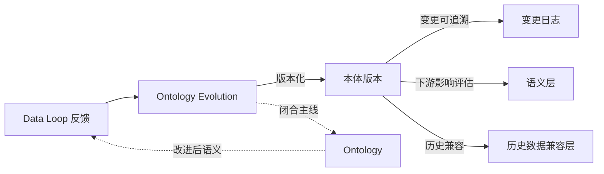
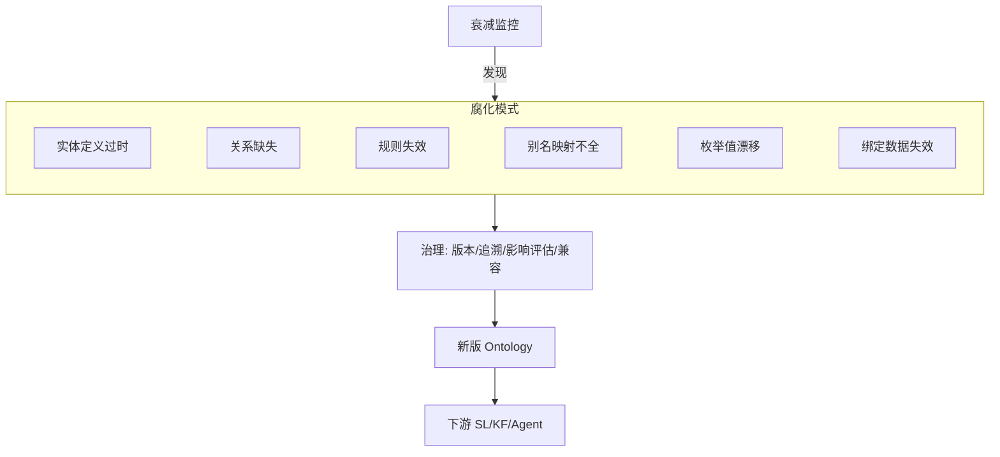

# 本体演进：Ontology Evolution

> 本章所属 DDA 层：Ontology Evolution

## 问题

为什么数据本体（Ontology）不能是一次性建模的产物？因为业务在变，Ontology 不变就会腐化。

药明诺华的 Ontology 上线时，定义了化合物、靶点、试验、研究者四类实体，覆盖当时的研发管线。半年后，公司新开了一条抗体偶联药物（Antibody-Drug Conjugate，ADC）管线，ADC 既有抗体又有连接子又有毒素，不是原来"单一化合物"模型能描述的。如果 Ontology 不演进，要么 ADC 数据塞进不合适的旧模型导致语义错乱，要么 ADC 数据游离在 Ontology 之外成为新的语义孤岛。

前面各层搭好了从数据到 Agent 的消费链，第 7 章 Data Loop 让反馈能回流修正 Ontology——本章管的是回流之后怎么长、长多快。不演进，「修正本体」那条回流没地方落；演进失控，下游 SL、KF、Agent 一起遭殃。

传递不可靠靠 Ontology 收拢口径；时效不可靠靠 Ontology Evolution 更新口径。ADC 新管线、枚举外溢、别名缺新通用名，都是世界模型跟不上现实。没有版本化、影响评估和历史兼容，修一处会震整条链；有治理流程，演进才不会把下游带崩。

## 传统方案

传统数据建模是一次性工程。项目初期做需求分析，设计实体关系模型，建表上线，结束。之后的变更靠临时工单：加个字段、改个枚举值、补张表，零散进行，没有整体版本管理，没有下游影响评估，没有历史数据兼容考虑。

药明诺华的早期数据模型也是这样。化合物表加字段靠发工单，临床试验状态枚举改值靠人工通知下游，没人全局看这次变更影响了哪些报表、哪些 Agent 接口。

## 为什么失效

失效往往是渐进的，发现时下游已经中招。

本体跟不上业务：新业务对象出现，数据被硬塞进旧模型。ADC 塞进化合物表，抗体信息丢了，AI 查不全。

下游没同步：Ontology 改了实体定义，SL 没跟，Agent 调用就错。没有影响评估，连锁反应不可控。

历史口径断裂：枚举改了，老数据还是旧值。「status='A'」旧版是「活性」，新版是「已归档」，同一查询不同时间给不同结果。

腐化常见六类：实体定义过时、关系缺失、规则失效、别名映射不全、枚举值漂移、绑定数据资产失效。每种都会让 AI 判断偏离业务。用全书框架说，都是**语义时效不可靠**的不同形态——多半不是当初建错了，是没跟上变化。



图：Ontology Evolution 闭合主线（DDA 层：Ontology Evolution）

反馈经版本化、追溯、影响评估、历史兼容四步后回到 Ontology，再进入下游。虚线是主线回边——演进不是孤立改模型，而是 Data Loop 驱动的受控生长。

## 新的设计思想

DDA 方法把 Ontology 当作活的产品，不是一锤子买卖的模型。四条纪律：

**版本化**——像代码一样有版本号、变更说明、作者；可回溯、可对比、可回滚。

**变更可追溯**——四个 W：改了什么（What）、为什么改（Why，连到 Data Loop 反馈或业务变化）、谁批准（Who）、何时生效（When）。

**下游影响评估**——变更前看清对 SL、KF、Agent 的冲击，给消费方迁移窗口；不能改完本体让下游悄悄挂掉。

**历史数据兼容**——老数据可读、老查询可解释；枚举变更要有映射，实体拆分要有归并，别让历史数据因升级而失语。

主线在此闭合：Data Loop 驱动演进，新语义经 SL、KF、RAG 到 Agent，Agent 再产反馈。

## 架构设计



图：本体腐化模式与治理（DDA 层：Ontology Evolution）

衰减监控发现腐化 → 治理四步 → 新版 Ontology → 同步下游。先发现、再修、再通知，不是随手改表。

## 工程实践

### 新实体纳入的版本演进

药明诺华纳入 ADC 管线是一次典型演进。旧版本 Ontology 只有 `Compound` 实体。新版本新增 `ADC` 实体，并定义它由 `Antibody`、`Linker`、`Toxin` 三个组件构成，`ADC` 与 `Target` 的关系沿用 `Compound` 的 `targets` 关系。

用 YAML 声明变更：

```yaml
ontology_change:
  version: 2.0.0
  type: minor
  change: 新增 ADC 实体及其组件关系
  reason: 公司新开 ADC 管线，原 Compound 模型无法描述抗体-连接子-毒素结构
  feedback_ref: data-loop-feedback-2025-08-17
  approved_by: ontology-council@novapharm.example
  effective_from: 2025-09-01
  additions:
    - entity: ADC
      properties: [adc_id, antibody, linker, toxin]
      relations:
        - type: targets
          target: Target
        - type: consists_of
          target: [Antibody, Linker, Toxin]
  downstream_impact:
    - layer: Semantic Layer
      change: 新增 list_adc_compounds 接口
    - layer: Knowledge Foundation
      change: ADC 相关 SOP 绑定到新实体
  historical_compat:
    compound_to_adc: legacy_compound_flag
    note: 历史 Compound 数据保留，不强制迁移
```

三处值得看：`reason` 连到业务和 Data Loop 反馈；`downstream_impact` 写清 SL、KF 怎么跟；`historical_compat` 规定历史数据怎么处理（这里保留 legacy 标记，不强制迁移）。一份 YAML 同时当文档、审批单和下游通知。

### 别名消歧规则的演进

第二章的别名消歧规则也需要演进。新通用名出现时（如某化合物获批后有了商品名），别名映射要更新。这类变更通常是补丁版本（2.0.1），只加别名不改实体结构，下游影响小，但仍要记录变更与校验不冲突。

药明诺华的做法：新通用名先在 UMLS、RxNorm 查有没有登记，有就引用标准编码，没有就内部登记并标待标准化。别名规则跟着新名走，但不脱离标准体系。征信、专利行业对权利人、专利族的持续版本化，纪律一样（见[附录](../appendix/index.md)）——Ontology Evolution 说到底就是数据产品目录的**版本管理**。

### 衰减监控

Ontology 腐化不能等用户投诉。衰减监控盯几类信号：

- **实体使用率下降**：某实体被查询的频率持续下降，可能定义过时。
- **关系缺失告警**：Agent 查询频繁触发"关系不存在"错误，说明缺关系定义。
- **别名未命中**：检索时化合物名频繁无法映射到实体，说明别名映射不全。
- **枚举值外溢**：数据出现枚举定义外的取值，说明枚举漂移或业务变化未跟上。

这些信号很多来自 Data Loop 可观测层，监控把它们转成演进触发器。

### 用约束语言校验

本体变更后要用约束语言校验一致性。SHACL（一种 RDF 数据约束语言，仅为一种实现选择）配合数据目录工具，可以自动校验：新实体定义是否符合本体规范、关系是否合法、枚举值是否在定义范围内。校验失败则变更不生效，强制修正。

Gartner 公开报告 [^2] 提到，约束校验能把本体治理效率提大约一倍，但部署率不高。工具够用了，卡点通常在组织有没有把校验写进变更流程。

### 下游影响评估

本体变更前必须评估对 SL、KF、Agent 的影响。药明诺华的做法是变更评审里列下游影响清单：

- SL：哪些语义接口要新增、要改口径、要废弃。
- KF：哪些知识绑定要更新。
- Agent：哪些 Agent 工作流要调整。

每项影响要有人签字、有迁移计划；下游没确认的变更不生效。

第 7 章反馈在此落地为版本化演进。至于「每次变更是否都要建满四层 Ontology」「中小团队先动哪一块」，是投入产出问题，见收束章[路线选择与适用边界](../decision-boundary/index.md)和[附录](../appendix/index.md)的成熟度模型与 RACI。

## 最佳实践

**Ontology 即产品** [^1]：把 Ontology 当作产品管理，有负责人、版本、消费者、衰减监控。Ontology 不是一次性建模，是持续维护的产品。

**变更必有四个 W**：每条变更记录改了什么、为什么改、谁批准、何时生效，可追溯可回滚。

**下游影响先评估再变更**：本体变更前评估对 SL、KF、Agent 的影响，下游有迁移窗口。

**历史数据兼容是硬约束**：本体演进不能让历史数据失语。枚举变更要有映射，实体拆分要有归并。

**衰减监控接入 Data Loop**：把可观测信号转成演进触发器，主动发现腐化而非等用户投诉。

**优先在模型知识稀疏区演进**：演进资源投在企业特定、模型不熟悉的概念上，与第二章的建本体原则一致。

**约束校验纳入流程**：变更必须过约束校验，校验失败不生效，不让不一致的本体进生产。

## 延伸阅读

- **本体即产品与衰减模式**：Ontology as product 与六种腐化模式相关资料；本体持续维护与衰减监控方法论。
- **本体约束校验**：SHACL（RDF 数据约束语言）规范；SHACL 与 Collibra 数据目录校验相关 Gartner 报告。
- **本体版本化与下游影响**：本体版本管理与下游语义层影响评估相关工程实践资料。
- **历史数据兼容**：本体演进中枚举映射、实体拆分归并、历史数据兼容相关方法论。

[^1]: Ontology 即产品（Ontology as product）与衰减模式，参见本体治理相关方法论资料。
[^2]: SHACL 与数据目录校验提升治理效率的发现，参见 Gartner 公开报告。

## Checklist

- [ ] Ontology 是否版本化管理，每次变更有版本号与变更说明？
- [ ] 每条变更是否记录四个 W（改了什么/为什么/谁批准/何时生效）？
- [ ] 变更前是否评估对 SL、KF、Agent 的下游影响，并给迁移窗口？
- [ ] 历史数据是否兼容，枚举变更与实体拆分是否有映射或归并规则？
- [ ] 是否有衰减监控，把可观测信号转成演进触发器？
- [ ] 是否用约束语言校验本体一致性，校验失败则变更不生效？
- [ ] Ontology Evolution 是否由 Data Loop 反馈驱动，而非凭感觉改模型？
- [ ] 演进后的 Ontology 是否回到主线起点，改进的语义喂给下游消费方？

---

**自检（依据 WRITING_STYLE §9）**：为何需要？业务在变，Ontology 不演进就腐化。DE 为何关心？Data Loop 反馈的落地处，主线闭合，数据治理的延续。解决什么？有控制地生长，保下游稳定与历史兼容。属哪层？Ontology Evolution。改什么架构？一次性建模 → 版本化、可追溯、影响评估、历史兼容的持续演进。
