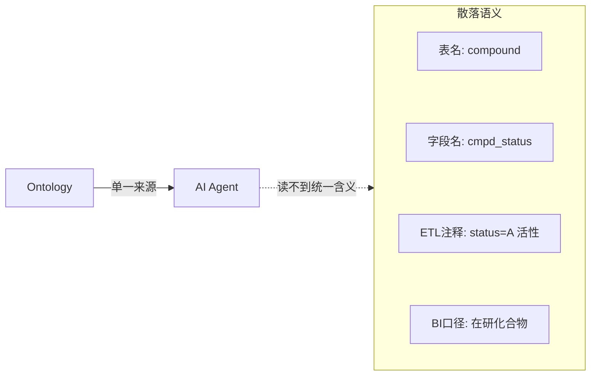
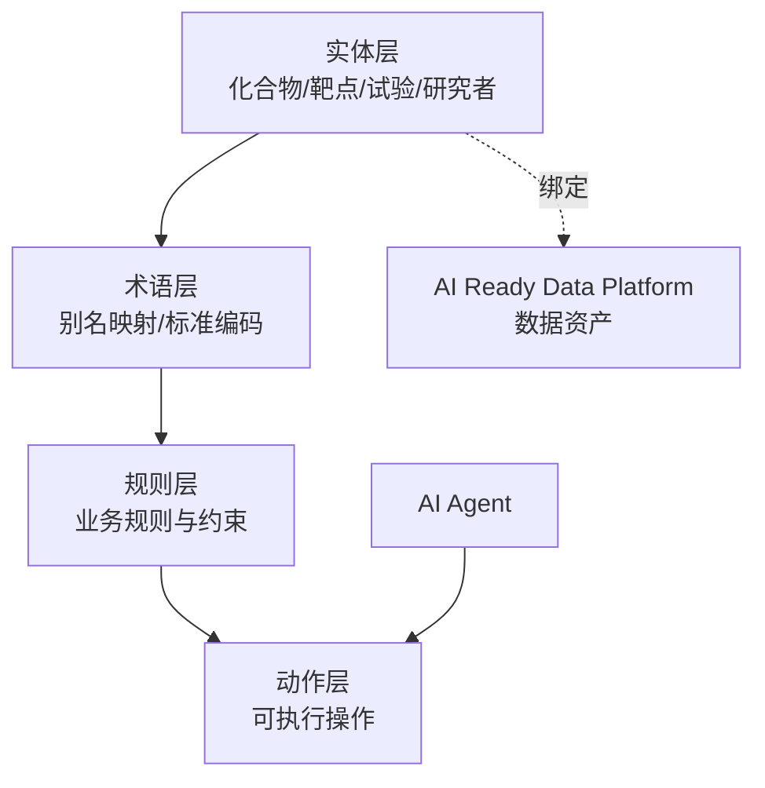

# 数据本体：Ontology

> 本章所属 DDA 层：Ontology

## 问题

为什么 AI 系统需要一份与业务共识对齐的世界模型？因为模型不知道你的企业怎么运作。

通用大语言模型（Large Language Model，LLM）预训练语料里有互联网的常识，但没有你企业的业务规则。它不知道化合物 `NVP-001` 和通用名 `savolitinib` 是同一个药，不知道 c-Met 抑制剂的临床试验要遵循 CDISC SDTM [^3] 标准，不知道"活性化合物"在药明诺华的研发流程里特指通过初筛的候选物。这些是企业内部共识，散落在不同系统与不同人脑里。

数据工程师为什么要学数据本体（Ontology）？因为这是机器理解企业业务世界的方式。前一章建好的 AI 就绪数据平台提供了"原材料"，但原材料本身不携带"如何理解"的说明。Ontology 提供这份说明：它显式定义业务世界里有哪些实体、实体间有什么关系、遵循什么规则、受什么约束。没有 Ontology，AI 系统就只能基于模型自己的猜测理解你的业务，而猜测在受监管的药企环境里是不可接受的。

Ontology 解决的问题是：给 AI 一个与人类业务共识对齐的世界模型。让 AI 的判断有据可依，而不是凭模型记忆发挥。

## 传统方案

传统数据平台里，业务语义没有单一来源。它散落在四处：表名承载实体名（`dwd_compound` 是化合物），字段名承载属性（`cmpd_status` 是状态），ETL 注释承载口径（"status='A' 表示活性"），BI 语义层承载指标定义（"在研化合物数"的过滤条件）。

药明诺华的早期实践也是这样。研发系统的表叫 `compound`，临床系统的表叫 `trial`，监管系统的文档叫 `submission`。三个系统对同一个化合物有不同的编号：研发用 `NVP-001`，临床用 `savolitinib`，监管文档用 CAS 号。要回答" savolitinib 现在在哪个阶段"，得靠人去三个系统里对齐。

这种方案在系统数量少、消费方是人的时候勉强能运转。人脑能在不同表名、不同字段名、不同编号之间建立映射。

## 为什么失效

失效的根本机制是：AI 无法读取散落的语义。

第一，没有单一来源。同一个"活性化合物"的概念，研发系统、临床系统、BI 报表各定义一遍，定义之间还有细微出入。AI 不知道该信哪一个。当 Agent 被问"有多少活性化合物"，不同口径给不同答案，无法追责。

第二，企业规则无法编码。"Phase I 试验失败则该化合物的研发状态自动转为 suspended"，这条规则在研发流程文档里写着，但不在任何数据系统里。AI 无法执行它无法读到的规则。

第三，别名消歧没有机器可读的依据。`NVP-001`、`savolitinib`、`AZD6094`、`HMPL-504`、`volitinib` 指向同一个 c-Met 抑制剂，但模型不知道。靠模型猜，召回率上不去；靠人工对齐，不可持续。这是一类典型的"机器读不到的语义"问题。



图：散落语义与 Ontology 单一来源的对比（DDA 层：Ontology）

解读：左侧是传统平台里语义散落的四处位置，AI 无法从中读出统一含义。右侧 Ontology 作为单一来源，把实体、关系、规则集中定义，Agent 经 Ontology 理解业务世界。这张图说明 Ontology 的价值不在"多一个系统"，而在"把散落语义收拢为机器可读的单一来源"。

## 新的设计思想

DDA 方法重新看这一层：要让机器理解企业业务世界，不能依赖模型猜测，必须显式定义。Ontology 就是这份显式定义。

Ontology 定义四样东西：实体（Entity，业务对象，如化合物、靶点、试验）、关系（Relation，实体间的业务连接，如"化合物作用于靶点""试验研究化合物"）、规则（业务规则，如"Phase I 失败则状态转 suspended"）、约束（业务约束，如"同一化合物的研发代号全局唯一"）。

这里必须澄清一个最常见的混淆：**Ontology 不是知识图谱（Knowledge Graph，KG）[^1]，不是 RDF，不是 OWL，不是图数据库的产品特性。** KG 是一种图结构的实现技术，RDF 与 OWL 是具体的表示语言，图数据库是存储引擎。它们可以是 Ontology 的实现方式之一，但不是 Ontology 本身。Ontology 是"机器如何理解业务世界"这个问题的答案，KG 是这个答案的一种落地形态。本书谈方法论时用 Ontology，谈具体图存储实现时才用 KG。

另一个关键区分：数据模型描述数据怎么存，KG 描述知识怎么检索，Ontology 描述业务世界是什么意思、遵循什么规则、支持什么操作。三者层次不同，不能互相替代。

## 架构设计



图：Ontology 四层架构（DDA 层：Ontology）

解读：Ontology 分四层。实体层定义业务对象，术语层处理别名与标准编码对齐，规则层编码业务规则与约束，动作层定义可执行操作。实体层向下绑定到 AI 就绪数据平台的数据资产，保证 Ontology 不是悬空的概念，而是有数据支撑。AI Agent 经动作层消费 Ontology，而非直接读原始数据。这张图的关键是：Ontology 不是纯概念模型，它通过绑定数据资产落地，通过动作层被 Agent 消费。

Ontology 在全书主线里位于 AI 就绪数据平台之上、语义层之下。它提供"如何理解原材料"，语义层把这份理解工程化为 Agent 可调用的接口。

## 工程实践

### 实体定义与别名消歧

以药明诺华的化合物实体为例，用 YAML 声明，重点处理别名消歧：

```yaml
entity: Compound
description: 候选化合物，研发管线的核心对象
properties:
  research_code:
    type: string
    meaning: 研发代号，企业内部唯一
    example: NVP-001
  status:
    type: enum
    meaning: 研发状态
    values: [discovery, preclinical, phase1, phase2, phase3, marketed, withdrawn]
aliases:
  - type: generic_name
    value: savolitinib
  - type: research_code_alias
    value: AZD6094
  - type: cas_number
    value: "1373746-33-2"
  - type: pubchem_cid
    value: "51035674"
  - type: chembl_id
    value: CHEMBL2108683
  - type: drugbank_id
    value: DB15423
  - type: umls_cui
    value: C4073094
standard_codes:
  - standard: RxNorm
    value: "1860324"
  - standard: MeSH
    value: D000077282
  - standard: CDISC_SDTM
    value: CMTRT
relations:
  - type: targets
    target: Target
    example: "NVP-001 targets c-Met"
```

这份定义里有几处要点。`aliases` 用行业标准编码把同一个化合物的多个名称对齐：研发代号、通用名、CAS 号、PubChem CID、ChEMBL ID、DrugBank ID、UMLS CUI。`standard_codes` 进一步接入 RxNorm、MeSH、CDISC SDTM 等行业标准。这样一来，无论 Agent 从哪个系统的哪个名称出发，都能落到同一个实体上。这就是机器可读的别名消歧，不依赖模型猜测。

行业编码标准的选取有据可依：UMLS CUI 是统一医学语言系统的概念标识，RxNorm 是药品标准化命名，CDISC SDTM 是临床试验数据提交标准，MeSH 是医学主题词表，ChEMBL 与 DrugBank 是药物化学数据库。它们各自覆盖不同语义维度，组合使用才能消歧。

这份别名消歧在下游被持续消费与修正：知识基础设施（KF，见第 4 章）用它把多源文档关联到同一实体（没有它，AI 在文档库里用通用名找不到研发代号对应的数据）；数据闭环（Data Loop，见第 7 章）把别名映射的错误回流修正到 Ontology 这一层。别名消歧不是一次定义即完成，它在主线里被消费、被检验、被演进。

别名消歧的工程难度，垂直数据行业早有生产级验证。企业征信要把同一主体在工商、税务、司法、海关多源系统的不同编号--统一社会信用代码、工商注册号、组织机构代码--统一到一个实体，三亿多家企业、每周几十万条变更，容错率极低：银行做贷前尽调查到错人，就是信贷事故。专利数据要做两层对齐：一是专利族对齐，把同一发明在各国专利局的公开号、申请号、优先权号归到同一专利族，横跨一百七十多个司法辖区；二是权利人标准化，同一公司在不同国家专利局登记的名称--"华为技术""Huawei Technologies""HUAWEI TECH CO LTD"--要合并为一个主体，否则竞争情报分析就会把一家公司的专利算成好几家的。这些场景与化合物别名消歧同构：一个真实对象跨数据源有不同标识，靠权威编码体系锚定到同一实体。不同之处在于，数据服务商做实体对齐是为了让付费的人能跨源查准，药企场景则要让 AI 能跨系统理解同一业务对象。后者容错更低：人查不到会换关键词重试，AI 查不到就答错或编造。这正是 Ontology 把行业经验推向 AI 消费的意义--不是另起炉灶，是把已验证的对齐方法升级为机器可读、可程序消费的形态。

### 三层治理

Ontology 的工程落地可以用三层治理组织，避免一锅粥：

- **L1 元数据契约层**：数据资产的字段契约，保证 Ontology 绑定的数据稳定可消费。对应前一章的数据契约。
- **L2 术语层**：实体、属性、别名的统一术语表，处理消歧与标准化。上面的化合物实体定义就属这一层。
- **L3 业务规则层**：编码业务规则与约束，如"Phase I 失败则状态转 suspended""同一研发代号全局唯一"。

三层分工明确：L1 管数据稳定，L2 管语义统一，L3 管业务逻辑。变更各自独立版本化，互不阻塞。

### 图结构作为实现技术

Ontology 落地到图结构时，实体为节点，关系为边。药明诺华可以用 PostgreSQL 配合 Apache AGE 扩展 [^4]（仅为一种实现选择）在同一实例里存结构化数据与图关系，避免维护两套系统。这是"图作为 Ontology 的实例化"的工程取舍，不是 Ontology 的定义。

关联图谱是 Ontology 关系层的直接产物，垂直数据行业有成熟的生产级实践。企业征信平台把三亿多家企业织成关联图谱，边类型包括股权、高管任职、投资、担保、分支机构。这张图的价值在多跳推理：借款人 A 的最大股东 B 的另一家公司 C 给 D 做了担保，D 被列入失信，风险就沿担保链传染回 A。这种"风险传染"规则是 Ontology 规则层的典型内容--不是数据里写着的，是需要显式编码的业务逻辑。专利数据平台的关联图谱则把专利、权利人、发明人、引用、技术分类连成网，支撑竞争情报分析：查某公司的专利布局，要先把它在不同专利局的子公司合并为一个权利人主体，再聚合其专利族，最后沿引用网络找出技术空白。这些多跳查询的背后，是 Ontology 的关系定义与规则编码。

GraphRAG [^5] 与 LazyGraphRAG（微软 2025 年公开的方法，仅为参考）展示了图结构知识在检索中的应用：LazyGraphRAG 用轻量 NLP 抽取替代 LLM 抽取建图，把建图成本压到原来的千分之一量级。这类方法说明图结构作为 Ontology 实现是有工程价值的，但它们是检索技术，不是 Ontology 本身。

### 一个反直觉的发现

关于"在哪些概念上建 Ontology 最有价值"，有一个值得注意的发现。有研究（FAOS 框架 [^2]，2025 年公开）观察到反参数化知识效应：在模型已经熟知的概念上建 Ontology，收益有限甚至可能干扰；在模型知识稀疏的概念上建 Ontology，收益显著。这个发现的工程含义是：不要均匀地铺 Ontology，应优先在模型不熟悉的企业特定概念上建模。药明诺华的内部研发代号、企业特定的研发状态流转、内部试验命名规则，这些是模型不熟悉的，是 Ontology 最该覆盖的地方。

## 最佳实践

**Ontology 即产品**：把 Ontology 当作产品管理，有负责人、版本、消费者、衰减监控。Ontology 不是一次性建模，是持续维护的产品。

**优先覆盖模型知识稀疏区**：把建模资源投在企业特定、模型不熟悉的概念上，而非重复模型已有的通用知识。

**绑定数据资产**：每个实体定义必须能绑定到 AI 就绪数据平台的真实数据，否则 Ontology 是悬空概念。

**标准编码优先**：能用行业标准编码（UMLS、RxNorm、CDISC）对齐的，不要自造编码体系。自造体系只在行业标准覆盖不到时使用，并明确记录映射。

**用 SHACL 等约束语言校验**：Ontology 的规则与约束应可程序校验，而非仅文档记录。SHACL [^6]（一种 RDF 数据约束语言，仅为一种实现选择）配合数据目录工具可以实现自动化校验。

**接受演进**：Ontology 会随业务变化而演进，这是下一章 Ontology Evolution 的主题。这里只强调：不要追求一次建模永久不变。

## 延伸阅读

- **Ontology 工程方法**：微软 Fabric IQ、Palantir Ontology 关于企业本体工程的实践资料。
- **FAOS 框架与反参数化知识效应**：FAOS 三层本体框架（2025 年公开）关于在模型知识稀疏区建本体的研究。
- **图结构实现**：GraphRAG 与 LazyGraphRAG（微软 2025 年公开）关于图结构知识检索的资料；Apache AGE 等 PostgreSQL 图扩展文档。
- **本体约束校验**：SHACL（RDF 数据约束语言）规范与数据目录校验相关 Gartner 报告。
- **药企行业标准编码**：UMLS CUI、RxNorm、CDISC SDTM、MeSH、ChEMBL、DrugBank 各自官方文档。

[^1]: 知识图谱（Knowledge Graph，KG）与 Ontology 的区别，参见知识表示与本体工程相关文献。
[^2]: FAOS 三层本体框架与反参数化知识效应，参见 2025 年公开的相关研究资料。
[^3]: CDISC SDTM（Study Data Tabulation Model）是 CDISC 组织制定的临床试验数据标准化提交模型，FDA 等监管机构要求以此格式报送试验数据。
[^4]: Apache AGE 是 PostgreSQL 的图扩展，在同一个 Postgres 实例里用 Cypher 查询图数据，无需单独维护图数据库。
[^5]: GraphRAG 是微软提出的图结构检索增强方法，先用 LLM 从文档抽取实体与关系建图，再基于社区层次做全局与局部检索。
[^6]: SHACL（Shapes Constraint Language）是 W3C 标准的 RDF 数据约束语言，用"形状"声明图数据应满足的结构与取值约束，可程序化校验本体一致性。

## Checklist

- [ ] 是否显式定义了核心业务实体、关系、规则、约束，而非依赖字段名隐含？
- [ ] 别名消歧是否用行业标准编码机器可读地声明，而非依赖人工对齐？
- [ ] 是否澄清了 Ontology 与 KG、RDF、OWL 的区别，未混用？
- [ ] 实体定义是否绑定到 AI 就绪数据平台的真实数据资产？
- [ ] 业务规则是否编码且可程序校验，而非仅写在流程文档里？
- [ ] 建模是否优先覆盖模型知识稀疏的企业特定概念？
- [ ] Ontology 是否作为产品管理，有版本与衰减监控？
- [ ] 能用行业标准编码的地方是否避免了自造编码体系？

---

**自检（依据 WRITING_STYLE §9）**：本章为何需要？因为 AI 需要与业务共识对齐的世界模型。数据工程师为何关心？Ontology 是全书两大核心之一，是机器理解业务世界的方式。解决什么问题？让 AI 不靠猜测理解企业业务。属哪一 DDA 层？Ontology。改变什么架构？把散落语义收拢为机器可读的单一来源，并绑定数据资产。
