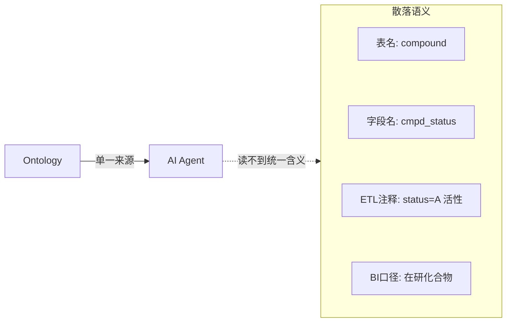
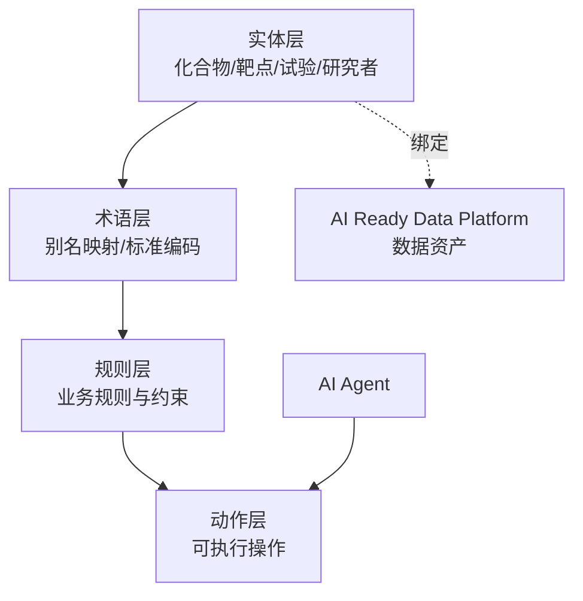
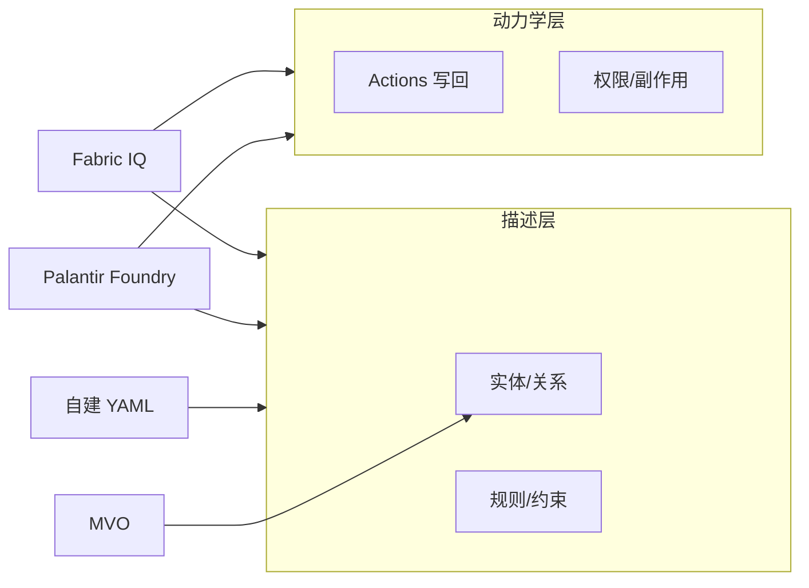
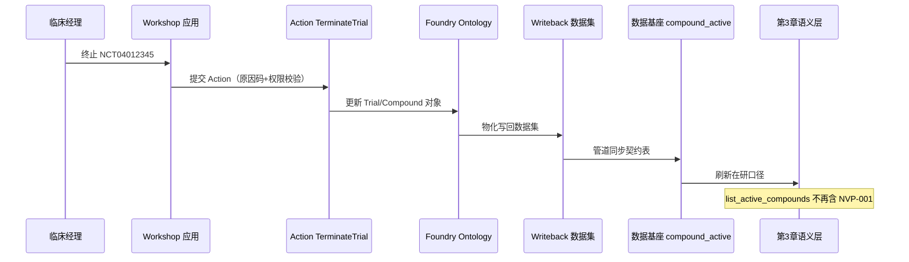

# 数据本体：Ontology

> 本章所属 DDA 层：Ontology

## 问题

为什么 AI 系统需要一份与业务共识对齐的世界模型[^7]？因为模型不知道你的企业怎么运作。

通用大语言模型（Large Language Model，LLM）预训练语料里有互联网的常识，但没有你企业的业务规则。它不知道化合物 `NVP-001` 和通用名 `savolitinib` 是同一个药，不知道 c-Met 抑制剂的临床试验要遵循 CDISC SDTM [^3] 标准，不知道"活性化合物"在药明诺华的研发流程里特指通过初筛的候选物。这些是企业内部共识，散落在不同系统与不同人脑里。

数据工程师为什么要学数据本体（Ontology）？因为这是机器理解企业业务世界的方式。前一章建好的 AI 就绪数据平台提供了"原材料"，但原材料本身不携带"如何理解"的说明。Ontology 提供这份说明：它显式定义业务世界里有哪些实体、实体间有什么关系、遵循什么规则、受什么约束。没有 Ontology，AI 系统就只能基于模型自己的猜测理解你的业务，而猜测在受监管的药企环境里是不可接受的。

Ontology 解决的问题是：给 AI 一个与人类业务共识对齐的世界模型[^7]。让 AI 的判断有据可依，而不是凭模型记忆发挥。承接上一章与前言：Ontology 是数据产品的**语义说明书**，也在业务层建立语义传递的单一来源——把散落的企业共识收拢为机器可读的实体、关系、规则与约束；没有这一层，下游只能各自猜口径。

## 传统方案

传统数据平台里，业务语义没有单一来源。它散落在四处：表名承载实体名（`dwd_compound` 是化合物），字段名承载属性（`cmpd_status` 是状态），ETL 注释承载口径（"status='A' 表示活性"），BI 语义层承载指标定义（"在研化合物数"的过滤条件）。

药明诺华的早期实践也是这样。研发系统的表叫 `compound`，临床系统的表叫 `trial`，监管系统的文档叫 `submission`。三个系统对同一个化合物有不同的编号：研发用 `NVP-001`，临床用 `savolitinib`，监管文档用 CAS 号。要回答" savolitinib 现在在哪个阶段"，得靠人去三个系统里对齐。

这种方案在系统数量少、消费方是人的时候勉强能运转。人脑能在不同表名、不同字段名、不同编号之间建立映射。

## 为什么失效

失效的根本机制是：AI 无法读取散落的语义。用全书框架说，这是**语义传递不可靠**在本体层的集中爆发——不是数据没进来，是"这个字段、这个编号、这个状态在业务上是什么意思"没有单一、机器可读的答案。

第一，没有单一来源。同一个"活性化合物"的概念，研发系统、临床系统、BI 报表各定义一遍，定义之间还有细微出入。AI 不知道该信哪一个。当 Agent 被问"有多少活性化合物"，不同口径给不同答案，无法追责。

第二，企业规则无法编码。"Phase I 试验失败则该化合物的研发状态自动转为 suspended"，这条规则在研发流程文档里写着，但不在任何数据系统里。AI 无法执行它无法读到的规则。

第三，别名消歧没有机器可读的依据。`NVP-001`、`savolitinib`、`AZD6094`、`HMPL-504`、`volitinib` 指向同一个 c-Met 抑制剂，但模型不知道。靠模型猜，召回率上不去；靠人工对齐，不可持续。这是一类典型的"机器读不到的语义"问题。



图：散落语义与 Ontology 单一来源的对比（DDA 层：Ontology）

解读：左侧是传统平台里语义散落的四处位置，AI 无法从中读出统一含义。右侧 Ontology 作为单一来源，把实体、关系、规则集中定义，Agent 经 Ontology 理解业务世界。这张图说明 Ontology 的价值不在"多一个系统"，而在"把散落语义收拢为机器可读的单一来源"。

## 新的设计思想

DDA 方法重新看这一层：要让机器理解企业业务世界，不能依赖模型猜测，必须显式定义。Ontology 就是这份显式定义。

Ontology 定义四样东西：实体（Entity，业务对象，如化合物、靶点、试验）、关系（Relation，实体间的业务连接，如"化合物作用于靶点""试验研究化合物"）、规则（业务规则，如"Phase I 失败则状态转 suspended"）、约束（业务约束，如"同一化合物的研发代号全局唯一"）。

这里必须澄清一个最常见的混淆：**Ontology 不是知识图谱（Knowledge Graph，KG）[^1]，不是 RDF[^8]，不是 OWL[^9]，不是图数据库的产品特性。** KG 是一种图结构的实现技术，RDF[^8] 与 OWL[^9] 是具体的表示语言，图数据库是存储引擎。它们可以是 Ontology 的实现方式之一，但不是 Ontology 本身。Ontology 是"机器如何理解业务世界"这个问题的答案，KG 是这个答案的一种落地形态。本书谈方法论时用 Ontology，谈具体图存储实现时才用 KG。

另一个关键区分：数据模型描述数据怎么存，KG 描述知识怎么检索，Ontology 描述业务世界是什么意思、遵循什么规则、支持什么操作。三者层次不同，不能互相替代。

## 架构设计



图：Ontology 四层架构（DDA 层：Ontology）

解读：Ontology 分四层。实体层定义业务对象，术语层处理别名与标准编码对齐，规则层编码业务规则与约束，动作层定义可执行操作。实体层向下绑定到 AI 就绪数据平台的数据资产，保证 Ontology 不是悬空的概念，而是有数据支撑。AI Agent 经动作层消费 Ontology，而非直接读原始数据。这张图的关键是：Ontology 不是纯概念模型，它通过绑定数据资产落地，通过动作层被 Agent 消费。

Ontology 在全书主线里位于 AI 就绪数据平台之上、语义层之下。它提供"如何理解原材料"，语义层把这份理解工程化为 Agent 可调用的接口。

## 工程实践

### 实体定义与别名消歧

以药明诺华的化合物实体为例，用 YAML 声明，重点处理别名消歧：

```yaml
entity: Compound
description: 候选化合物，研发管线的核心对象
properties:
  research_code:
    type: string
    meaning: 研发代号，企业内部唯一
    example: NVP-001
  status:
    type: enum
    meaning: 研发状态
    values: [discovery, preclinical, phase1, phase2, phase3, marketed, withdrawn]
aliases:
  - type: generic_name
    value: savolitinib
  - type: research_code_alias
    value: AZD6094
  - type: cas_number
    value: "1373746-33-2"
  - type: pubchem_cid
    value: "51035674"
  - type: chembl_id
    value: CHEMBL2108683
  - type: drugbank_id
    value: DB15423
  - type: umls_cui
    value: C4073094
standard_codes:
  - standard: RxNorm
    value: "1860324"
  - standard: MeSH
    value: D000077282
  - standard: CDISC_SDTM
    value: CMTRT
relations:
  - type: targets
    target: Target
    example: "NVP-001 targets c-Met"
```

这份定义里有几处要点。`aliases` 用行业标准编码把同一个化合物的多个名称对齐：研发代号、通用名、CAS 号、PubChem CID、ChEMBL ID、DrugBank ID、UMLS CUI。`standard_codes` 进一步接入 RxNorm、MeSH、CDISC SDTM 等行业标准。这样一来，无论 Agent 从哪个系统的哪个名称出发，都能落到同一个实体上。这就是机器可读的别名消歧，不依赖模型猜测。

行业编码标准的选取有据可依：UMLS CUI 是统一医学语言系统的概念标识，RxNorm 是药品标准化命名，CDISC SDTM 是临床试验数据提交标准，MeSH 是医学主题词表，ChEMBL 与 DrugBank 是药物化学数据库。它们各自覆盖不同语义维度，组合使用才能消歧。

这份别名消歧在下游被持续消费与修正：知识基础设施（KF，见第 4 章）用它把多源文档关联到同一实体（没有它，AI 在文档库里用通用名找不到研发代号对应的数据）；数据闭环（Data Loop，见第 7 章）把别名映射的错误回流修正到 Ontology 这一层。别名消歧不是一次定义即完成，它在主线里被消费、被检验、被演进。

别名消歧的工程难度在垂直数据行业早有验证——跨源编号归一、多跳关联推理，与化合物别名消歧同构（详见[附录：行业同构参照](../appendix/index.md)）。Ontology 是数据产品的**语义说明书**；药企要做的是把它写成机器可读、可程序消费的形态，并与业务方共建共识。下面用三层治理把实体定义、术语与规则分开维护，再讨论图实现与落地路线。

### 三层治理

Ontology 的工程落地可以用三层治理组织，避免一锅粥：

- **L1 元数据契约层**：数据资产的字段契约，保证 Ontology 绑定的数据稳定可消费。对应前一章的数据契约。
- **L2 术语层**：实体、属性、别名的统一术语表，处理消歧与标准化。上面的化合物实体定义就属这一层。
- **L3 业务规则层**：编码业务规则与约束，如"Phase I 失败则状态转 suspended""同一研发代号全局唯一"。

三层分工明确：L1 管数据稳定，L2 管语义统一，L3 管业务逻辑。变更各自独立版本化，互不阻塞。

### 图结构作为实现技术

Ontology 落地到图结构时，实体为节点，关系为边。药明诺华可以用 PostgreSQL 配合 Apache AGE 扩展 [^4]（仅为一种实现选择）在同一实例里存结构化数据与图关系，避免维护两套系统。这是"图作为 Ontology 的实例化"的工程取舍，不是 Ontology 的定义。

关联图谱是 Ontology 关系层的产物。药明诺华的多跳场景包括：化合物 → 试验 → 研究者 → 关联试验 → 竞争化合物管线对比；规则层编码「担保链式风险」类逻辑时，边类型与传递规则须显式定义（垂直数据行业的关联图谱实践见[附录](../appendix/index.md)）。

GraphRAG [^5] 与 LazyGraphRAG（微软 2025 年公开的方法，仅为参考）展示了图结构知识在检索中的应用：LazyGraphRAG 用轻量 NLP 抽取替代 LLM 抽取建图，把建图成本压到原来的千分之一量级。这类方法说明图结构作为 Ontology 实现是有工程价值的，但它们是检索技术，不是 Ontology 本身。

### FAOS 与建模预算投向

有研究（FAOS 框架 [^2]，2025 年公开）观察到反参数化知识效应：在模型已经熟知的概念上建 Ontology，收益有限甚至可能干扰；在模型知识稀疏的概念上建 Ontology，收益显著。工程含义是：**不要均匀地铺 Ontology**，应优先在药明诺华内部研发代号、企业特有状态流转、内部试验命名规则等模型不熟悉处建模——这与上文 L2/L3 治理的资源分配直接相关。

| 药明诺华概念 | 模型熟悉度 | 建模预算建议 |
| --- | --- | --- |
| 临床试验 Phase I–III | 高（通用医学） | 契约字段 + MeSH 引用即可，不必铺规则层 |
| `NVP-001` 内部代号体系 | 低 | Ontology 别名 + 绑定契约 |
| Phase I 失败 → `suspended` 状态机 | 低（企业内部） | L3 规则层 + 可校验约束 |
| SOP `SOP-CT-012` 终止流程 | 低 | 规则层或 KF 绑定，非重复建通用医学本体 |

建模资源应投向**内部研发代号、企业特有状态流转、跨系统 ID 对齐**，而非重复模型已有的通用知识。若当前只需验证别名与口径，可先走最小可行本体（MVO），不必一次建满四层——分档路径见[第 9 章](../decision-boundary/index.md)。

### 业界 Ontology 路线对照

至此，本书默认路径是：第 1 章契约提供 L1 绑定，本章 YAML 实体与三层治理提供 L2/L3，图结构可选作关系层实现。落地时企业常问第二个问题：**这套描述层自建，还是采购 Palantir / Fabric IQ？** 对照的不是厂商功能清单，而是能否满足上文四要素（实体/关系/规则/约束）并绑定 `compound_active`；下一章语义层与第 6 章 Agent 只消费已绑定的语义，不能替 Ontology 补别名。

| 方案 | DDA 映射 | 药明诺华示例 | 与后续层关系 |
| --- | --- | --- | --- |
| **自建 YAML + Git** | 四层架构；绑定契约 | `NVP-001` 别名 + Phase 规则 | 第 3 章 SL 投影同一 `business_definition` |
| **Palantir Foundry Ontology** | Object/Link + **操作层** Actions | 「终止试验」写回 + 审计日志 | Agent 可调 Action；描述层仍须绑定真实数据 |
| **Microsoft Fabric IQ** | Entity/Rules + Bindings | 化合物绑定 OneLake 表 | 联邦查询；Bindings 不能替代别名消歧 |
| **MVO** | 仅 L2 别名 + 关键枚举 | 只做化合物别名 | 足够支撑第 3 章 SL 与第 4 章文档绑定起步 |



图：Ontology 描述层与操作层 — 自建 vs 平台采购（DDA 层：Ontology）

解读：横轴从描述层延伸到动力学层（写回源系统）。自建 YAML 覆盖描述层即可支撑「查询理解」类 Agent；若需终止试验同步 ERP，须评估操作层——采购平台 Actions 或自建写回服务。GraphRAG / LazyGraphRAG 属于第 5 章 RAG 检索实现，不能替代本章实体与规则的单一定义。

### 落地深潜：Palantir Foundry Ontology 与药明诺华

对照表里的 **Palantir Foundry Ontology** 行，值得用一条完整业务链拆开看——否则容易把它当成「带写回功能的图数据库」，或误以为买了平台就不用做本章的别名与规则共建。Palantir 官方把 Ontology 定义为组织的**操作层（operational layer）**：它坐在已接入平台的数据集、虚拟表与模型之上，把数字资产映射到真实世界的对应物——工厂、订单、**化合物、临床试验**——并同时承载**语义元素**（对象、属性、链接）与**动力学元素**（Actions、Functions、动态权限）。它不是语义层的替代品，也不是「又一个数据目录」；它是把「业务世界是什么意思」与「业务世界允许怎么改」绑在同一套可审计对象模型上的工程产物。

#### 场景：Phase I 失败，必须终止试验并同步全公司口径

药明诺华临床运营经理收到邮件：`NCT04012345`（`NVP-001` / savolitinib 的 c-Met 抑制剂 Phase I 试验）因安全性信号需按 SOP `SOP-CT-012` 终止。传统做法里，她要：在 CTMS 改试验状态、在研发管线表把化合物标为 `suspended`、通知监管事务准备递交说明、在 Slack 里口头同步 BI 团队「这药暂时别算在研」。四处改动、四个口径、邮件与截图当审计证据——这正是本章「为什么失效」里的企业规则无法编码、别名无法机器对齐、写回无法追责的合体。

若药明诺华采购 Foundry（仅为一种实现选择），同一条业务链被收进 Ontology 的对象与 Action 模型，而不是散落在四个系统里各自改。

#### 这套框架是什么：从本章 YAML 到 Object / Link / Action

本书默认路径用 YAML 声明 `entity: Compound` 与 `aliases`；Foundry 用产品化类型把同一套 DDA 概念实例化。命名对照见[附录「自建 YAML vs 平台 Ontology 命名对照」](../appendix/index.md)（药明诺华统一案例小节内），此处只强调**职责映射**，不背厂商菜单：

| DDA / 本章概念 | Palantir Foundry（仅为实现选择） | 药明诺华落地含义 |
| --- | --- | --- |
| 实体 `Compound` | Object Type `Compound` | 一个候选药是一个对象，主键绑定研发代号 |
| 属性 `research_code`、`status` | Properties | `NVP-001`、`phase1` → `suspended` 可版本化 |
| 别名 savolitinib / CAS | Property 别名或 Shared Properties | Agent 用通用名检索仍落到同一对象 |
| 关系 `targets c-Met` | Link Type `Compound → Target` | Object Explorer / Vertex 可沿链接跳转 |
| L3 规则「Phase I 失败 → suspended」 | Action 提交规则 + Submission criteria | 未选终止原因码则 Action 不能提交 |
| 绑定 `compound_active` 契约 | Object 后端数据集（backing dataset） | Ontology 不悬空，对象来自第 1 章数据产品 |
| 动作层：终止试验写回 | Action Type `TerminateTrial` | 一次提交改试验对象 + 化合物状态 + 审计 |

关键区分：**Object Type 不是表名翻译**。`dwd_compound` 是数据资产；`Compound` 对象类型声明「业务上什么叫一个化合物、哪些属性代表研发状态、链到哪些试验」，并通过 backing dataset 与契约字段对齐。这与本章「实体层向下绑定 AI 就绪数据平台」一致——Foundry 只是把绑定与索引做成平台能力，并没有免除药明诺华与临床、研发共建 `status` 枚举与终止 SOP 的义务。

**Link Type** 解决的是多跳业务问题。临床经理在 Object Explorer 里从 `Compound: NVP-001` 沿 `studies` 链到 `Trial: NCT04012345`，再沿 `conducted_at` 到研究中心、沿 `competes_with` 看同靶点竞品管线——这正是上文「化合物 → 试验 → 研究者 → 竞争管线」图结构的消费界面，图存储是实现，Link Type 是 Ontology 上的关系契约。

**Action Type** 是 Foundry 相对「纯描述型 Ontology」的增量，也是对照表里「操作层」一词的来源。官方定义：Action 是一次事务，按用户定义的逻辑修改一个或多个对象的属性与链接，并可附带副作用（通知、Webhook、触发管道构建）。`TerminateTrial` 可设计为：

- **参数**：试验对象（下拉仅限有权终止的 Phase I 试验）、终止原因码（对齐 CDISC / 内部枚举）、是否同步暂停化合物研发状态。
- **规则**：提交时校验操作者角色、试验当前状态必须为 `active`、终止原因必填。
- **本体编辑**：将 `Trial.status` 设为 `terminated`；若勾选同步，将链接的 `Compound.status` 设为 `suspended`。
- **副作用**：通知监管事务队列；Webhook 调 ERP；Action log 留痕供 21 CFR Part 11 审计（药明诺华合规约束见附录）。

用户点一次「终止」，或第 6 章 Agent 经授权调用同一 Action Type，**各消费应用共享同一套校验与写回逻辑**——不会出现 CTMS 已终止、数仓仍算在研的口径分裂。对象最新状态写入该 Object Type 的 **writeback dataset**，再经管道同步回第 1 章契约与第 3 章语义层消费者；Ontology 是写回枢纽，不是只读视图。

#### 怎么用：一条写回链与一条只读链

药明诺华落地时通常并行两条链——与第 6 章「查询 vs 变更」分工一致：



图：Foundry Action 写回链 — Ontology 作变更枢纽（DDA 层：Ontology → 数据基座 → Semantic Layer）

**只读链**（查询「在研 c-Met 抑制剂」）不经过 Action：第 6 章 Agent 或分析师经第 3 章 `list_active_compounds` / MetricFlow 指标查询，仍走 Ontology 别名解析 → 语义口径 → `compound_active` 契约。附录中的端到端序列图对平台 Agent 与自建 Agent 同样适用；Foundry 内置 AIP Agent 若绕过语义层直连对象集，仍会踩口径漂移——平台不替代第 3 章单一口径定义点。

**Functions**（同为动力学元素）适合复杂逻辑：例如按 FAOS 建议，不在通用医学概念上铺规则，而用 Function 计算「该化合物是否满足内部暂停管线规则」，再被 Action 或 Workshop 按钮调用。这与本章 L3 规则层「优先模型知识稀疏区」一致。

#### 解决了什么问题：相对自建 YAML 与相对裸平台

相对**散落语义**，Foundry Ontology 把实体、别名、链接、可执行终止流程收进**单一操作层**，Agent 与人工共用同一对象 ID 与同一 Action 审计日志。相对**本章自建 YAML**，采购路线用 Object/Link/Action 产品化封装了版本、权限、写回物化、跨应用一致编辑——适合终止试验、管线状态机、跨部门写回强审计的场景。相对**误以为「买了就会」**，它**不**自动解决：`NVP-001` 与 savolitinib 的别名仍需人定义；「在研」是否含 `preclinical` 仍须在 Ontology 与第 3 章 SL 同源；SOP 正文仍在第 4 章 KF，Ontology 只编码可执行状态机而非 PDF 全文。

| 痛点 | 无 Ontology | 自建 YAML（本章默认） | Foundry Ontology（采购） |
| --- | --- | --- | --- |
| savolitinib → NVP-001 | 人工三系统对齐 | `aliases` + 契约绑定 | Object 别名 + backing dataset |
| Phase I 失败改状态 | 邮件+四处改表 | L3 规则文档化；写回需自建服务 | Action `TerminateTrial` + log |
| Agent 终止试验 | 不可信/不可审计 | 须自建 Action API | 同 Action Type，权限继承 |
| 成本与锁定 | 低，但风险高 | 中，Git 友好 | 高 license + 实施，见第 9 章 |

#### 企业落地实践：药明诺华若上 Foundry，前 90 天做什么

与附录 30-60-90 清单对齐，Ontology 专项建议：

1. **先绑契约，再铺对象**：用 `compound_active`、`trial_master` 等第 1 章契约作 Object backing dataset，禁止「空中对象」。
2. **先别名，再 Action**：MVO 阶段只上线 `Compound` + 别名 + `Trial` 链接；`TerminateTrial` 在别名与 `status` 枚举与临床部门签字后再发布。
3. **Action 与 SOP 一一映射**：每个 Action Type 对应一条可审计 SOP（如 `SOP-CT-012`），Submission criteria 编码 SOP 必填项，而非把 SOP PDF 塞进提示词。
4. **写回同步 SLA**：writeback → 契约表 → 第 3 章 SL 的延迟必须可监控；否则 Agent 查询仍显示旧在研数。
5. **与第 7 章 Data Loop 衔接**：别名错误、终止原因码新增，从 Action log 与人工纠错回流 Ontology 提案（Foundry 支持 Ontology 变更评审），避免只改表不改对象定义。

采购决策矩阵与「何时 MVO、何时全栈 Foundry」见[第 9 章](../decision-boundary/index.md)。下一章语义层说明如何把本章 `business_definition` 工程化为 MetricFlow 指标，使终止后的在研数在报表、Agent、RAG 三处一致。

## 最佳实践

**Ontology 即产品**：把 Ontology 当作产品管理，有负责人、版本、消费者、衰减监控。Ontology 不是一次性建模，是持续维护的产品。

**优先覆盖模型知识稀疏区**：把建模资源投在企业特定、模型不熟悉的概念上，而非重复模型已有的通用知识。

**绑定数据资产**：每个实体定义必须能绑定到 AI 就绪数据平台的真实数据，否则 Ontology 是悬空概念。

**标准编码优先**：能用行业标准编码（UMLS、RxNorm、CDISC）对齐的，不要自造编码体系。自造体系只在行业标准覆盖不到时使用，并明确记录映射。

**用 SHACL 等约束语言校验**：Ontology 的规则与约束应可程序校验，而非仅文档记录。SHACL [^6]（一种 RDF[^8] 数据约束语言，仅为一种实现选择）配合数据目录工具可以实现自动化校验。

**接受演进**：Ontology 会随业务变化而演进，这是下一章 Ontology Evolution 的主题。这里只强调：不要追求一次建模永久不变。

## 延伸阅读

- **业务世界模型与本章 Ontology**：企业 Ontology 作为业务世界模型的知识表示传统；与强化学习/生成式 AI 文献中 World Model（环境动力学预测）的区分；Palantir Ontology、微软 Fabric IQ 关于企业语义模型与实践的资料；Gruber 等知识表示与本体工程（Knowledge Representation and Ontology Engineering）基础论述。
- **Ontology 工程方法**：微软 Fabric IQ、Palantir Ontology 关于企业本体工程的实践资料。
- **FAOS 框架与反参数化知识效应**：FAOS 三层本体框架（2025 年公开）关于在模型知识稀疏区建本体的研究。
- **图结构实现**：GraphRAG 与 LazyGraphRAG（微软 2025 年公开）关于图结构知识检索的资料；Apache AGE 等 PostgreSQL 图扩展文档。
- **本体约束校验**：SHACL（RDF 数据约束语言）规范与数据目录校验相关 Gartner 报告。
- **药企行业标准编码**：UMLS CUI、RxNorm、CDISC SDTM、MeSH、ChEMBL、DrugBank 各自官方文档。

[^1]: 知识图谱（Knowledge Graph，KG）与 Ontology 的区别，参见知识表示与本体工程相关文献。
[^2]: FAOS 三层本体框架与反参数化知识效应，参见 2025 年公开的相关研究资料。
[^3]: CDISC SDTM（Study Data Tabulation Model）是 CDISC 组织制定的临床试验数据标准化提交模型，FDA 等监管机构要求以此格式报送试验数据。
[^4]: Apache AGE 是 PostgreSQL 的图扩展，在同一个 Postgres 实例里用 Cypher 查询图数据，无需单独维护图数据库。
[^5]: GraphRAG 是微软提出的图结构检索增强方法，先用 LLM 从文档抽取实体与关系建图，再基于社区层次做全局与局部检索。
[^6]: SHACL（Shapes Constraint Language）是 W3C 标准的 RDF 数据约束语言，用"形状"声明图数据应满足的结构与取值约束，可程序化校验本体一致性。
[^7]: **业务世界模型**（Business World Model）在本书中指：企业业务世界的显式、机器可读的语义结构——有哪些实体（Entity）、实体间什么关系（Relation）、遵循什么规则与约束，由 Ontology 编码并绑定数据资产，供 Agent 程序化消费。它**不是**强化学习或生成式 AI 里常说的 World Model（学习环境动力学、预测下一状态，如 World Models 论文及后续 JEPA 等路线）。也**不是**泛泛的"企业世界观"口号，而是可版本化、可校验、可落地到语义接口的工程产物。Ontology 章讲的"世界模型"，默认是这个含义。
[^8]: **RDF**（Resource Description Framework，资源描述框架）是 W3C 制定的语义 Web 基础数据模型，用**三元组**（主语–谓语–宾语）表述事实，例如「`NVP-001` `rdf:type` `Compound`」。常见序列化格式包括 Turtle、JSON-LD、N-Triples。RDF 解决的是"知识如何被机器交换与存储"，不是 Ontology 的同义词；本书方法论里的 Ontology 可以用 RDF 落地，也可以用 YAML、图数据库等其他形式表达。
[^9]: **OWL**（Web Ontology Language，网络本体语言）是 W3C 在 RDF 之上定义的本体描述语言，用于声明**类、属性、继承关系与逻辑约束**（例如"化合物必须至少有一个研发代号"）。OWL 文档通常编码为 RDF 三元组。它是 Ontology 的一种工程表示与推理格式，不是本书谈的业务 Ontology 本身——企业 Ontology 完全可以用更轻量的 YAML 或产品化本体平台表达，而不必上 OWL 全栈。

## Checklist

- [ ] 是否显式定义了核心业务实体、关系、规则、约束，而非依赖字段名隐含？
- [ ] 别名消歧是否用行业标准编码机器可读地声明，而非依赖人工对齐？
- [ ] 是否澄清了 Ontology 与 KG、RDF、OWL 的区别，未混用？
- [ ] 实体定义是否绑定到 AI 就绪数据平台的真实数据资产？
- [ ] 业务规则是否编码且可程序校验，而非仅写在流程文档里？
- [ ] 建模是否优先覆盖模型知识稀疏的企业特定概念？
- [ ] Ontology 是否作为产品管理，有版本与衰减监控？
- [ ] 能用行业标准编码的地方是否避免了自造编码体系？
- [ ] 是否对照过自建 YAML 与采购 Ontology 平台的适用边界（见业界路线对照与 Palantir 落地深潜）？

---

**自检（依据 WRITING_STYLE §9）**：本章为何需要？因为 AI 需要与业务共识对齐的世界模型。数据工程师为何关心？Ontology 是全书两大核心之一，是机器理解业务世界的方式。解决什么问题？让 AI 不靠猜测理解企业业务。属哪一 DDA 层？Ontology。改变什么架构？把散落语义收拢为机器可读的单一来源，并绑定数据资产。
