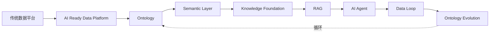

# 前言

> 本章所属：跨层

本书写给一群特定的人：做了五到十五年数据工程的工程师。你们写过 SQL，搭过 ETL 与 ELT，建过数仓与湖仓，跑过 Spark 与 Flink，用 Airflow 调度过任务，也处理过数据治理、元数据与血缘。这些技能本书不再解释。

那么为什么还要写一本给数据工程师看的 AI 书？

因为 AI 正在改变数据平台要解决的问题。过去十年，数据平台服务的对象是人。BI 报表、分析看板、Ad-hoc 查询，都是人读数据。人能容忍 T+1 的新鲜度，能容忍口径的模糊，能在字段名里读懂业务含义。AI 系统不能。AI 系统是一个不会自己猜业务含义的消费方，它要求数据具备访问语义、契约稳定性、可追溯血缘与持续校验的质量。当数据平台的主要消费方从人变成 AI，数据平台的设计前提就变了。

这本书要完成的，是数据工程师的一次思维升级（Mindset Shift）[^1]。不是技能升级，不是"学一个新框架"。是从"数据服务人"的视角，切换到"数据服务 AI"的视角，重新理解企业数据应该如何组织。

这个判断不是理论推演，来自一线观察。作者在企业征信与专利数据行业做过几年数据研发，服务的两类公司有一个共同特征：数据本身就是付费产品，数据治理不是"重要但不紧急"的待办，是活下去的前提。企业征信平台覆盖三亿多家企业，要把同一主体在工商、税务、司法、海关多源系统里的不同编号--统一社会信用代码、工商注册号、组织机构代码--统一到一个实体上，否则银行做贷前尽调时查到的就是错人。专利数据平台覆盖两亿多件专利、横跨一百七十多个司法辖区，要把同一发明在不同专利局的公开号、申请号、优先权号对齐到同一专利族，否则研发查竞争情报时就会漏掉一半。这些实体对齐、口径统一、血缘追溯、质量门禁，远在 AI 爆发前就是日常工程，不做就卖不出产品。

本书讲的数据契约、数据本体（Ontology）、语义层（Semantic Layer）、知识绑定，并非 AI 时代凭空发明——它们是把征信、专利等行业早已验证的治理经验，重新组织为 Agent 与 RAG 可消费的形态。下一节说明，这对一般企业意味着什么。

对多数企业，这套治理还没建起来。AI 的到来把数据治理的紧迫性提前了--过去数据质量问题藏在报表脚注里，高层难以感知；现在它直接变成 AI 答案里的错误，暴露在所有人面前。本书正是为这个窗口期而写：借 AI 倒逼出的数据治理需求，把数据平台从"能跑批"推进到"AI 就绪"。全书统一案例是创新药研发（药明诺华），药企的实体对齐、别名消歧、口径统一、知识绑定，与征信、专利等行业的问题是同构的，只是业务对象不同。

## AI-ready 本质：升级版的数据产品

当下企业谈 AI-ready 转型，容易滑向两个误区：一是另起一套"AI 数仓"或"AI 沙箱"，与现有数据平台并行；二是把问题归结为"选哪个模型、哪个向量库"。本书的立场不同：**AI-ready 转型，本质上是在做新一代、升级版的数据产品。**

这不是新口号。Data Mesh 早已提出"数据即产品"——每个数据集应有负责人、有契约、有 SLA、有明确消费者。AI 时代只是把这条纪律**升级**了：消费者从"人读报表"扩展到 Agent 与 RAG；交付形态从"表+字段名"升级到"语义接口+可程序元数据+可追溯血缘"；产品边界从"结构化表"扩展到"知识资产"（文档、图表、SOP 也要产品化管理）。全书主线八层，可以理解为**数据产品栈的逐级升级**：数据基座定义产品单元，Ontology 定义产品语义，语义层封装产品接口，知识基础设施把非结构化内容纳入产品目录，RAG/Agent 是新产品消费者，Data Loop 是产品的持续迭代机制。

升级的具体标志，可以用数据基座章的五项 AI 就绪特性概括：语义化、可治理、可追溯、低延迟、安全。BI 时代的数仓交付的是"能跑批的表"；AI-ready 交付的是"能被机器可靠消费的产品"——有契约、有版本、有消费者清单（报表、Agent、RAG 都算消费者）。

**这套产品思维并非空中楼阁。** 垂直数据服务商——启信宝、智慧芽等——几十年来就在用商业模式验证它：数据本身就是付费商品，每一个对外 API 背后都是一个带口径、带 SLA、带版本的数据产品；脏数据流向付费客户就是直接经济损失，所以实体对齐、口径统一、血缘追溯、质量门禁在 AI 爆发前就已生产级。专利平台把化学结构图做成可检索产品，征信平台把扫描件做成带坐标的结构化产品——多模态知识产品化也有成熟先例。它们证明了一件事：**当数据按产品标准交付时，AI 消费才有可靠地基。** 一般企业要做的，是把这套已在商业环境跑通的产品纪律内化到服务内部 Agent 与 RAG 的数据平台上；卖不卖钱不同，产品标准同构。

内化时须注意几处现实差异，但不改变"做升级版数据产品"这个本质：企业内部 Ontology 须与业务方共建，反馈没有付费客户替你纠错须自建黄金集，最忌 Agent 团队复制数据、自造口径——那等于在组织内再造一套未受产品纪律约束的旁路系统。附录有产品升级维度与行业验证对照，供各章参照。

## 全书要驯服什么

数据工程师熟悉分布式系统的两个根本不可靠：时钟与网络——设计时默认它们存在，用协议与副本去驯服。Data-Driven AI 里有同构的一面：**业务语义不可靠**。产品升级要解决的正是它。它不是模型笨，也不是向量库小——多数企业从来没有一份机器可读、单一来源、可追责的业务共识。AI 把这个问题放大了：人能打电话确认口径、在字段名里猜含义，AI 不能。过去语义不可靠藏在报表脚注里，现在直接暴露在所有人面前的 AI 答案里。

拆成两件事，各章会反复回到这里：

第一，**语义传递不可靠**。含义散落在表名、字段名、ETL 注释、BI 口径、文档库各说各话里，没有一个单一口径定义点能把同一业务概念稳定地传给 AI。像网络丢包：不是没数据，是传过去的含义不一致、对不上、甚至传不到。数据基座、Ontology、语义层、知识基础设施、RAG 的接地与引用，主要在这条传递链上逐层加固。

第二，**语义时效不可靠**。业务在变——新化合物、新通用名、SOP 换版、试验规则调整——但 Ontology 与知识资产没跟上。像时钟漂移：不是当时错了，是过一阵就过时了。"第三月停滞"（见第 7 章）就是这种时效不可靠累积到爆发的典型。Data Loop 与 Ontology Evolution 主要对付这一类。

**问题是语义不可靠，工程落点是升级版数据产品。** 读每一章时，可以问：这一层在加固传递还是时效？它在产品栈里交付什么单元或接口？

## 本书写给谁

默认读者：数据工程师、数据平台工程师、数据架构师、分析工程师、技术负责人。

经验门槛：五到十五年。假定你已经熟悉 SQL、ETL/ELT、数仓、湖仓、CDC、流处理、Spark、Flink、Airflow、数据治理、元数据、数据血缘。这些是本书的地基，不再重复讲授。

如果你正在思考"AI 时代数据平台该怎么演进""数据团队在 AI 项目里到底负责什么""为什么 AI 系统需要本体和语义层"，这本书为你而写。

## 本书不写什么

四条红线，开篇讲清。

第一，不写 ChatGPT、Prompt Engineering、模型 API 教程。市面上这类内容已经足够多，本书不重复。

第二，不写工具书。章节围绕数据本体（Ontology）、语义层（Semantic Layer）、知识基础设施（Knowledge Foundation）、数据闭环（Data Loop）组织，不围绕某个工具组织。Neo4j、Milvus、LangChain、LlamaIndex、MCP 只会在工程实践章节作为实现示例出现，并明确标注"仅为一种实现选择"。

第三，不写模型排行榜，不讨论"哪个 LLM 更聪明"。本书的立场是数据驱动 AI（Data-Driven AI，DDA）：竞争优势来自数据资产与数据闭环，不来自模型本身。

第四，不逐章切换案例域。全书统一用一个案例域--创新药研发（Drug Discovery）。案例本身是虚构的"药明诺华"（NovaPharm），融合了真实行业模式，但不指名任何真实企业。让一个案例域贯穿全书，读者才能看到数据本体如何在同一个业务世界里逐层生长，数据闭环如何闭合在同一组数据上。

## 如何阅读本书

按主线顺序读。全书只有一条主线：

图：全书主线

解读这张图：主线从传统数据平台出发，先建 AI 就绪数据平台（AI Ready Data Platform），让数据能被 AI 可靠消费；再定义数据本体，让机器理解业务世界；本体经语义层工程化为 Agent 可调用的接口；语义层之上叠加非结构化知识，形成知识基础设施（KF 把多格式多模态文档统一组织，含视觉资产）；知识基础设施支撑检索增强生成（Retrieval-Augmented Generation，RAG，经多向量多路检索、视觉融合、接地引用提供有依据知识）；RAG 为 AI 智能体（AI Agent）提供接地知识；Agent 的执行结果回流，驱动数据闭环；闭环持续运转，推动本体演进；本体演进又回到主线的起点，形成循环。

整本书只有两个真正的核心：**Ontology** 与 **Data Loop**。Ontology 回答"机器如何理解企业业务世界"，Data Loop 回答"AI 系统如何持续学习与修正"。其余各层都是围绕这两个核心的工程支撑。如果读完一章，你既没看到 Ontology 的生长，也没看到 Data Loop 的闭合，那一章可能写偏了。

每一章默认遵循同一个结构：问题、传统方案、为什么失效、新的设计思想、架构设计、工程实践、最佳实践、Checklist。先讲为什么，再讲怎么做。工具是例子，不是主角。

## 一个提醒

本书的立场很明确：数据是中心，模型不是。任何一章如果从"模型能做什么"讲起，就背离了本书。如果一张架构图把 LLM 放在中心，也背离了本书。这不是对模型的轻视，而是对数据工程师视角的坚持。你能为 AI 系统提供的最大价值，不在调模型，在筑数据——把语义不可靠的问题，落实为可交付、可迭代的数据产品。

后续每一章，都从这两条主线出发：驯服语义不可靠，交付升级版数据产品。

## 延伸阅读

- **数据网格与数据产品**：Dehghani《Data Mesh》关于数据作为产品、数据网格治理的论述。
- **垂直数据服务商实践**：启信宝/合合信息、智慧芽/PatSnap 的 DaaS 与数据产品实践，作为升级版数据产品在商业环境已验证的参照，而非本书对比主轴。
- **AI 原生**：AI Native 企业组织数据与流程围绕 AI 系统的相关讨论。
- **思维升级**：数据工程师视角转向 AI 数据架构的相关方法论资料。

[^1]: 思维升级（Mindset Shift）与 AI 原生（AI Native）的概念，参见数据网格与 AI 数据架构相关论述。

---
