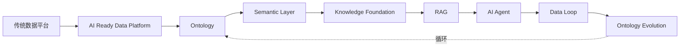

# 前言

> 本章所属：跨层

本书写给一群特定的人：做了五到十五年数据工程的工程师。你们写过 SQL，搭过 ETL 与 ELT，建过数仓与湖仓，跑过 Spark 与 Flink，用 Airflow 调度过任务，也处理过数据治理、元数据与血缘。这些技能本书不再解释。

那还要写一本给数据工程师看的 AI 书，图什么？

AI 改的是数据平台要解决的问题。过去十年，数仓、看板、Ad-hoc 查询，消费方都是人。人能忍 T+1，能在口径模糊时打电话确认，能从字段名里猜出业务含义。AI 不会猜。它要可读的语义、稳定的契约、可追溯的血缘、持续校验的质量。消费方从人换成 AI，设计前提就换了。

本书要做的是思维升级（Mindset Shift）[^1]，不是多学一个框架。视角从「数据服务人」转到「数据服务 AI」，重新想企业数据该怎么组织。

这个判断不是理论推演，来自一线观察：在垂直数据服务商（征信、专利等）场景，数据本身就是付费产品，实体对齐、口径统一、血缘追溯、质量门禁在 AI 爆发前已是生存级工程——与药明诺华面临的化合物别名、试验口径、CSR 绑定同构（详见[附录：行业同构参照](../appendix/index.md)）。

本书讲的数据契约、数据本体（Ontology）、语义层（Semantic Layer）、知识绑定，并非 AI 时代凭空发明——它们是把上述行业早已验证的治理经验，重新组织为 Agent 与 RAG 可消费的形态。

对多数企业，这套治理还没建起来。AI 的到来把数据治理的紧迫性提前了——过去数据质量问题藏在报表脚注里，高层难以感知；现在它直接变成 AI 答案里的错误，暴露在所有人面前。本书正是为这个窗口期而写：借 AI 倒逼出的数据治理需求，把数据平台从"能跑批"推进到"AI 就绪"。全书统一案例是创新药研发（药明诺华）；实体对齐、别名消歧等问题与征信、专利等行业同构，见附录。

## AI-ready 本质：升级版的数据产品

企业谈 AI-ready，常见两个偏门：另起一套 AI 数仓或沙箱，跟现有平台并行；或者把问题简化成「选哪个模型、哪个向量库」。本书立场不同：AI-ready 转型，本质是在做升级版的数据产品。

Data Mesh 早就说过「数据即产品」——负责人、契约、SLA、明确消费者。AI 时代只是把这条纪律加码：消费者多了 Agent 和 RAG；交付从「表加字段名」变成「语义接口、可程序元数据、可追溯血缘」；产品边界扩到文档、图表、SOP 这类知识资产。全书八层可以看成数据产品栈逐级往上叠：基座定产品单元，Ontology 定语义，语义层封装接口，知识基础设施管非结构化目录，RAG/Agent 是新消费者，Data Loop 负责迭代。

升级的具体标志，可以用数据基座章的五项 AI 就绪特性概括：语义化、可治理、可追溯、低延迟、安全。BI 时代的数仓交付的是"能跑批的表"；AI-ready 交付的是"能被机器可靠消费的产品"——有契约、有版本、有消费者清单（报表、Agent、RAG 都算消费者）。

这套产品思维有行业底子。垂直数据服务商几十年按契约、SLA、版本卖数据，AI 消费才有可靠地基（详见[附录](../appendix/index.md)）。一般企业不卖数据，但内部 Agent 和 RAG 用的平台，产品标准应同构。

内化时有几个现实差异，本质不变：Ontology 得跟业务方共建；没有付费客户替你纠错，就得自建黄金集；最忌 Agent 团队复制数据、自造口径——等于在组织里又养一套没纪律的影子产品。附录有产品升级维度和行业对照，各章会反复用到。

## 全书要驯服什么

做分布式系统的人，默认时钟和网络不可靠，用协议和副本去扛。数据驱动 AI（Data-Driven AI，DDA）用同一套类比来看其中的核心问题：业务语义不可靠。产品升级要对付的就是它。多半不是模型笨，也不是向量库小——而是企业从来没有一份机器可读、单一来源、可追责的业务共识。人能打电话确认口径，AI 不能。以前语义问题躲在报表脚注里，现在直接出现在所有人能看到的 AI 答案里。

全书会反复回到两件事：

**语义传递不可靠。** 含义散在表名、字段、ETL 注释、BI 口径、文档库里，各说各话，没有单一口径能把同一概念稳定传给 AI。像网络丢包：数据在，含义对不上或传不到。数据基座、Ontology、语义层、知识基础设施、RAG 的接地与引用，主要在这条链上逐层加固。

**语义时效不可靠。** 业务在变——新化合物、新通用名、SOP 换版、试验规则调整——Ontology 和知识资产没跟上。像时钟漂移：当时没错，过一阵就过时。「第三月停滞」（第 7 章）是时效问题攒到头的典型。Data Loop 和 Ontology Evolution 主要对付这一类。

问题在语义不可靠，工程落点是升级版数据产品。读每一章可以问：这一层在加固传递还是时效？交付的是产品栈里的哪一块？

## 本书写给谁

默认读者：数据工程师、数据平台工程师、数据架构师、分析工程师、技术负责人。

经验门槛：五到十五年。假定你已经熟悉 SQL、ETL/ELT、数仓、湖仓、CDC、流处理、Spark、Flink、Airflow、数据治理、元数据、数据血缘。这些是本书的地基，不再重复讲授。

如果你正在思考"AI 时代数据平台该怎么演进""数据团队在 AI 项目里到底负责什么""为什么 AI 系统需要本体和语义层"，这本书为你而写。

## 本书不写什么

四条红线，开篇讲清：

- 不写 ChatGPT、Prompt Engineering、模型 API 教程。市面上这类内容已经足够多，本书不重复。
- 不写工具书。章节围绕 Ontology、语义层（Semantic Layer）、知识基础设施（Knowledge Foundation）、数据闭环（Data Loop）组织，不围绕某个工具组织。Neo4j、Milvus、LangChain、LlamaIndex、MCP 只会在工程实践章节作为实现示例出现，并标注「仅为一种实现选择」。
- 不写模型排行榜，不讨论「哪个 LLM 更聪明」。本书立场是 DDA：竞争优势来自数据资产与数据闭环，不来自模型本身。
- 不逐章切换案例域。全书统一用创新药研发（Drug Discovery）。案例是虚构的「药明诺华」（NovaPharm），融合真实行业模式，不指名任何真实企业。一个案例域贯穿全书，读者才能看到 Ontology 如何在同一业务世界里逐层生长，Data Loop 如何闭合在同一组数据上。

## 如何阅读本书

按主线顺序读。全书只有一条主线：

图：全书主线

从传统数据平台出发，先建 AI 就绪数据平台，让数据能被 AI 可靠消费；再定义 Ontology，让机器理解业务世界；经语义层工程化成 Agent 可调用的接口；叠加非结构化知识形成知识基础设施；RAG 提供有依据的检索增强；Agent 消费接地知识；执行结果回流驱动 Data Loop；Data Loop 推动 Ontology 演进，回到起点形成循环。

全书只有两个真正的核心：**Ontology** 与 **Data Loop**。前者回答机器如何理解企业业务世界，后者回答 AI 系统如何持续学习与修正。其余各层都是围绕这两个核心的工程支撑。读完一章，如果既没看到 Ontology 的生长，也没看到 Data Loop 的闭合，那一章可能写偏了。

每一章默认遵循同一个结构：问题、传统方案、为什么失效、新的设计思想、架构设计、工程实践、最佳实践、Checklist。先讲为什么，再讲怎么做。工具是例子，不是主角。

八层读完后，建议读[第 9 章：路线选择与适用边界](../decision-boundary/index.md)——把各章能力对照到贵司档位（L1/L2/L3）与自建/采购选择；若时间紧，也可先读第 9 章决策树，再按决策回读各层细节。工程落地的成熟度、成本与 RACI 见[附录](../appendix/index.md)。

## 一个提醒

本书立场很明确：数据是中心，模型不是。任何一章如果从「模型能做什么」讲起，就偏了；架构图把 LLM 放中心，也偏了。这不是轻视模型，是坚持数据工程师的视角。你能为 AI 系统提供的最大价值，不在调模型，在筑数据——把语义不可靠落实成可交付、可迭代的数据产品。

后续每一章，都从这两条主线出发：驯服语义不可靠，交付升级版数据产品。

## 延伸阅读

- **数据网格与数据产品**：Dehghani《Data Mesh》关于数据作为产品、数据网格治理的论述。
- **垂直数据服务商实践**：启信宝/合合信息、智慧芽/PatSnap 的 DaaS 与数据产品实践，作为升级版数据产品在商业环境已验证的参照，而非本书对比主轴。
- **AI 原生**：AI Native 企业组织数据与流程围绕 AI 系统的相关讨论。
- **思维升级**：数据工程师视角转向 AI 数据架构的相关方法论资料。

[^1]: 思维升级（Mindset Shift）与 AI 原生（AI Native）的概念，参见数据网格与 AI 数据架构相关论述。

---
