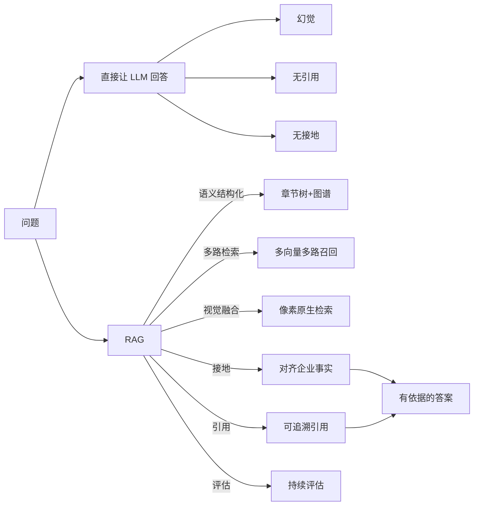
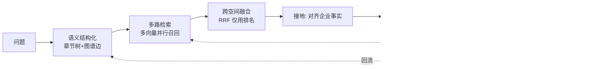
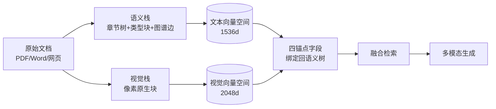
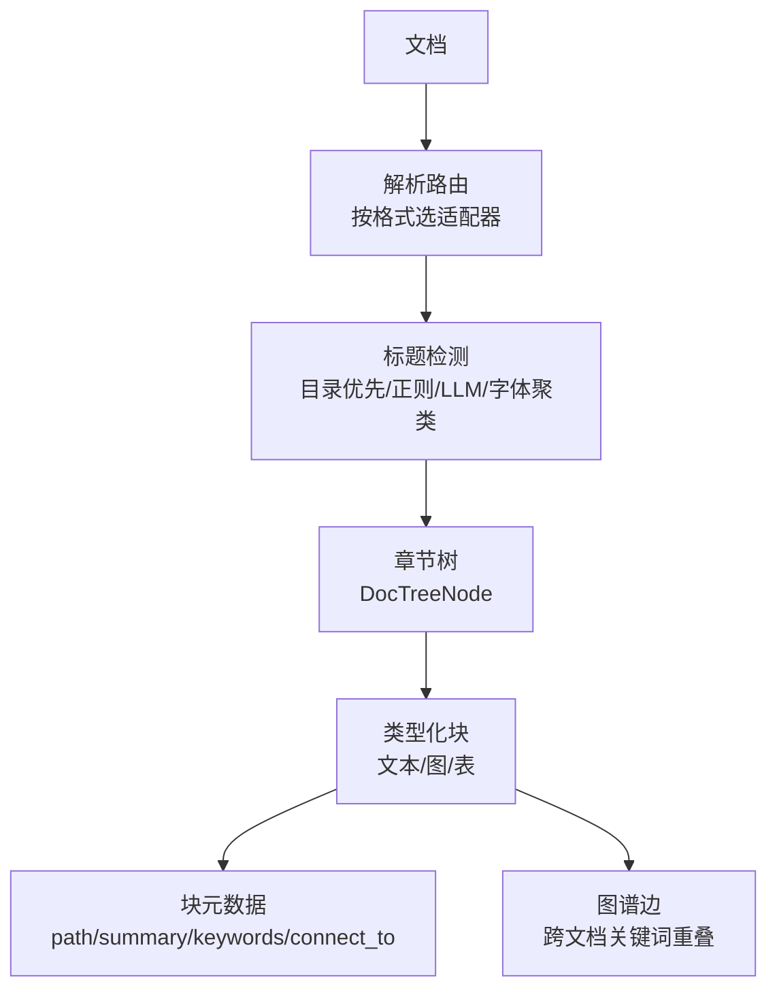
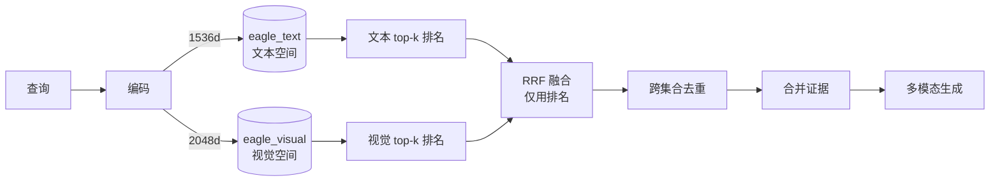

# 检索增强：RAG

> 本章所属 DDA 层：RAG

## 问题

为什么 AI 输出需要可追溯、可引用、可校验？因为企业场景里，一个没有依据的答案是负债，不是资产。

直接让大语言模型回答企业问题，模型会用预训练语料里的通用知识"编"一个答案。在闲聊场景这无所谓，在药企场景这是灾难。药明诺华的监管问答里，如果 AI 说"该化合物的 Phase I 试验已通过"，但说不出依据哪份 CSR 的哪一段、哪个版本，这个答案在监管审计面前毫无价值，甚至有害。

数据工程师为什么要学检索增强生成（Retrieval-Augmented Generation，RAG）？因为这是企业知识基础设施的检索与落地层。前面建的知识基础设施（Knowledge Foundation，KF）提供了带绑定的知识资产，RAG 在其上做向量化、多路检索、视觉融合、接地、引用、评估，把知识变成 AI 可用的、有依据的答案。RAG 解决的问题是：让 AI 在生成前接地（Grounding）到企业事实，生成后可引用（Citation）到具体来源，整个过程可评估（Evaluation）。

## 传统方案

传统做法是直接让 LLM 回答。把问题塞进提示词，模型生成答案，结束。药明诺华的早期尝试也是这样：搭一个聊天界面，接一个通用模型，问什么答什么。

稍进一步的做法是"向量库加模型"：把文档切块、向量化、存进向量库，查询时按向量相似度召回 top-k 文档块塞进提示词。这是市面上最常见的 RAG 教程形态。药明诺华的第二次尝试就是这样：把 SOP 与 CSR 切成段落，用通用文本嵌入模型向量化，查询时余弦相似度召回。

这种做法在通用问题上表现尚可，在企业专属问题上一塌糊涂。模型不知道 `NVP-001` 是什么，不知道药明诺华的试验状态流转规则，不知道现行 SOP 是哪一版。它要么说不知道，要么编一个听起来像真的答案。

## 为什么失效

"向量库加模型"的失效机制有四条，每条都有具体后果。

第一，幻觉。模型没有企业知识，却会生成看起来合理的答案。问" savolitinib 的 Phase I 试验结果"，模型可能编造一组数据。没有接地机制，幻觉无法遏制。

第二，语义结构丢失。把文档切成等长段落向量化，丢掉了文档的章节结构。CSR 里"3.2 不良反应"的表格数据，被切成无结构文本块后，检索召回的是一句孤立描述，而不是表格所在章节的完整上下文。AI 看到叶子，看不到树。

第三，视觉信息丢失。药企文档大量信息在表格、图表、分子结构图里。纯文本向量化把表格拍平成文字，把图表直接丢弃。AI 问"某化合物的剂量-响应曲线"，纯文本检索找不到图表，回答不了。

第四，无引用与无接地。模型即使答对了，也说不出依据。无法追溯的答案在企业场景不可用，因为没法校验、没法问责。模型在生成前没有对齐到企业事实，答案来自参数记忆，会过时、会混淆。

这里必须澄清：**RAG 不是"向量数据库 + 大模型"。** 那是 RAG 的一种最小实现，不是 RAG 的定位。RAG 的定位是企业知识基础设施的检索与落地层，向量检索只是检索的一种手段。把 RAG 等同于向量库加模型，会忽视知识组织、多路检索、视觉融合、接地、引用、评估这些真正决定企业可用性的部分。



图：直接让 LLM 回答与 RAG 的对比（DDA 层：RAG）

解读：上半部分直接让 LLM 回答，产出幻觉、无引用、无接地三类问题。下半部分 RAG 经语义结构化、多路检索、视觉融合、接地、引用、评估，产出有依据的答案。这张图说明 RAG 的价值不在"加一个向量库"，而在用多环节把无依据的生成变成有依据的生成，其中语义结构化与视觉融合是企业文档场景的关键。

## 新的设计思想

DDA 方法重新看这一层：RAG 的核心不是检索，是让 AI 生成有依据。六个环节各有设计思想。

第一，知识组织，不止切块。知识在进入检索前要按 Ontology 实体组织、按文档章节结构化、绑定版本，而非机械等长切块。语义结构化做不好，检索再先进也召回垃圾。

第二，多路检索，不止向量相似度。多路召回（向量、关键词、图关系、Few-shot 示例）融合，单一向量召回覆盖不了企业知识的全部形态。

第三，多向量架构，不止一个向量空间。文本与视觉用各自合适的编码器进入各自维度的向量空间，查询时跨空间并行召回再融合。不同模态、不同编码器的原始分数不可比，跨空间融合只用排名不用原始分。

第四，视觉融合，不止文本检索。把文档的视觉信息（表格、图表、版式）作为像素原生块保留并检索，与语义结构锚定，让 AI 能回答"图表里写了什么"这类问题。

第五，接地（Grounding）与引用（Citation），生成前对齐、生成后追溯。生成前确认检索到的知识与问题对齐，对齐了才生成，不对齐就拒答；生成后每条陈述挂上来源文档、版本、段落。

第六，评估（Evaluation），持续度量。评估不是上线前一次性测试，是运行时持续度量，结果回流驱动改进（这是下一章 Data Loop 的入口）。

本章不重点讨论提示词（Prompt）工程与 Embedding 模型选型。这两个话题已有大量资料，且不是数据工程师视角的核心。本书关心的是 RAG 作为知识落地层的工程结构。

## 架构设计



图：RAG 六环节闭环（DDA 层：RAG）

解读：问题进入后依次经语义结构化、多路检索、跨空间融合、接地、生成、引用六环节产出答案，评估环节度量全过程并回流驱动结构与检索改进。回流用虚线，表示反馈驱动改进，这是 Data Loop 在 RAG 层的体现。这张图说明 RAG 不是线性管道，是带评估反馈的闭环，且语义结构化与多路检索是上游决定召回质量的关键环节。

RAG 与 Knowledge Foundation 的关系是：KF 提供组织好的、带绑定的知识资产，RAG 在其上做语义结构化、检索、融合、接地。没有 KF，RAG 只能在原始文档上检索，知识组织无从谈起。

### 双栈基础：语义骨架与视觉血肉

企业文档有两类信息：结构化语义（章节、段落、实体关系）与视觉信息（表格、图表、版式）。RAG 的架构要把两类都保留，方法是双栈。



图：双栈基础——语义骨架与视觉血肉（DDA 层：RAG）

解读：同一份文档分别进入语义栈与视觉栈。语义栈产出章节树、类型化块（文本/图/表）、图谱边，进入文本向量空间；视觉栈把页面渲染成像素块，进入视觉向量空间。两个向量空间维度不同、编码器不同，不在数据库层做连接，而是通过四个锚点字段把视觉块绑定回语义树。这张图的核心是：文本与视觉各有合适的编码空间，靠锚点字段桥接，而非强行统一成一个向量空间。

## 工程实践

### 语义结构化：从等长切块到章节树

等长切块是 RAG 最常见的错误起点。它假设文档是一串等长文本，按固定字符数切分。这个假设在企业文档上不成立。CSR 有章节层级，SOP 有编号结构，试验方案有嵌套小节。等长切块会把一个完整章节切散，检索召回孤立段落，丢失上下文。

语义结构化的正确做法是重建文档的章节树。以 Knowhere（Ontos-AI/knowhere，一种文档语义解析服务，仅为一种实现选择）的设计为例，它把文档解析成树状结构：



图：语义结构化解析流水线（DDA 层：RAG）

解读：文档经解析路由选适配器，经标题检测重建章节树，产出类型化块（文本、图、表）。每个块带元数据：`path` 是层级位置（如 `{kb}/{file}/{章节1}/{章节2}`），`summary` 是摘要，`keywords` 是关键词，`connect_to` 链接到块内嵌入的图或表。跨文档的关键词重叠构成图谱边。这张图说明语义结构化不是"切几段"，而是把文档还原成可导航的语义树，每个块都知道自己在树里的位置。

标题检测有多种方法配合：DOCX 的目录是标题层级的 ground truth；正则匹配编号标题；LLM 给候选标题分配层级；PDF 用字体大小聚类把标题分成几档。多种方法覆盖不同文档形态。

类型化块是关键。一个块知道自己是文本、图还是表，检索时能按类型过滤。这比把表格拍平成文本强得多。

### 视觉融合：像素原生块与四锚点

视觉信息不能用文本向量化处理。药企的剂量-响应曲线、分子结构图、临床试验入组流程图，这些信息在像素里，不在文字里。把图表转成文字描述会丢信息，丢的恰好是 AI 要回答的那部分信息。

视觉融合的正确做法是像素原生：把文档页面渲染成图片，切成块，用视觉编码器向量化。以 PixelRAG（StarTrail-org/PixelRAG，一种视觉检索库 [^1]，仅为一种实现选择）的设计为例，它把页面渲染成约 8192px 长的图，切成 1024px 的条带，用视觉语言模型（Vision Language Model，VLM）编码成向量。

但纯像素检索有个问题：它能找到视觉相似的块，却不知道这个块属于哪份文档的哪个章节。一个分子结构图视觉上可能和很多化合物相似，但 AI 要的是" NVP-001 的 CSR 第 3.2 节里那张图"。解法是四锚点字段，把每个视觉块绑定回语义树：

| 锚点字段 | 作用 | 工程含义 |
| --- | --- | --- |
| `parent_section` | 视觉块所属章节路径 | 按章节范围过滤视觉检索，如"只搜 3.2 节的图" |
| `chunk_type` | 视觉块来源：tile/image/table | 区分整页渲染、内嵌图、表格渲染图，避免类型混淆 |
| `content_summary` | 来源块的文本摘要 | 生成时把文本上下文带进 VLM 提示，无需回查文本库 |
| `source_chunk_id` | 来源文本块 ID | 视觉块命中后可下钻到对应文本块，跨空间导航 |

这四个字段让视觉块不脱离语义结构。检索时既能按视觉相似度召回，又能按章节、类型、文本上下文约束。生成时 VLM 同时拿到图像和它的结构上下文，能回答版式敏感的问题。

视觉栈的失败不应阻塞文本检索。视觉处理是增强，不是依赖。文本检索随时可用，视觉块后到后用，这把视觉融合的工程风险隔离了。

### 多向量架构：双空间并行召回

文本与视觉用不同编码器、不同维度，进入不同向量空间。以 EagleRAG（zhiweio/EagleRAG，一种企业 RAG 平台 [^2]，仅为一种实现选择）的设计为参照，两个核心空间是：

| 集合 | 维度 | 编码器 | 模态 |
| --- | --- | --- | --- |
| `eagle_text` | 1536 | 文本嵌入模型 | 文本 |
| `eagle_visual` | 2048 | 视觉语言模型 | 视觉 |

两个空间维度不同、分数分布不同，原始相似度分数不可比。这是多向量架构的一条硬规则：**跨空间融合只用排名，不用原始分数。**

查询时，路由器把查询编码成两个空间的向量，并行做近似最近邻（Approximate Nearest Neighbor，ANN）搜索。每个空间独立召回 top-k，再用倒数秩融合（Reciprocal Rank Fusion，RRF）合并。RRF 的公式是 `1/(k+rank)`，k 取 60，奖励多路共识的文档：一个文档被多空间召回且排名靠前，融合后排名更高。



图：多向量并行召回与跨空间融合（DDA 层：RAG）

解读：查询同时编码进文本空间与视觉空间，各自做 ANN 召回 top-k。两个空间的排名送入 RRF 融合，RRF 只用排名不用原始分数，因为跨编码器的分数不可比。融合后跨集合去重（同一逻辑块可能在两空间都被召回，保留排名高的）。这张图说明多向量架构的关键不是"多存几个向量"，而是跨空间召回后用排名融合，规避了跨编码器分数不可比的问题。

### 单空间内的混合检索

跨空间用 RRF，单空间内可以更精细。在文本空间里，dense（向量）与 sparse（词项）可以混合：

```
combined = alpha * dense_score + (1 - alpha) * sparse_score
```

alpha 默认 0.6，偏向语义但保留词项信号。纯 dense 对应 alpha=1，纯 sparse 对应 alpha=0。视觉空间不做 sparse，因为视觉块没有词项。

这是空间内增强，不是跨空间操作。跨空间永远只用排名融合，空间内才允许分数混合。这条边界要守住，否则跨编码器的分数混算会给出错误的融合结果。

### 领域专用空间

双核心空间（文本、视觉）是通用基线。垂直领域可以加专用空间。药企可以加化学结构空间：用分子编码器把 SMILES 字符串编码成向量，支持"结构相似的化合物"这类检索。专用空间有自己的维度与编码器，同样遵守跨空间只用排名融合的规则。

这件事专利数据平台已经做到生产级。它用分子指纹（如 ECFP/Morgan 圆形指纹 [^4]）把化合物的 SMILES 编码成向量，支持精确匹配、子结构搜索（SMARTS [^5]）、相似度检索（Tanimoto 系数 [^6]），把化学结构从专利图片里提取出来建索引。药企的化合物检索与专利平台的化学检索是同一类问题：同一个分子在不同专利里有不同名称，但结构一样，靠分子指纹向量就能跨名称召回。这就是领域专用空间的工程价值--文本空间找不到的，化学结构空间能找到。

领域空间的加法要克制。路由器默认只查核心空间，领域空间由领域插件显式路由。否则空间越多，召回越散，融合越难。

### Citationware：引用优先的 RAG

药企这类受监管场景，RAG 的核心哲学是引用优先（Citationware）[^3]，六条设计原则：

1. **引用优先生成**：生成时先确定引用哪些来源，再围绕引用组织陈述，而非先生成再补引用。
2. **可验证溯源**：每条陈述可追溯到具体文档、版本、段落，甚至页码与块 ID。
3. **无接地不主张**：没有检索到对应知识的陈述，不生成。宁可拒答，不编造。
4. **双向可追溯**：从答案能查到来源，从来源能查到哪些答案引用了它。
5. **冲突浮现**：多源知识冲突时，把冲突呈现给用户或交规则裁决，不掩盖。
6. **引用完整性校验**：生成后校验引用是否真实存在、是否支持陈述，防止"幻觉引用"。

这六条在药企监管问答里是刚需。"该试验已通过"这类陈述，必须挂上 CSR 的具体段落，且校验那段确实这么说。垂直数据行业对此有同构需求：专利数据平台做多语言生物医学 RAG 评估时，专门建了跨语言的引用保真基准，校验 AI 答案里的引用在英、法、德、中四种语言下是否都能追溯到原文。引用完整性不是药企独有，是所有卖数据给决策方的场景的共性。

与引用优先配套的一条治理原则是数据隔离：客户的数据与查询不用于训练模型。专利数据平台明确承诺零训练数据政策，企业征信平台的 AI 服务也遵循类似约束。这在受监管场景是硬要求--如果客户的尽调查询被用来训练模型再服务其他客户，就是数据泄露。RAG 的引用优先与数据隔离合在一起，构成"可信"的工程基础。

### 接地与拒答

接地是生成前对齐。药明诺华的做法：检索后先判断检索结果是否足以支撑回答。足够则生成并挂引用；不足则拒答或追问，而不是硬编。拒答在通用聊天里是缺陷，在企业场景是美德。一个会说"我没有足够依据回答"的 AI，比一个乱编的 AI 可靠得多。

### 评估作为闭环入口

RAG 的评估度量三件事：检索质量（召回了相关知识吗）、融合质量（跨空间融合排对了吗）、生成质量（答案准确吗、有引用吗）。评估指标不是越多越好，要选能驱动改进的。检索用召回率与命中率，生成用准确率与引用完整率。评估结果回流驱动语义结构化与检索参数调整，这是 Data Loop 在 RAG 层的具体形态，下一章展开。

评估要有基准才谈得上度量。垂直数据行业已经建了领域专用的评估基准：专利数据平台发布了专利 AI 基准测试集，覆盖新颖性检索、自由实施分析（FTO）、权利要求图表、专利翻译等八个子任务，样本来自真实审查与诉讼，系统无关（自带检索与模型即可评测）。这种基准的价值在于用真实业务场景定义"好"--不是通用的问答准确率，而是"新颖性检索的命中率""FTO 高风险漏检率"这类业务可直接判断的指标。药企的 RAG 评估同理，要建自己的黄金集：哪些化合物别名消歧是对的、哪些试验状态判断是对的，用真实监管场景定义评估标准。

## 最佳实践

**语义结构化决定检索上限**：等长切块是 RAG 失效的常见根因。先把文档还原成章节树与类型化块，检索才有结构可依。

**视觉信息要像素原生保留**：表格图表里的信息在像素里不在文字里。把文档渲染成像素块检索，用四锚点绑回语义树，别把图表拍平成文字。

**跨空间融合只用排名**：不同编码器的原始分数不可比。跨空间用 RRF，空间内才允许分数混合，这条边界要守住。

**视觉栈不阻塞文本栈**：视觉处理是增强不是依赖。文本检索随时可用，视觉块后到后用，隔离视觉处理的工程风险。

**接地优先于生成**：先确认有依据再生成，无依据则拒答。拒答不是失败，是可靠性的体现。

**引用是硬约束**：没有引用的陈述在受监管场景不可用。引用完整性要校验，防幻觉引用。

**评估驱动改进**：评估不是上线门，是运行时持续度量，结果回流驱动 RAG 各环节改进。

**领域空间克制加**：核心空间满足大多数场景，领域空间由插件显式路由，不要让空间泛滥。

**不纠结 Prompt 与 Embedding 选型**：这两个不是数据工程师视角的核心。把精力放在语义结构化、视觉融合、多向量融合、接地、引用、评估上。

## 延伸阅读

- **多向量与跨空间融合**：倒数秩融合（RRF）方法资料；多向量跨空间融合与单空间 dense+sparse 混合资料；EagleRAG（zhiweio/EagleRAG）多向量双空间并行召回的开源实现。
- **视觉融合与像素原生检索**：PixelRAG（StarTrail-org/PixelRAG）像素原生视觉检索的开源实现；视觉语言模型在文档检索中的应用资料。
- **语义结构化**：Knowhere（Ontos-AI/knowhere）文档语义解析与章节树重建的开源实现；GraphRAG 与 LazyGraphRAG（微软 2025 年公开）资料。
- **Citationware 与接地拒答**：引用优先 RAG 方向资料；接地（Grounding）与幻觉遏制相关研究。
- **ANN 与重排**：HNSW、DiskANN 等近似最近邻索引资料；交叉编码器重排方法资料。

[^1]: PixelRAG 视觉检索库，参见 StarTrail-org/PixelRAG 开源项目。
[^2]: EagleRAG 企业 RAG 平台，参见 zhiweio/EagleRAG 开源项目；多向量融合与 RRF 方法参见相关检索融合文献。
[^3]: Citationware 与引用优先 RAG 哲学，参见引用增强生成与可追溯 RAG 方向资料。
[^4]: ECFP（Extended-Connectivity Fingerprints）/ Morgan 圆形指纹是把分子结构编码为定长位向量的经典方法，按原子邻域半径（如半径 2）捕获子结构，常用于分子相似度计算。
[^5]: SMARTS（SMiles ARbitrary Target Specification）是 SMILES 的扩展语法，用于描述分子子结构模式，支持"是否含某官能团"这类子结构匹配检索。
[^6]: Tanimoto 系数是衡量两个位向量（如分子指纹）相似度的常用指标，取值 0-1，1 表示完全相同，是化学相似度检索的事实标准。

## Checklist

- [ ] RAG 是否建立在 Knowledge Foundation 之上，而非直接检索原始文档？
- [ ] 是否澄清了 RAG 与"向量库+大模型"的区别？
- [ ] 文档是否经语义结构化还原成章节树与类型化块，而非等长切块？
- [ ] 视觉信息是否像素原生保留并检索，而非拍平成文字？
- [ ] 视觉块是否通过锚点字段绑回语义树，不脱离结构上下文？
- [ ] 多向量是否跨空间并行召回，跨空间融合是否只用排名不用原始分？
- [ ] 单空间内 dense+sparse 混合是否在跨空间 RRF 之前完成？
- [ ] 生成前是否有接地环节，无依据是否拒答而非硬编？
- [ ] 每条陈述是否挂引用，可追溯到文档版本段落甚至块 ID？
- [ ] 引用完整性是否被校验，防幻觉引用？
- [ ] 多源冲突是否浮现而非被掩盖？
- [ ] 评估是否持续运行，结果是否回流驱动语义结构与检索改进？

---

**自检（依据 WRITING_STYLE §9）**：本章为何需要？因为企业场景要求 AI 输出有依据，且企业文档含大量结构与视觉信息。数据工程师为何关心？RAG 是知识基础设施的落地层，语义结构化、视觉融合、多向量融合是数据团队的本职。解决什么问题？让 AI 生成前接地、生成后可引用、全过程可评估，且能处理文本与视觉多模态知识。属哪一 DDA 层？RAG。改变什么架构？把直接让 LLM 回答的线性流程，改为带语义结构化、多向量并行召回、跨空间融合、接地、引用、评估反馈的闭环。
