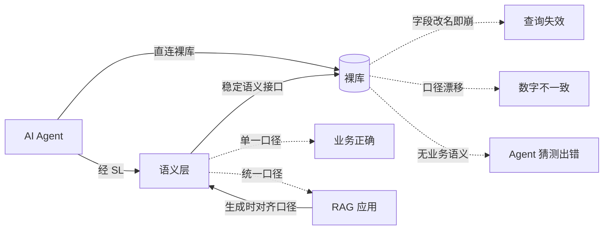
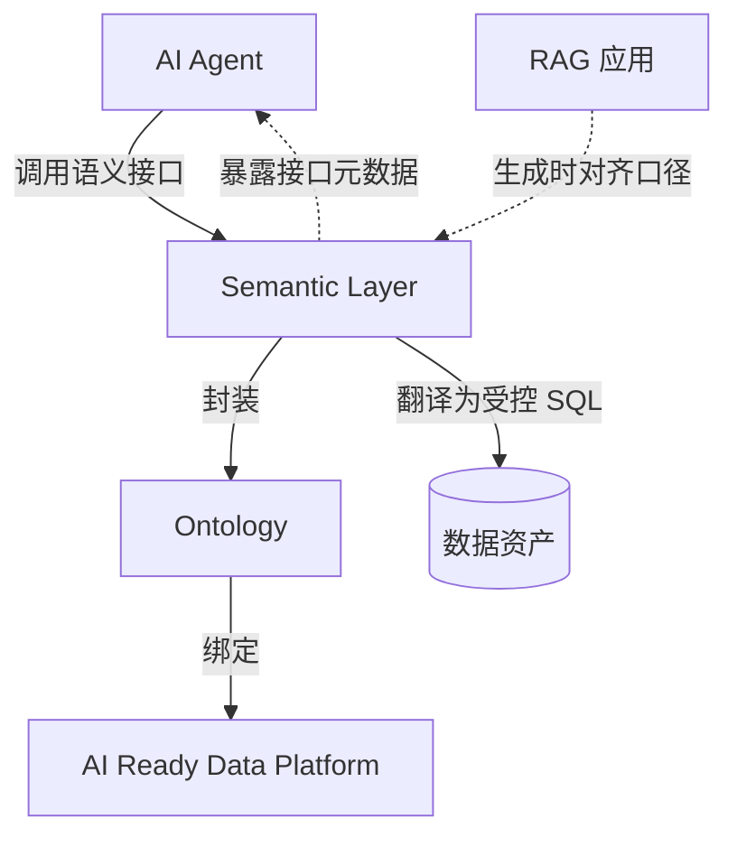
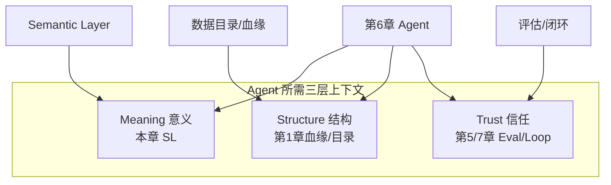
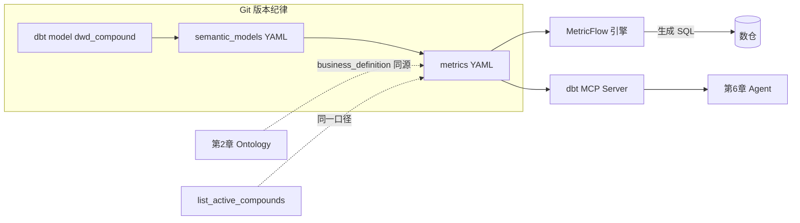

# 语义层：Semantic Layer

> 本章所属 DDA 层：Semantic Layer

## 问题

为什么 AI 智能体（AI Agent）不应该直连裸库写 SQL？因为裸库不携带语义，Agent 写出的 SQL 没有业务正确性保障。

数据工程师为什么要学语义层（Semantic Layer，SL）？因为它是数据本体（Ontology）的工程化实现，是把上一章定义的"机器如何理解业务世界"变成"Agent 可调用的接口"的那一层。Ontology 回答"业务世界是什么意思"，SL 回答"Agent 怎么按这个意思去取数据"。没有 SL，Ontology 就是悬空的概念模型；有了 SL，Agent 才能经稳定接口消费数据，而不是自己拼 SQL。

SL 解决的问题是：让 Agent 经语义接口访问数据，而非裸 SQL——在 Ontology 与消费方之间，SL 既是**传递通道**（对付传递不可靠），也是**产品交付接口**（把语义封装为可调用能力）。由此带来口径统一、字段改名不崩、查询可追责；口径漂移、RAG 与 Agent 各说各话，都是这一层失效时的典型症状。

需要强调的是，SL 不只服务 Agent 的结构化查询，也为知识库与检索增强生成（Retrieval-Augmented Generation，RAG）应用提供口径锚点。RAG 生成答案时引用的数据，必须与 SL 定义的业务口径一致，否则 AI 答案里的数字与报表对不上。SL 是跨消费方的单一口径来源，既给 Agent 调用，也给 RAG 生成时对齐数据口径。本章聚焦 SL 本身，RAG 如何对齐口径在后续章节展开。

## 传统方案

传统数据消费里，分析师直接写 SQL。口径写在 BI 语义层或 ETL 注释里。药明诺华的早期实践是：分析师查"在研的 c-Met 抑制剂"，自己写：

```sql
SELECT research_code
FROM dwd_compound
WHERE target = 'c-Met'
  AND status IN ('phase1','phase2','phase3');
```

字段名 `target`、取值 `c-Met`、状态过滤条件，全靠分析师记忆与口口相传。BI 语义层 [^1] 会封装一部分指标定义，但它的服务对象是人读报表，不是 Agent 消费。

## 为什么失效

失效机制有四条，每条都有具体后果。

第一，字段改名即崩溃。上游把 `research_code` 改成 `compound_code`，所有依赖这张表的 SQL 与 Agent 提示词全部失效。没有语义层隔离，物理 schema 的任何变动直接冲击消费方。

第二，口径漂移。同一指标"在研化合物数"，研发系统按 `status IN ('phase1','phase2','phase3')` 算，BI 报表把 `preclinical` 也算进去，Agent 又用了第三种口径。三个数字不一样，没人说得清哪个对。BI 语义层只管报表口径，管不到 Agent。垂直数据服务商把单一口径定义点当作产品基础设施（见[附录](../appendix/index.md)）；SL 把同一纪律接到 AI 消费——报表、Agent、RAG 引用同一处定义。口径漂移是语义传递不可靠最直观的业务后果。

第三，Agent 不懂"这张表到底算什么"。Agent 直连裸库时，它看到的是表名与字段名，不是业务语义。它不知道 `dwd_compound` 里 `status='A'` 是什么意思，只能猜，猜错就答错。裸库给不了 Agent 业务正确性。

第四，RAG 与 Agent 口径各说各话。没有 SL 时，RAG 应用自造口径，生成的数字与数仓报表不一致；Agent 查的结构化数据与 RAG 答案里的数字也各算各的。用户从 Agent 拿到一个数，从 RAG 答案拿到另一个数，两个数都对不上，因为没有任何一层统一口径。

这里必须澄清一个混淆：**语义层不是 BI 语义层。** BI 语义层服务人读报表，容忍口径模糊与人工兜底；SL 服务 Agent 与 RAG 消费，要求契约稳定、单一口径定义点、可程序发现与调用。两者的稳定性、契约、消费要求完全不同。把 BI 语义层当作 SL 用，Agent 与 RAG 消费的稳定性就得不到保障。



图：Agent 直连裸库与经语义层消费的对比（DDA 层：Semantic Layer）

解读：上半部分 Agent 直连裸库，遇到字段改名、口径漂移、无业务语义三类失效。下半部分 Agent 经 SL 消费，SL 提供稳定语义接口并向下封装裸库变动，单一口径定义保证业务正确。RAG 也在生成时经 SL 对齐口径，与 Agent 共享同一份口径来源。这张图说明 SL 的价值是隔离与统一：隔离物理变动，统一业务口径，且统一覆盖 Agent 与 RAG 两类消费方。

## 新的设计思想

DDA 方法重新看这一层：Agent 不该写 SQL，该调语义接口。SL 的设计思想有六点。

第一，语义 API 而非语义表。SL 对外暴露的是可调用的语义接口（Semantic API），不是又一张语义表。Agent 调用"查活性化合物"这个接口，不需要知道底层表结构。

第二，单一口径定义点。一个指标只在一处定义，所有消费方共用。"在研化合物数"在 SL 定义一次，报表、Agent、RAG 生成引用它。

第三，版本化。语义接口有版本，破坏性变更新主版本，老版本保留过渡期，消费方有迁移窗口。

第四，Agent 可发现、可调用。SL 的接口元数据本身可被 Agent 查询，Agent 知道有哪些语义接口、各自含义与参数。

第五，拒绝直连裸库。SL 是 Agent 访问数据的唯一通道，裸库不对 Agent 开放。这是边界，不是建议。

第六，跨消费方口径锚点。SL 不只封装 SQL，还封装"业务怎么说"。Agent 查询与 RAG 生成涉及数据时，都引用 SL 的口径定义，保证两类消费方的数字一致。

SL 是 Ontology 的工程化实现接口。Ontology 定义"业务世界是什么意思"，SL 把这份意思封装成"Agent 与 RAG 都能调用的接口"。

## 架构设计



图：Semantic Layer 在消费链中的位置（DDA 层：Semantic Layer）

解读：Agent 调用 SL 的语义接口，SL 基于下层 Ontology 理解业务语义，把调用翻译为受控 SQL 访问数据资产。SL 同时向 Agent 暴露接口元数据，让 Agent 能发现可调用的接口。RAG 在生成涉及数据的答案时，也向 SL 对齐口径。注意箭头方向：消费方向上指向下，Agent 经 SL、经 Ontology 到数据。SL 不是又一层存储，是消费通道上的语义封装层，且同时服务 Agent 与 RAG。

两层分离是这里的工程关键：语义面（定义业务口径）与数据面（执行物理查询）分开。语义面稳定，数据面可变。底层换表、换引擎，语义面不动，Agent 与 RAG 都不受影响。

## 工程实践

### 语义接口的定义

以药明诺华的语义接口为例，用 YAML 声明：

```yaml
semantic_api:
  name: list_active_compounds
  version: 2.1.0
  description: 查询活性化合物清单
  business_definition: |
    通过初筛、进入临床前或临床阶段的候选化合物。
    口径：status IN ('preclinical','phase1','phase2','phase3')
  parameters:
    - name: target
      type: string
      optional: true
      meaning: 按靶点过滤，如 c-Met
    - name: phase
      type: enum
      optional: true
      values: [preclinical, phase1, phase2, phase3]
  returns:
    fields: [compound_id, research_code, target, status]
  underlying:
    table: dwd_compound
    filter: "status IN ('preclinical','phase1','phase2','phase3')"
  owner: semantic-platform@novapharm.example
```

`business_definition` 是单一口径定义点，所有消费方引用它。`underlying` 封装了底层表与过滤条件，Agent 看不到也不需要看到。版本号控制变更：加参数是小版本，改口径是大版本。

### 两层分离

语义面负责"业务怎么说"，数据面负责"数据怎么查"。药明诺华的实践是把两者分开维护：语义面用 YAML 定义接口与口径，数据面负责把语义翻译为具体 SQL 并执行。底层从 PostgreSQL 换到带向量扩展的引擎，语义面不动，Agent 与 RAG 都不受影响。

这种分离与 dbt MetricFlow [^2]、Cube 等**通用语义层（Universal / Headless Semantic Layer）**工具的思路一致（仅为实现选择）——指标定义从 SQL 抽离、进 Git 版本管理。业界还有与云平台绑定的路线，选型差异放在本节后半「落地选型」统一对照，此处只强调分离原则：语义面稳定，数据面可变。

### SL 作为 Agent 与 RAG 的共同口径锚点

SL 不只服务 Agent 的结构化查询，也服务 RAG 的生成口径对齐。这里说明 RAG 如何消费 SL，而非以 RAG 为设计依据。

**RAG 生成时对齐 SL 口径**。当 RAG 生成的答案涉及数据指标（如"在研化合物数""c-Met 抑制剂数量"），这些指标的口径必须与 SL 定义一致。RAG 在生成前，从 SL 取对应指标的 `business_definition`，作为生成约束。这样 RAG 答案里的数字与 Agent 查询的数字、报表的数字三者一致，因为都引用同一份 SL 口径。

**Agent 结合 SL 结构化查询与 RAG 知识答案**。Agent 完成多步任务时，可能既经 SL 查结构化数据（如"在研化合物清单"），又经 RAG 取知识答案（如"试验终止的合规要求"）。两类结果在 Agent 处汇总时，涉及数据的部分都以 SL 口径为准。SL 是 Agent 把结构化查询结果与 RAG 知识答案拼到一起时的口径基准。

**口径变更同步两类消费方**。SL 的口径定义变更时（如"在研"是否含 `preclinical`），Agent 与 RAG 都经版本化机制收到通知并迁移。不会出现 Agent 用新口径、RAG 还用老口径的不一致。

SL 的设计原则因此要补一条：口径定义要覆盖 Agent 查询与 RAG 生成两类场景，不能只管 Agent 不管 RAG。

### 五层 SQL 护栏

SL 把 Agent 的查询翻译为受控 SQL 时，需要护栏防止越权与出错。五层护栏由浅入深：

1. **语法层**：校验 SQL 语法合法性。
2. **策略黑名单层**：拦截危险操作（DROP、DELETE、无 LIMIT 的全表扫描）。
3. **AST 列白名单层**：解析 SQL 抽象语法树，只允许访问白名单内的表与列。
4. **术语语义层**：校验查询用的术语是否与 Ontology 口径一致，拦截自造口径。
5. **成本估算层**：估算查询成本，超阈值拦截或降级，防止 Agent 跑垮平台。

五层叠起来，Agent 经 SL 发出的查询既语义正确又工程安全。注意这套护栏是 SL 的内部机制，不是 Agent 要学的东西。Agent 只管调语义接口，护栏由 SL 自动施加。

### MCP 使语义层对 Agent 原生

垂直数据服务商早已用数据即服务（Data-as-a-Service，DaaS）[^3] 形态对外交付带口径的 API（详见[附录](../appendix/index.md)）。AI 时代的变化是消费通道从 REST 扩展到模型上下文协议（Model Context Protocol，MCP）[^4]：SL 暴露为 MCP Server 后，Agent 像调内置工具一样调语义接口，无需把 SQL 拼进提示词。MCP 是通道，不是 SL 的定义。

企业转型的关键不是先上 MCP，而是**先让内部能力达到数据产品级**——每个对外暴露的能力都是语义接口，有单一口径、有版本，而非裸表。多数企业若跳过产品化、让 Agent 直连裸库，等于新产品消费者接入未完工的产品目录。MCP 把第 2 章 Ontology 与上文语义接口暴露给第 6 章 Agent；通道就绪后，还需选定语义层在贵司技术栈上的落地形态。

### 业界语义层路线对照（落地选型）

上文 `list_active_compounds` 的 YAML、`business_definition` 与五层护栏是 DDA 对 SL 的要求，与具体厂商无关。2025 年前后「语义层复兴」的本质是：Agent 消费迫使指标定义从 BI 内嵌走向可程序发现、可版本化——药明诺华若已 all-in 某云或 dbt，选型应服从**与 Ontology 同源、与 Agent 可发现**这两条，而不是另起一套口径。

| 模式 | 代表方案 | 与上文 SL 原则的对应 | 药明诺华适配 |
| --- | --- | --- | --- |
| **Universal / Headless** | dbt MetricFlow、Cube | YAML 指标 + Git；可经 MCP 暴露 | 已有 dbt 栈时，`list_active_compounds` 口径可迁入 MetricFlow |
| **Platform-native** | Snowflake Cortex Semantic Views | 仓内单一口径；Cortex Agents 为下游消费者 | 已 all-in Snowflake |
| **Platform-native** | Databricks Unity Catalog + Genie | UC 血缘/权限 + 栈内指标；Genie 为消费界面 | 已 all-in Databricks |
| **BI-native** | LookML、Power BI | 人读报表口径；Agent 集成弱 | 不满足本章 Agent SL 要求 |

**dbt MetricFlow**（仅为一种实现选择）：指标 measures/dimensions 与 Ontology `business_definition` 应同源；dbt MCP Server 让 Agent 调已认证指标而非拼 SQL。

**Cube**（仅为一种实现选择）：Headless + REST/GraphQL/**MCP**，适合多消费方（内部 Agent、合作方 API）共用同一语义面。

**Snowflake Cortex Semantic Views / Databricks UC**（仅为一种实现选择）：指标与仓一体；Cortex Agents、Genie 是第 6 章 Agent 消费者，不能替代第 2 章别名消歧——若 Semantic Views 不知道 `NVP-001` 即 `savolitinib`，平台 Agent 仍会猜错。

**OSI（Open Semantic Interchange）**：指标定义跨工具移植的标准动向，对应避免 SL 锁定，不是 SL 本身。



图：SL 只覆盖 Meaning — Structure 与 Trust 须另建（DDA 层：Semantic Layer）

解读：只完成本章 SL，仍缺第 1 章可程序血缘（Structure）与第 5 章 RAG 黄金集（Trust），第 6 章 Agent 会「口径对但不可信」。选型 MetricFlow 或 Cortex Semantic Views 不改变这一分工。

落地路线与投入分档见[第 9 章](../decision-boundary/index.md)；药明诺华与平台 Object/Bindings 命名对照见[附录](../appendix/index.md)。

### 落地深潜：dbt MetricFlow 与药明诺华

对照表里 **dbt MetricFlow** 一行，最适合用本章已有的 `list_active_compounds` 语义接口做**完整投影**——读者已经见过 YAML 里的 `business_definition` 与 `underlying.filter`；MetricFlow 做的是把「口径 + 维度 + 聚合」从分析师各自的 SQL 里抽出来，交给 **semantic graph**（语义图）统一生成 SQL。MetricFlow 是 dbt Semantic Layer 的查询引擎（仅为一种实现选择）：用 YAML 声明 semantic models 与 metrics，由引擎按实体（entities）遍历路径、拼装 join 与聚合，避免 fan-out / chasm join；指标定义进 Git，与 dbt 模型同一套 PR、测试与版本纪律。

#### 场景：同一个问题，三种 SQL

BI 晨会，三个数字打架：研发看板显示 c-Met 靶点「在研化合物」**4** 个，临床 PM 报表 **5** 个，刚上线的 Agent 答 **7** 个。追问 SQL 才发现：有人把 `preclinical` 算进在研，有人只数 `phase1–3`，有人忘了排除上周刚 `suspended` 的 `NVP-001`。这正是本章「为什么失效」里的口径漂移——**不是 Agent 笨，是没有单一口径定义点**。药明诺华若已用 dbt 管 `dwd_compound`，MetricFlow 把 `list_active_compounds` 的口径固化为可版本化指标，报表、Agent、RAG 引用同一处定义。

#### 这套框架是什么：semantic model、entity、dimension、metric

MetricFlow 引入三类核心元数据（与上文「语义 API 而非语义表」一致，只是落为 dbt 项目内的 YAML）：

| 概念 | 作用 | 药明诺华 `list_active_compounds` 映射 |
| --- | --- | --- |
| **Semantic model** | 语义图的节点，对应一个 dbt model（如 `dwd_compound`） | 粒度：一行一化合物 |
| **Entity** | 遍历路径 / join 键（primary、foreign） | `compound_id` 为 primary entity `compound` |
| **Dimension** | 切片维度（categorical、time） | `target`（c-Met）、`status`、`phase` |
| **Measure** | 列上的聚合原语（sum、count_distinct…） | 对化合物行 `count_distinct` |
| **Metric** | 对外暴露的指标名 | `active_compound_count`、`active_compound_list` 等 |

**Semantic graph** 是 DAG 的子集：表是节点，entity 是边；MetricFlow 生成指标 SQL 时自动选 join 路径，而不是让分析师手写 `LEFT JOIN`。这与本章「语义面稳定、数据面可变」一致——底层 `research_code` 改成 `compound_code`，只改 dbt model 与 semantic model 的 `expr`，指标名 `active_compound_count` 不变，Agent 与 BI 不用改。

下面把上文语义接口 YAML **同源**翻译为 MetricFlow 配置（仅为示例，非安装教程）：

```yaml
# models/marts/compound/_compound_semantic.yml
semantic_models:
  - name: novapharm_compound
    description: |
      药明诺华化合物宽表，一行一候选化合物。
      口径与 Ontology entity Compound 及契约 compound_active 对齐。
    model: ref('dwd_compound')
    defaults:
      agg_time_dimension: updated_at
    entities:
      - name: compound
        type: primary
        expr: compound_id
    dimensions:
      - name: target
        type: categorical
        description: 靶点，如 c-Met
      - name: status
        type: categorical
        description: 研发状态 discovery…withdrawn
      - name: phase_bucket
        type: categorical
        expr: |
          CASE WHEN status IN ('preclinical','phase1','phase2','phase3')
               THEN status ELSE 'other' END
    measures:
      - name: compound_count
        description: 化合物行数
        agg: count_distinct
        expr: compound_id

metrics:
  - name: active_compound_count
    label: 在研化合物数
  # 与 list_active_compounds.business_definition 同源 — 改口径须 PR 评审
    description: |
      通过初筛、进入临床前或临床阶段的候选化合物。
      status IN ('preclinical','phase1','phase2','phase3')
    type: simple
    type_params:
      measure: compound_count
    filter: |
      {{ Dimension('novapharm_compound__status') }} IN (
        'preclinical','phase1','phase2','phase3'
      )
```

要点有三。第一，`description` 与第 2 章 Ontology、`list_active_compounds` 的 `business_definition` **必须同源**——MetricFlow 不是第二套口径。第二，`filter` 编码在研状态集，与 `underlying.filter` 一致；若临床部门决定「在研」不含 `preclinical`，只改此处并升指标主版本，消费方走 dbt 版本迁移。第三，`entity` + `dimensions` 让「按靶点 c-Met 分组的在研数」成为引擎可生成的标准查询，而不是每次手写 `WHERE target = 'c-Met'`。

分析师与 Agent 侧可用 MetricFlow CLI（`mf query`）或 dbt Cloud Semantic Layer API 查询：

```text
# 概念示例：MetricFlow 生成受控 SQL，非 Agent 手写
mf query --metrics active_compound_count \
  --group-by novapharm_compound__target \
  --where "novapharm_compound__target = 'c-Met'"
```

返回的单一数字，与 `list_active_compounds(target='c-Met')` 在契约一致时的行数相同——因为语义面只有一份定义。

#### 怎么用：从 dbt model 到第 6 章 Agent

药明诺华推荐流水线与附录消费链、第 6 章 Agent 工程实践一致：



图：MetricFlow 在 SL 中的位置 — 语义图生成 SQL，MCP 暴露给 Agent（DDA 层：Semantic Layer）

1. **数据面**：第 1 章 `compound_active` 契约入仓，`dwd_compound` 为 dbt mart，血缘进目录（Structure，第 1 章）。
2. **语义面**：semantic model + metrics YAML 进 Git；改 `active_compound_count` 走 PR，与改 API 契约同级。
3. **消费面**：报表经 Semantic Layer JDBC/REST；Agent 经 **dbt MCP Server**（仅为一种实现选择）调用 `list_metrics`、`get_dimensions`、`query_metrics`，按组织定义查指标而非拼 SQL。官方集成路径与 Snowflake Cortex Agent 说明一致：编排指令应优先 Semantic Layer 工具。
4. **护栏**：MetricFlow 生成 SQL 仍须过本章「五层 SQL 护栏」——引擎不是安全边界；禁止 Agent 旁路 MCP 直连仓。

**RAG 对齐**：第 5 章 RAG 生成「在研 c-Met 抑制剂约 X 个」时，应从 SL 取 `active_compound_count` 的 `description` / 版本号作为生成约束，而非让 LLM 读文档猜 X。本章「SL 作为 Agent 与 RAG 的共同口径锚点」在 MetricFlow 里体现为**指标元数据即锚点**。

#### 解决了什么问题：相对手写 SQL 与相对 BI 内嵌口径

| 问题 | 手写 SQL | BI 语义层（LookML 等） | MetricFlow + MCP |
| --- | --- | --- | --- |
| 口径漂移 | 每人一份 WHERE | 服务人读报表 | 单指标定义 + Git |
| Agent 消费 | 拼 SQL，不可追责 | 集成弱 | `query_metrics` 可追溯 |
| 字段改名 | 全库 SQL 炸裂 | 部分隔离 | 改 model/semantic model |
| 跨表指标 | 手写 join 易 fan-out | 视产品而定 | entity 路径自动生成 |
| 与 Ontology 同源 | 无 | 常脱节 | 需工程纪律：description 对齐 |

MetricFlow **不**替代第 2 章别名消歧：指标 filter 用 `target = 'c-Met'`，若用户问 savolitinib，仍须 Ontology 把通用名映射到 `NVP-001` / `compound_id`，再作为 Agent 工具参数传入 `query_metrics`。**不**替代 Trust：指标对了但数据脏，靠第 5 章 Eval 与第 7 章 Data Loop（上图 Meaning / Structure / Trust 分工不变）。

#### 企业落地实践：药明诺华 dbt 栈上的 90 天

与附录 RACI、30-60-90 对齐：

1. **第 1–30 天**：在 `dwd_compound` 上建一个 semantic model + 一个 `active_compound_count`；与 `list_active_compounds` 口径 diff 为零；dbt test 断言与契约行数一致。
2. **第 31–60 天**：增加 `target`、`status` 维度；BI 改读 Semantic Layer；禁止新报表手写 `status IN (...)`。
3. **第 61–90 天**：上线 dbt MCP Server；第 6 章试点 Agent 只许 `query_metrics`；口径变更走 major version + 消费方迁移窗口。
4. **组织**：指标 owner 对齐 `semantic-platform@novapharm.example`；临床与研发对「在研」定义签字后方能改 metric filter（与 Ontology L3 同一变更单）。
5. **OSI**：若未来迁移 Cube 或平台 Semantic Views，用 Open Semantic Interchange 导出指标定义，避免锁定——OSI 是移植格式，不是 SL 本身。

若试验 `NCT04012345` 终止、第 2 章 Action 将 `NVP-001` 标为 `suspended`，`dwd_compound` 刷新后 MetricFlow 查询自动排除该化合物——**无需改 Agent 提示词**。这是 SL 相对提示词工程的根本优势：变在语义面，消费面不动。

## 最佳实践

**单一口径定义点**：一个指标只在一处定义，杜绝多口径并存。任何重复定义都是隐患。

**接口优先于表**：对外只暴露语义接口，不暴露表。物理 schema 变动不冲击消费方。

**版本化与迁移窗口**：破坏性变更新主版本，老版本保留过渡期，给消费方迁移时间。

**护栏内建**：SQL 护栏是 SL 的一部分，不是外挂。Agent 的查询必须过护栏，没有旁路。

**与 Ontology 同源**：SL 的口径定义必须与 Ontology 一致，不能自造。SL 是 Ontology 的工程投影。

**不开放裸库给 Agent**：这是硬边界。Agent 一旦能直连裸库，SL 的所有保障都失效。

**口径覆盖两类消费方**：SL 口径要覆盖 Agent 查询与 RAG 生成两类场景，不能只管 Agent 不管 RAG。

## 延伸阅读

- **语义层复兴**：dbt MetricFlow 开源相关资料；Cube、AtScale、LookML 语义层对比资料；Open Semantic Interchange（OSI）标准。
- **BI 语义层与 Agent 语义层的区别**：语义层复兴讨论中关于 Agent 消费与 BI 消费差异的资料。
- **MCP 协议**：模型上下文协议（Model Context Protocol）规范与语义层暴露为 MCP Server 的实践资料。

[^1]: BI 语义层（BI Semantic Layer）的概念，参见 LookML、dbt MetricFlow 等工具的文档与语义层复兴相关讨论。
[^2]: dbt MetricFlow 是 dbt 开源的语义层引擎，用 YAML 声明指标口径并从 SQL 抽离集中管理；Cube、AtScale、LookML 同属语义层工具家族，参见各自开源项目文档与语义层对比资料。
[^3]: 数据即服务（Data-as-a-Service，DaaS）是把数据封装为可调用 API 产品对外交付的模式，客户按调用或订阅付费，是数据服务商的主要商业模式。
[^4]: 模型上下文协议（Model Context Protocol，MCP）是让工具对 AI 智能体原生可调用的协议规范，参见 MCP 规范文档。

## Checklist

- [ ] Agent 是否经语义接口消费数据，而非直连裸库写 SQL？
- [ ] 每个指标是否有单一口径定义点，无重复定义？
- [ ] 语义接口是否版本化，破坏性变更是否有迁移窗口？
- [ ] 接口元数据是否可被 Agent 程序发现与调用？
- [ ] 是否澄清了 SL 与 BI 语义层的区别，未混用？
- [ ] SQL 护栏是否内建，覆盖语法、黑名单、列白名单、术语、成本五层？
- [ ] 语义面与数据面是否分离，底层变动不冲击 Agent？
- [ ] SL 口径是否与下层 Ontology 同源，未自造口径？
- [ ] SL 口径是否覆盖 Agent 查询与 RAG 生成两类场景，RAG 生成时是否对齐 SL 口径？
- [ ] 是否对照过 Universal / Platform-native / BI-native 路线与当前栈的匹配度（见业界路线对照与 MetricFlow 落地深潜）？

---

**自检（依据 WRITING_STYLE §9）**：本章为何需要？因为 Agent 不应直连裸库，且 RAG 生成也需要口径锚点。数据工程师为何关心？SL 是 Ontology 的工程化实现，是数据工程师最该负责的 Agent 与 RAG 共同消费通道。解决什么问题？让 Agent 经稳定语义接口取数据、RAG 生成时对齐口径，口径统一、字段改名不崩。属哪一 DDA 层？Semantic Layer。改变什么架构？把数据消费从裸 SQL 转为语义 API，语义面与数据面分离，且 SL 成为 Agent 与 RAG 的共同口径锚点。
