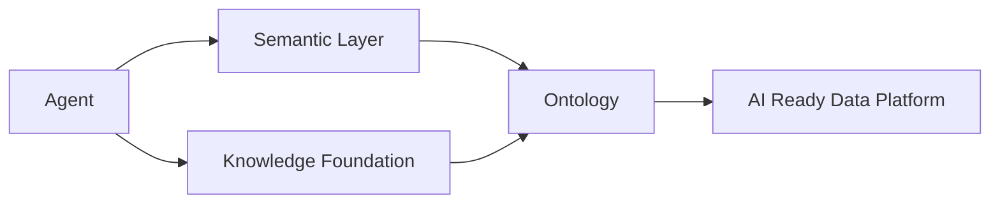

# ARCHITECTURE.md

# DDA 方法论：各层定义与章节依赖

> 本文件定义《Data-Driven AI：从数据到智能》的方法论骨架。
>
> 任何章节在开写前，必须先确认自己属于本文件的哪一层。
>
> 层的定义、层与层的关系，以本文件为准。

---

# 一、DDA 方法论总览

## 1.1 什么是 DDA

DDA = Data-Driven AI。

DDA 是一种以数据为起点的 AI 系统设计方法。

它不是一种框架。

它不是一种产品。

它是一组关于"AI 系统应该围绕什么组织"的工程判断。

## 1.2 DDA 的核心立场

数据是中心。

模型、Prompt、Agent 都不是中心。

AI 系统的竞争壁垒来自数据资产与数据闭环，不来自模型本身。

## 1.3 DDA 与其他立场的区别

| 立场 | 起手点 | 核心资产 | 本书态度 |
| --- | --- | --- | --- |
| LLM-Driven | 模型能力 | Prompt | 不写 |
| Prompt-Driven | 提示工程 | Prompt 模板 | 不写 |
| Agent-Driven | Agent 编排 | 工作流 | 仅作为消费方 |
| Data-Driven（本书） | 数据 | Ontology + Data Loop | 唯一立场 |

## 1.4 判定规则

如果一个章节的论证起点是"某模型能做什么"，它不是 DDA。

如果一个章节的论证起点是"数据长什么样、业务世界如何被机器理解"，它是 DDA。

---

# 二、各层定义

每一层采用统一格式：

- 定义
- 解决什么问题
- 为什么传统方案失效
- 工程化要点
- 与上下层的关系

## 2.1 AI Ready Data Platform

### 定义

让企业数据从"能跑批"变为"能被 AI 系统可靠消费"的数据底座。

### 解决什么问题

AI 系统需要的数据访问语义、新鲜度、可追溯性、契约稳定性，传统数仓不提供。

### 为什么传统方案失效

传统数仓面向 BI 报表设计。

报表可以容忍 T+1。

报表可以容忍口径模糊。

AI 系统不行。

### 工程化要点

- 数据契约（Data Contract）
- 数据新鲜度与可见性
- 元数据可被程序消费
- 血缘可被 Agent 追溯
- 质量可被持续校验

### 与上下层的关系

上层：Ontology。

AI Ready Data Platform 提供"原料"，Ontology 提供"理解原料的方式"。

## 2.2 Ontology

### 定义

Ontology 是机器理解企业业务世界的方式。

它定义业务实体、关系、规则、约束。

### 解决什么问题

让 AI 系统拥有一份与人类业务共识对齐的"世界模型"。

### 为什么传统方案失效

传统数仓的语义散落在表名、字段名、ETL 注释、BI 口径里。

没有统一来源。

AI 无法读取。

### Ontology 不是什么

Ontology 不是 RDF。

Ontology 不是 OWL。

Ontology 不是知识图谱。

Ontology 不是某款图数据库。

这些只是 Ontology 的可能实现技术，不是 Ontology 本身。

### 工程化要点

- 实体与关系的显式定义
- 业务规则的显式编码
- 与数据资产的绑定
- 可被 Agent 程序化消费
- 可演进

### 与上下层的关系

下层：AI Ready Data Platform。

上层：Semantic Layer。

Semantic Layer 是 Ontology 的工程化实现接口。

## 2.3 Semantic Layer

### 定义

Semantic Layer 是 Ontology 的工程化实现。

它把 Ontology 暴露为 AI 系统可调用的语义接口。

### 解决什么问题

让 Agent 通过语义访问数据，而不是写裸 SQL。

### 为什么传统方案失效

裸 SQL 脆弱。

口径漂移。

字段改名即崩溃。

Agent 无法理解"这张表到底在算什么"。

### Semantic Layer 不是什么

Semantic Layer 不是 BI 语义层。

BI 语义层面向人读报表。

Semantic Layer 面向 Agent 消费数据。

二者的稳定性要求、契约要求、消费方式完全不同。

### 工程化要点

- 语义 API 而非语义表
- 口径单一定义点
- 版本化
- Agent 可发现、可调用
- 拒绝裸库直连

### 与上下层的关系

下层：Ontology。

上层：Knowledge Foundation。

Knowledge Foundation 在 Semantic Layer 提供的结构化语义之上，叠加非结构化知识。

## 2.4 Knowledge Foundation

### 定义

Knowledge Foundation 是 AI 系统的知识基础设施。

它把结构化语义（Ontology + Semantic Layer）与非结构化知识统一组织。

### 解决什么问题

AI 系统不仅要查数据，还要理解数据背后的业务知识、流程、约束、历史决策。

### 为什么传统方案失效

传统知识管理是文档库。

文档之间无关联。

文档与数据无关联。

AI 无法把"这份 SOP"和"这张表"对应起来。

### 工程化要点

- 知识与实体的绑定
- 知识的版本与时效
- 知识的可检索
- 知识的可引用（Citation）

### 与上下层的关系

下层：Semantic Layer。

上层：RAG。

RAG 在 Knowledge Foundation 之上做检索与 Grounding。

## 2.5 RAG

### 定义

RAG 是企业知识基础设施的检索与落地层。

它让 AI 系统在生成前先"接地"（Grounding）。

### RAG 不是什么

RAG 不是"向量数据库 + 大模型"。

那是 RAG 的一个最简实现，不是 RAG 的定位。

### 解决什么问题

让 AI 系统的回答可追溯、可引用、可校验。

### 为什么传统方案失效

直接让 LLM 回答，会产生幻觉。

没有 Citation，无法追责。

没有 Grounding，无法对齐企业事实。

### 工程化要点

- 知识组织（不是只做切块）
- 检索（不只是向量相似度）
- Grounding（生成前对齐事实）
- Citation（生成后可追溯）
- Evaluation（持续评估检索与生成质量）

### 不重点讨论

不要大量讨论 Prompt。

不要把重点放在 Embedding 模型选型。

### 与上下层的关系

下层：Knowledge Foundation。

上层：AI Agent。

Agent 调用 RAG 获取 grounded 知识，而非凭空生成。

## 2.6 AI Agent

### 定义

AI Agent 是消费上述所有层的执行单元。

它不是中心。

### Agent 不是什么

Agent 不是中心。

数据才是中心。

Agent 不是"会调工具的 LLM"。

那只是 Agent 的一个实现视角。

### 解决什么问题

让 AI 系统能在受控的语义边界内完成多步任务。

### 为什么传统方案失效

让 Agent 直接连数据库，会失控。

让 Agent 自己写 SQL，会出错且无法追责。

让 Agent 自己编口径，会与企业共识脱节。

### 工程化要点

- Agent 消费 Ontology
- Agent 消费 Semantic Layer
- Agent 消费 Knowledge Foundation
- Agent 不直连裸库
- Agent 的每一步可追溯

### Agent 的消费链路

### 与上下层的关系

下层：RAG / Knowledge Foundation / Semantic Layer。

上层：Data Loop。

Agent 的执行结果回流，驱动 Data Loop。

## 2.7 Data Loop

### 定义

Data Loop 是 AI 系统持续学习、持续修正、持续演进的能力。

### Data Loop 不是什么

Data Loop 不是新的 ETL。

Data Loop 不是数据管道的另一个名字。

Data Loop 不是模型再训练流程。

### 解决什么问题

让 AI 系统的输出反过来修正数据、知识、Ontology。

### 为什么传统方案失效

传统数据管道是单向的。

数据流向下游，下游不回流。

错误不反馈，知识不更新，Ontology 不演进。

### 工程化要点

- 反馈采集
- 反馈回流到数据
- 反馈回流到知识
- 反馈回流到 Ontology
- 闭环可观测

### 与上下层的关系

下层：AI Agent。

上层：Ontology Evolution。

Data Loop 的持续运转驱动 Ontology Evolution。

## 2.8 Ontology Evolution

### 定义

Ontology Evolution 是 Ontology 随业务与反馈持续生长的能力。

### 解决什么问题

业务在变，Ontology 不能是静态的。

### 工程化要点

- Ontology 的版本化
- 变更的可追溯
- 变更对 Semantic Layer 的下游影响
- 变更对历史数据的兼容

### 与上下层的关系

Ontology Evolution 回到主线起点，形成闭环。

## 2.9 路线选择与适用边界（跨层）

### 定义

路线选择与适用边界是跨层决策框架，帮助读者在资源有限时判断：DDA 八层应建到哪一档、哪些层可暂缓、自建与采购如何组合。

### 解决什么问题

企业不能也不应每层都上满；误用全套 DDA 与误用 Text-to-SQL 或 AI 沙箱同样危险。

### 为什么需要单独成章

各层正文讲「为什么需要这一层」，本章讲「何时可以不要或降级这一层」。

二者互补，不构成矛盾。

### 工程化要点

- 按语义传递不可靠与语义时效不可靠分型诊断
- 三档成熟度（轻量 / 标准 / 完整）分阶段建设
- 反面教材：过度 Ontology、过早 Data Loop、采购平台但数据前提空心化
- 自建 YAML/Git 与商业 Ontology 平台（Palantir、Fabric IQ 等）的能力映射，非厂商排行榜
- 中小团队 Minimum Viable Ontology（MVO）路径

### 与八层的关系

读完 Ontology Evolution 之后阅读；可被附录成熟度模型与 RACI 引用。

不替代任何一层的定义。

---

# 三、章节依赖关系

## 3.1 主线递进图

见 `BOOK_CONSTITUTION.md` 第三章。

## 3.2 前置依赖矩阵

写某层章节前，应先读哪些层的定义：

| 要写的层 | 必读前置层 |
| --- | --- |
| AI Ready Data Platform | 无 |
| Ontology | AI Ready Data Platform |
| Semantic Layer | Ontology |
| Knowledge Foundation | Semantic Layer |
| RAG | Knowledge Foundation |
| AI Agent | Semantic Layer, Knowledge Foundation, RAG |
| Data Loop | AI Agent |
| Ontology Evolution | Ontology, Data Loop |
| 路线选择与适用边界（跨层） | 全部八层 |

## 3.3 反向引用规则

某层章节可被哪些后续层引用：

| 被引用的层 | 可被引用的层 |
| --- | --- |
| AI Ready Data Platform | 所有后续层 |
| Ontology | Semantic Layer 及之后所有层 |
| Semantic Layer | Knowledge Foundation 及之后所有层 |
| Knowledge Foundation | RAG 及之后所有层 |
| RAG | AI Agent 及之后所有层 |
| AI Agent | Data Loop 及之后所有层 |
| Data Loop | Ontology Evolution |

## 3.4 禁止反向

低层章节不得引用高层概念。

例如，AI Ready Data Platform 章节不得出现"为 Agent 服务"作为主要论证。

它可以提到下游会消费，但不能把高层概念作为自己的设计依据。

---

# 四、章节归属判定

## 4.1 新增内容如何归属

回答三个问题：

1. 它主要解决主线上哪一段的问题？
2. 它的主要读者是谁？
3. 它的核心论证起点是数据还是模型？

第一个问题的答案，就是它的归属层。

## 4.2 跨层主题如何拆分

如果一个主题横跨多层，按以下规则：

- 把"为什么需要"放在最底层归属章节。
- 把"如何被消费"放在更高层章节。
- 不要在多个章节重复定义同一个概念。

## 4.3 不属于任何层的内容

如果一个主题不属于任何一层，它不属于本书。

不要为了"完整性"强行增设章节。

---

# 五、本文件的修订规则

新增一层需要：

1. 在主线图上明确它的位置。
2. 在前置依赖矩阵中追加它的前置。
3. 在反向引用规则中追加它的可被引用关系。
4. 更新 `BOOK_CONSTITUTION.md` 的主线图。

修订一层的定义需要同步检查：

- 它的所有下游章节是否仍成立。
- `GLOSSARY.md` 中相关术语是否仍准确。
