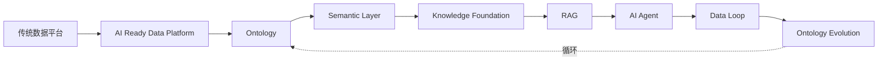

# BOOK_CONSTITUTION.md

# 全书宪法：世界观、原则与边界

> 本文件是《Data-Driven AI：从数据到智能》的最高约束。
>
> 所有章节、所有贡献者、所有 AI 协作 Agent，都必须先读本文件。
>
> 本文件与 `AGENTS.md` 冲突时，以本文件为准。

---

# 一、项目定位与边界

## 1.1 本书是什么

本书是一部开源技术书籍（GitHub Book）。

书名：《Data-Driven AI：从数据到智能》。

英文副标题：Teach Data Engineers How to Think AI。

## 1.2 唯一目标

帮助具有数据研发背景的工程师完成 AI 思维升级（Mindset Shift）。

所有新增内容，都必须围绕这一目标展开。

## 1.3 本书不是什么

本书不是 AI 入门教程。

本书不是 Prompt Engineering 教程。

本书不是 LangChain 或 MCP 的使用手册。

本书不是 AI Framework 的合集。

本书不是某个模型或某个工具的官方文档翻译。

## 1.4 判定规则

如果某段内容无法帮助读者理解 AI 数据架构，则不要写。

如果某段内容换个框架名仍然成立，则它太通用，不要写。

如果某段内容在一年后仍成立，才值得写。

---

# 二、目标读者画像

## 2.1 默认读者

数据研发工程师（Data Engineer）。

数据平台工程师（Data Platform Engineer）。

数据架构师（Data Architect）。

Analytics Engineer。

技术负责人（Tech Lead）。

## 2.2 经验门槛

5~15 年。

## 2.3 读者已掌握的技能

不要重复介绍以下内容，默认读者已经熟悉：

- SQL
- ETL / ELT
- Data Warehouse
- Lakehouse
- CDC
- Streaming
- Spark
- Flink
- Airflow
- 数据治理
- 元数据
- 数据血缘

## 2.4 判定规则

所有内容应建立在上述经验之上。

如果一段话在解释什么是 ETL，删除它。

如果一段话在解释什么是 Spark，删除它。

---

# 三、全书唯一主线

## 3.1 主线

全书只有一条主线：

## 3.2 判定规则

任何新增内容，都必须能够放进这条主线。

如果不能放进，说明它不属于本书。

如果一个概念横跨多段主线，按它"主要解决哪一段的问题"归属。

## 3.3 主线不可拆散

不要把 Ontology 章节写成知识图谱章节。

不要把 Semantic Layer 章节写成 BI 语义层章节。

不要把 Data Loop 章节写成 ETL 章节。

每一层的定义见 `ARCHITECTURE.md`。

---

# 四、两大核心

整本书只有两个真正的核心。

## 4.1 Ontology（数据本体）

Ontology 是机器理解企业业务世界的方式。

所有知识最终都应该回到 Ontology。

Ontology 不是 RDF。

Ontology 不是 OWL。

Ontology 不是知识图谱。

Ontology 不是某款图数据库的产品功能。

## 4.2 Data Loop（数据闭环）

Data Loop 是 AI 系统持续学习、持续修正、持续演进的能力。

Data Loop 是 AI Native 企业最重要的竞争壁垒。

Data Loop 不是新的 ETL。

Data Loop 不是数据管道的另一个名字。

Data Loop 不是模型再训练流程。

## 4.3 判定规则

任何章节，如果既不涉及 Ontology，也不涉及 Data Loop，需要自问它是否属于本书。

---

# 五、Data First 原则

## 5.1 起手必须从数据

讨论任何 AI 架构时，必须首先讨论数据。

而不是首先讨论模型。

## 5.2 禁止的起手

不要从 LLM 起手。

不要从 Prompt 起手。

不要从 Agent 起手。

不要从某个 API 起手。

## 5.3 正确的起手

应该从 Data Foundation 起手。

应该从"数据长什么样、从哪来、怎么治理"起手。

## 5.4 判定反例

如果一个章节的开篇在介绍某个模型的能力，违反 Data First。

如果一个章节的架构图把 LLM 画在中心，违反 Data First。

---

# 六、统一案例约束

## 6.1 全书统一案例

全书统一采用创新药研发（Drug Discovery）作为贯穿案例。

## 6.2 禁止逐章换域

禁止这一章写金融。

禁止下一章写电商。

禁止第三章写制造。

## 6.3 为什么

持续使用同一个案例，让读者看到完整演进过程。

让 Ontology 在同一个业务世界里逐步生长。

让 Data Loop 在同一组数据上闭环。

## 6.4 判定规则

任何章节引入新案例域，需要先在本文件追加授权。

未授权的新域，使用 Drug Discovery 替代。

---

# 七、语言与态度红线

## 7.1 基调

专业。

克制。

工程化。

## 7.2 禁用词

禁用以下营销语言：

- 革命性
- 颠覆
- 黑科技
- 神奇
- 万能
- 一站式（除非确有其物且点名）
- 赋能
- 抓手
- 闭环（作为动词使用时）
- 落地（作为口号使用时）

## 7.3 禁止制造焦虑

不要写"不学 AI 就会被淘汰"。

不要写"再不转型就晚了"。

不要用恐惧驱动读者。

## 7.4 禁止过度口语化

本书不是博客。

本书不是公众号文章。

保持书面工程语言的密度。

## 7.5 写作细节

写作细节见 `WRITING_STYLE.md`。

---

# 八、成功标准

## 8.1 读者应该能说出

希望读者读完后能够说：

"我终于理解 AI 为什么需要 Ontology。"

"我终于理解 Semantic Layer 的价值。"

"我终于理解 Data Loop 为什么如此重要。"

"我终于知道未来的数据平台应该如何演进。"

## 8.2 读者不应该说

而不是：

"我学会了某个 AI 框架。"

"我知道了某个模型的参数。"

"我会调 Prompt 了。"

## 8.3 唯一标准

读者从"数据视角"理解了 AI，是本书成功的唯一标准。

---

# 九、本文件的修订规则

本文件是最高约束。

修订本文件需要同时更新 `AGENTS.md` 的路由说明。

任何与本文件冲突的章节内容，章节让步。

任何与本文件冲突的工具实现，工具让步。
