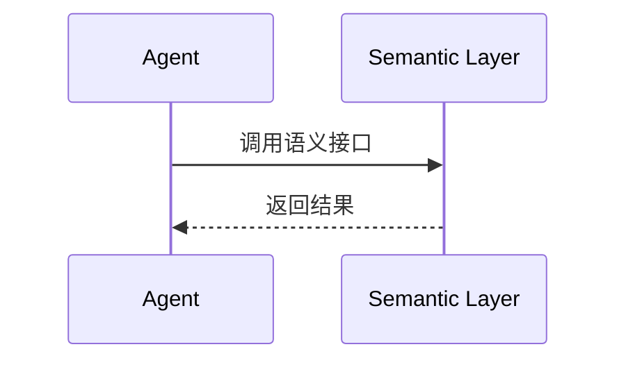
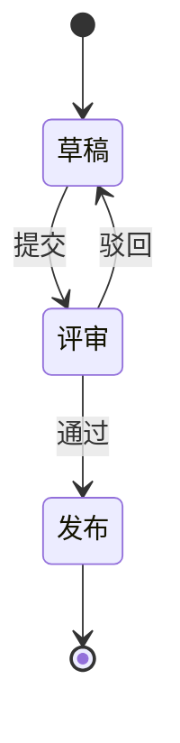
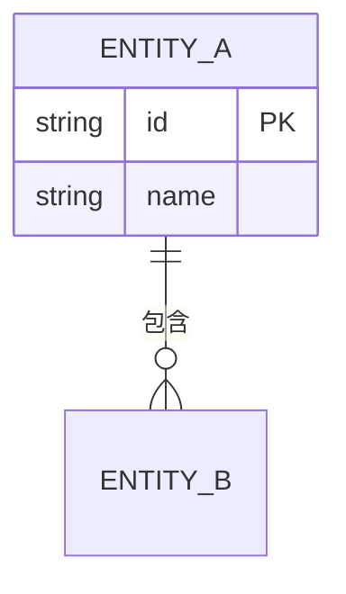

# DIAGRAM_GUIDE.md

# 图表规范：Mermaid、架构图与图与正文的关系

> 本文件定义《Data-Driven AI：从数据到智能》的图表规范。
>
> 图优先原则见 `WRITING_STYLE.md` 第三章，本文件是它的展开。
>
> 所有图必须能在 `mkdocs.yml` 的 superfences + mermaid@11 配置下直接渲染。

---

# 一、图优先原则与图的种类

## 1.1 原则

能用图，不用大段文字。

一本优秀技术书，应该让读者看图就理解。

## 1.2 图的种类

本书使用的图包括：

| 图种 | 何时用 |
| --- | --- |
| 架构图 | 描述系统由哪些层组成、层间关系 |
| 生命周期图 | 描述某对象从产生到消亡的阶段 |
| 时序图 | 描述多组件之间的交互顺序 |
| 对比图 | 描述两种方案的差异 |
| 数据流图 | 描述数据从源到汇的流向 |
| 闭环流程图 | 描述反馈回路的闭合路径 |

## 1.3 不用的图

不用饼图。

不用装饰性插图。

不用与正文信息重复的图。

## 1.4 判定规则

一张图不携带任何正文没有的信息，删除它。

一张图携带的信息正文没有，补正文或删图。

---

# 二、工具选择

## 2.1 优先顺序

1. Mermaid（首选）
2. 架构图（HTML + SVG）
3. Draw.io / PlantUML（Mermaid 表达力不足时）

## 2.2 选择依据

| 工具 | 用它的理由 | 不用它的理由 |
| --- | --- | --- |
| Mermaid | 进版本库、可 diff、可渲染 | 复杂拓扑表达力不足 |
| HTML + SVG | 复杂架构图、需要精确排版 | 不可 diff、维护成本高 |
| Draw.io | 图形丰富 | 源文件二进制、不可 diff |
| PlantUML | 时序图表达力强 | 需要 Java 运行环境 |

## 2.3 源文件存放

Mermaid 源直接写在 Markdown 代码块里。

不单独存 `.mmd` 文件。

架构图源文件存 `diagrams/` 目录。

命名规范：`层名-图名.扩展`。

示例：`ontology-agent-consumption.svg`。

## 2.4 判定规则

能用 Mermaid 表达的图，不要用 Draw.io。

同一种图出现两种工具版本，删一个。

---

# 三、Mermaid 规范

## 3.1 版本

本书 Mermaid 版本对齐 `mkdocs.yml` 的 `mermaid@11.15.0`。

不要使用 11 不支持的语法。

## 3.2 主题色

统一对齐 `mkdocs.yml` 的 `indigo` primary。

主色用 `#3f51b5` 系。

辅色用灰阶。

禁止用红绿同图（色盲不友好）。

禁止用超过 5 种颜色。

## 3.3 图的必备要素

每张图必须有：

- 图标题（用 Markdown 标题或图注）
- 图注（图下方一句话说明）
- 正文引用

## 3.4 中文标签

节点标签用中文。

英文术语按 `GLOSSARY.md` 首次出现规范给中英文。

标签尽量短。

长标签换行用 ` `。

## 3.5 嵌套与拆图

禁止节点嵌套超过两层。

一张图超过 15 个节点，考虑拆成多张图。

拆图时每张图聚焦一个视角。

## 3.6 代码骨架模板

### 流程图（flowchart）

方向优先用 `LR`（从左到右）。

闭环用 `flowchart LR` + 虚线回边。

### 时序图（sequenceDiagram）

参与者用中文别名。

### 状态图（stateDiagram-v2）

### 实体关系图（erDiagram）

仅用于 Ontology 层的实体关系展示。

## 3.7 判定规则

一张 Mermaid 图在本地 `mkdocs serve` 渲染失败，必须修。

一张 Mermaid 图的颜色超过 5 种，精简。

---

# 四、架构图（HTML + SVG）规范

## 4.1 何时用

Mermaid 无法表达复杂拓扑时用。

例如：

- 多层嵌套的部署架构
- 需要精确对齐的组件排版
- 需要图标与配色的系统全景图

## 4.2 导出格式

每张架构图导出两种格式：

- SVG（进版本库，可缩放）
- PNG（备用，高分辨率）

## 4.3 命名与存放

存 `diagrams/` 目录。

命名：`层名-图名.svg`。

示例：`semantic-layer-overview.svg`。

## 4.4 与 Mermaid 的互斥

同一信息只画一次。

Mermaid 能表达的，不要用 SVG 重复画。

## 4.5 判定规则

一张 SVG 图没有对应正文解读，补解读或删图。

---

# 五、图与正文的关系

## 5.1 必须有引用

每张图必须在正文有引用。

引用方式：

> 如图所示，Agent 通过 Semantic Layer 访问数据。

## 5.2 必须有解读

引用后必须解读。

解读不是复述图里有什么。

解读是说明图说明了什么结论。

## 5.3 图不能替代论述

图能说明"是什么"。

图不能替代"为什么"的论述。

"为什么"必须用文字讲清。

## 5.4 图的更新

图的更新必须同步正文。

正文引用了图，图改了，正文要改。

## 5.5 判定规则

一张图在正文中没有被引用，删除它或补引用。

一张图被引用但没有解读，补解读。

---

# 六、图的 DDA 层标注

## 6.1 必须标注所属层

每张架构图必须标注它属于 DDA 的哪一层。

标注方式：

- 图标题中包含层名
- 或图注中说明所属层

示例：

> 图：Semantic Layer 层的 Agent 消费架构

## 6.2 跨层依赖的箭头方向

跨层依赖的箭头必须从上层指向下层（消费方向）。

不要从下层指向上层。

除非描述反馈回流，此时用虚线箭头并标注"反馈"。

## 6.3 闭环图的特殊规则

描述 Data Loop 的闭环图，必须：

- 用虚线表示反馈回流
- 标注回流内容（数据修正、知识修正、Ontology 修正）
- 显示闭环的起点与终点重合

## 6.4 判定规则

一张架构图无法判断它属于哪一层，补标注或重画。

---

# 七、本文件的修订规则

新增一种图种需要：

1. 在图的种类表中追加。
2. 给出何时用的判定。
3. 给出代码骨架模板（如适用）。

修订 Mermaid 版本需要：

1. 同步 `mkdocs.yml` 的 `extra_javascript`。
2. 全书检查现有 Mermaid 图是否仍渲染。
3. 更新本文件的版本号说明。
